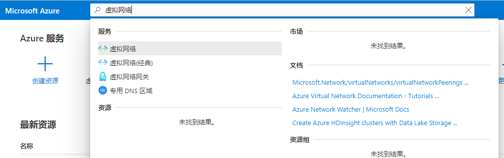
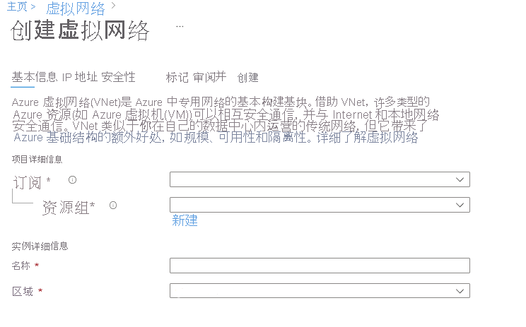
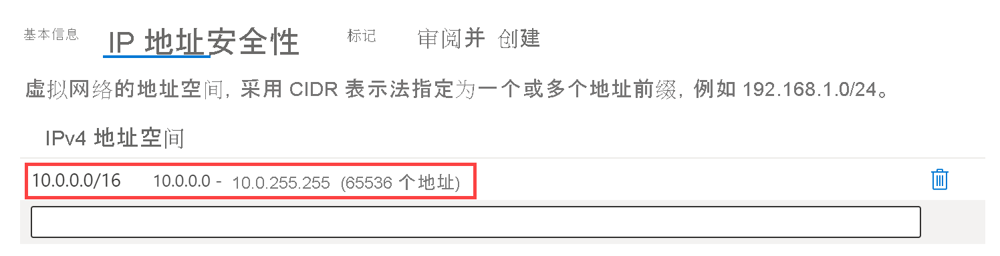
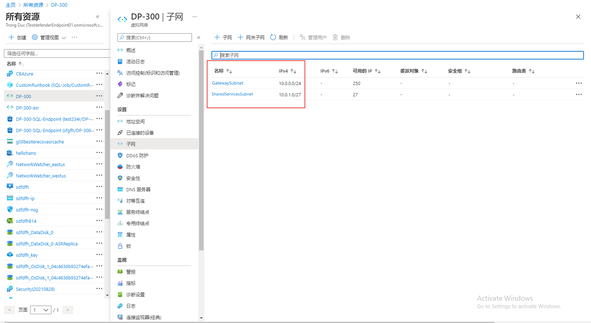

---
Exercise:
  title: 模块 01 - 第 4 单元 - 在 Azure 中设计和实现虚拟网络
  module: Module 01 - Introduction to Azure Virtual Networks
---

# 模块 01 - 第 4 单元 - 在 Azure 中设计和实现虚拟网络

## 练习场景

现在，你已准备好在 Azure 门户中部署虚拟网络。

假设有一家虚构的组织 Contoso Ltd，它正在将基础结构和应用程序迁移到 Azure。 如果你担任网络工程师一职，则必须计划并实现三个虚拟网络和子网，以支持这些虚拟网络中的资源。

### 交互式实验室模拟

>**注意**：此前提供的实验室模拟已停用。

### 预计用时：20 分钟

虚拟网络“CoreServicesVnet”部署在“美国东部”区域。 此虚拟网络将具有最大数量的资源。 它将通过 VPN 连接与本地网络建立连接。 此网络将包含 Web 服务、数据库和其他系统，这些都是业务运营的关键所在。 共享服务（如域控制器和 DNS）也将位于此处。 预计会有大量增长，因此该虚拟网络需要较大的地址空间。

虚拟网络“ManufacturingVnet”部署在靠近你组织的制造工厂位置的“欧洲西部”区域。 此虚拟网络将包含制造工厂的运营系统。 该组织预计会有大量内部连接设备供其系统检索温度等数据，而且还需要一个它可扩展到其中的 IP 地址空间。

虚拟网络“ResearchVnet”部署在靠近组织研发团队位置的“东南亚”区域。 研发团队使用此虚拟网络。 该团队有少量稳定的资源，并且预计这些资源不会增长。 团队需要少量的 IP 地址以供少数虚拟机工作。

你将创建以下资源：

| **虚拟网络** | 区域     | **虚拟网络地址空间** | **子网**                | **子网**    |
| ------------------- | -------------- | --------------------------------- | ------------------------- | ------------- |
| CoreServicesVnet    | 美国东部        | 10.20.0.0/16                      |                           |               |
|                     |                |                                   | GatewaySubnet             | 10.20.0.0/27  |
|                     |                |                                   | SharedServicesSubnet      | 10.20.10.0/24 |
|                     |                |                                   | DatabaseSubnet            | 10.20.20.0/24 |
|                     |                |                                   | PublicWebServiceSubnet    | 10.20.30.0/24 |
| ManufacturingVnet   | 西欧    | 10.30.0.0/16                      |                           |               |
|                     |                |                                   | ManufacturingSystemSubnet | 10.30.10.0/24 |
|                     |                |                                   | SensorSubnet1             | 10.30.20.0/24 |
|                     |                |                                   | SensorSubnet2             | 10.30.21.0/24 |
|                     |                |                                   | SensorSubnet3             | 10.30.22.0/24 |
| ResearchVnet        | 东南亚 | 10.40.0.0/16                      |                           |               |
|                     |                |                                   | ResearchSystemSubnet      | 10.40.0.0/24  |

这些虚拟网络和子网以一种既可容纳现有资源，又允许预计增长的方式构建。 让我们来创建这些虚拟网络和子网，为网络基础结构奠定基础。

### 工作技能

通过学习本练习，你将能够：

+ 任务 1：创建 Contoso 资源组
+ 任务 2：创建 CoreServicesVnet 虚拟网络和子网
+ 任务 3：创建 ManufacturingVnet 虚拟网络和子网
+ 任务 4：创建 ResearchVnet 虚拟网络和子网
+ 任务5：验证 VNet 和子网的创建

## 任务 1：创建 Contoso 资源组

1. 转到 [Azure 门户](https://portal.azure.com/)。

1. 在主页的“Azure 服务”下，选择“资源组”。  

1. 在“资源组”中，选择“+ 创建”。

1. 使用下表中的信息创建资源组。

   | Tab         | **选项**                                 | **值**            |
   | --------------- | ------------------------------------------ | -------------------- |
   | 基础          | 资源组                             | ContosoResourceGroup |
   |                 | 区域                                     | （美国）美国东部         |
   | 标记            | 无需更改                        |                      |
   | 审阅 + 创建 | 检查设置，然后选择“创建” |                      |

1. 在“资源组”中，验证 ContosoResourceGroup 是否显示在列表中。

## 任务 2：创建 CoreServicesVnet 虚拟网络和子网

1. 在 Azure 门户主页上，导航到“全局搜索”栏，搜索“虚拟网络”，然后在“服务”下选择“虚拟网络”。  

1. 在“虚拟网络”页上选择“创建”。  
   
1. 使用下表中的信息创建 CoreServicesVnet 虚拟网络。  
   删除或覆盖默认 IP 地址空间。 

   | Tab      | **选项**         | **值**            |
   | ------------ | ------------------ | -------------------- |
   | 基础       | 资源组     | ContosoResourceGroup |
   |              | 名称               | CoreServicesVnet     |
   |              | 区域             | （美国）美国东部         |
   | IP 地址 | IPv4 地址空间 | 10.20.0.0/16         |

1. 使用下表中的信息创建 CoreServicesVnet 子网。

1. 若要开始创建每个子网，请选择“+ 添加子网”。 若要完成创建每个子网，请选择“添加”。

   | **子网**             | **选项**           | 值               |
   | ---------------------- | -------------------- | ----------------------- |
   | GatewaySubnet          | 子网用途       | 虚拟网络网关 |
   |                        | 子网名称          | GatewaySubnet           |
   |                        | 子网地址范围 | 10.20.0.0/27            |
   | SharedServicesSubnet   | 子网名称          | SharedServicesSubnet    |
   |                        | 子网地址范围 | 10.20.10.0/24           |
   | DatabaseSubnet         | 子网名称          | DatabaseSubnet          |
   |                        | 子网地址范围 | 10.20.20.0/24           |
   | PublicWebServiceSubnet | 子网名称          | PublicWebServiceSubnet  |
   |                        | 子网地址范围 | 10.20.30.0/24           |

1. 若要完成创建 CoreServicesVnet 及其关联的子网，请选择“审阅并创建”。

1. 验证配置是否通过验证，然后选择“创建”。

1. 根据下表对每个 VNet 重复步骤 1 - 8  

## 任务 3：创建 ManufacturingVnet 虚拟网络和子网

   | Tab      | **选项**         | **值**            |
   | ------------ | ------------------ | -------------------- |
   | 基础       | 资源组     | ContosoResourceGroup |
   |              | 名称               | ManufacturingVnet    |
   |              | 区域             | （欧洲）西欧 |
   | IP 地址 | IPv4 地址空间 | 10.30.0.0/16         |

   | **子网**                | **选项**           | 值                 |
   | ------------------------- | -------------------- | ------------------------- |
   | ManufacturingSystemSubnet | 子网名称          | ManufacturingSystemSubnet |
   |                           | 子网地址范围 | 10.30.10.0/24             |
   | SensorSubnet1             | 子网名称          | SensorSubnet1             |
   |                           | 子网地址范围 | 10.30.20.0/24             |
   | SensorSubnet2             | 子网名称          | SensorSubnet2             |
   |                           | 子网地址范围 | 10.30.21.0/24             |
   | SensorSubnet3             | 子网名称          | SensorSubnet3             |
   |                           | 子网地址范围 | 10.30.22.0/24             |

## 任务 4：创建 ResearchVnet 虚拟网络和子网

   | Tab      | **选项**         | **值**            |
   | ------------ | ------------------ | -------------------- |
   | 基础       | 资源组     | ContosoResourceGroup |
   |              | 名称               | ResearchVnet         |
   |              | 区域             | 东南亚       |
   | IP 地址 | IPv4 地址空间 | 10.40.0.0/16         |

   | **子网**           | **选项**           | 值            |
   | -------------------- | -------------------- | -------------------- |
   | ResearchSystemSubnet | 子网名称          | ResearchSystemSubnet |
   |                      | 子网地址范围 | 10.40.0.0/24         |

## 任务5：验证 VNet 和子网的创建

1. 在 Azure 门户主页上，选择“所有资源”。

1. 验证是否列出了 CoreServicesVnet、ManufacturingVnet 和 ResearchVnet。

1. 选择“CoreServicesVNet”。

1. 在“CoreServicesVnet”中的“设置”下，选择“子网”。

1. 在“CoreServicesVnet \| 子网”中，验证是否列出了已创建的子网，以及 IP 地址范围是否正确。

   

1. 对每个 VNet 重复步骤 3 - 5。
   
## 使用 Copilot 扩展学习

Copilot 可帮助你了解如何使用 Azure 脚本工具。 Copilot 还可以帮助了解实验室中未涵盖的领域或需要更多信息的领域。 打开 Edge 浏览器并选择“Copilot”（右上角）或导航到*copilot.microsoft.com*。 花几分钟时间尝试这些提示。
+ 是否可以提供如何在实际应用场景中使用 10.30.0.0/16 IP 地址的示例？
+ 在东部（美国）区域创建名为 CoreServicesVnet 的虚拟网络的 Azure PowerShell 命令是什么。 虚拟网络应使用 10.20.0.0/16 IP 地址空间。
+ 在西欧区域创建名为 ManufacturingVnet 的虚拟网络的 Azure CLI 命令是什么。 虚拟网络应使用 10.30.0.0/16 IP 地址空间。

## 通过自定进度的培训了解详细信息

+ [为 Azure 部署设计 IP 寻址方案](https://learn.microsoft.com/training/modules/design-ip-addressing-for-azure/)。 在本模块中，识别 Azure 虚拟网络的公共和专用 IP 寻址功能。
+ [Azure 虚拟网络的简介](https://learn.microsoft.com/training/modules/introduction-to-azure-virtual-networks/)。 在本模块中，你将了解如何设计和实现 Azure 网络服务。 你将了解虚拟网络、公共和专用 IP、DNS、虚拟网络对等互连、路由和 Azure 虚拟 NAT。

## 关键结论

+ Azure 虚拟网络是为 Azure 中的专用网络提供基础构建基块的服务。 借助服务实例（虚拟网络），多种类型的 Azure 资源可相互之间并与 Internet 和本地网络安全通信。 确保地址空间不会重叠。 确保虚拟网络地址空间（CIDR 块）不会与组织的其他网络范围重叠。
+ 虚拟网络中的所有 Azure 资源都部署到虚拟网络内的子网中。 使用子网可将虚拟网络划分为一个或多个子网络，并向每个子网分配一部分虚拟网络的地址空间。 子网不应涵盖虚拟网络的整个地址空间。 提前规划，为将来留出一些地址空间。

