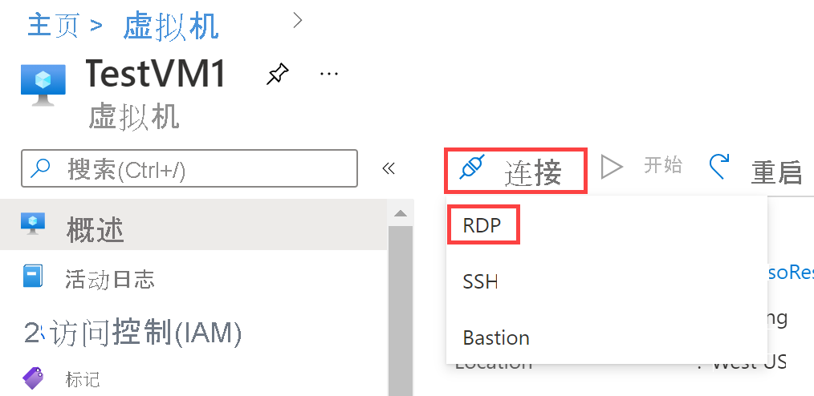

---
Exercise:
  title: 模块 01 - 第 6 单元 在 Azure 中配置 DNS 设置
  module: Module - Introduction to Azure Virtual Networks
ms.openlocfilehash: e6a21f21c87ff92e0e8a1a245d5b1fab477ce271
ms.sourcegitcommit: e98d709ed0f96f3c8e8c4e74c3aea821dff153ca
ms.translationtype: HT
ms.contentlocale: zh-CN
ms.lasthandoff: 09/13/2022
ms.locfileid: "147922323"
---
# <a name="m01---unit-6-configure-dns-settings-in-azure"></a>模块 01 - 第 6 单元 在 Azure 中配置 DNS 设置

## <a name="exercise-scenario"></a>练习场景 
在本单元中，你将为 Contoso Ltd 配置 DNS 名称解析。你将创建一个名为 contoso.com 的专用 DNS 区域，链接 VNet 进行注册和解析，然后创建两个虚拟机并测试配置。

通过学习本练习，你将能够：

+ 任务 1：创建专用 DNS 区域
+ 任务 2：链接子网进行自动注册
+ 任务 3：创建虚拟机以测试配置
+ 任务 4：验证 DNS 区域中是否存在记录

#### <a name="estimated-time-25-minutes"></a>预计用时：25 分钟

## <a name="task-1-create-a-private-dns-zone"></a>任务 1：创建专用 DNS 区域

1. 转到 [Azure 门户](https://portal.azure.com/)。

2. 在 Azure 主页上的搜索栏中，输入“dns”，然后选择“专用 DNS 区域”。  
   ‎

3. 在专用 DNS 区域中，选择“+ 创建”。

4. 使用下表中的信息创建专用 DNS 区域。

| Tab         | **选项**                             | **值**            |
| --------------- | -------------------------------------- | -------------------- |
| 基础          | 资源组                         | ContosoResourceGroup |
|                 | 名称                                   | Contoso.com          |
| Tags            | 无需更改                    |                      |
| 查看 + 创建 | 检查设置，然后选择“创建” |                      |


5. 等待部署完成，然后选择“转到资源”。

6. 验证是否已创建区域。

## <a name="task-2-link-subnet-for-auto-registration"></a>任务 2：链接子网进行自动注册

1. 在“Contoso.com”中的“设置”下，选择“虚拟网络链接”。

2. 在“Contoso.com | 虚拟网络”链接上，选择“+ 添加”。


3. 使用下表中的信息添加虚拟网络链接。

| **选项**                          | 值                               |
| ----------------------------------- | --------------------------------------- |
| 链接名称                           | CoreServicesVnetLink                    |
| 订阅                        | 无需更改                     |
| 虚拟网络                     | CoreServicesVnet (ContosoResourceGroup) |
| 启用自动注册            | 选定                                |
| 检查设置，然后选择“确定”。 |                                         |


4. 选择“刷新”。

5. 验证是否已创建 CoreServicesVnetLink，以及是否已启用自动注册。

6. 使用下表中的信息，对 ManufacturingVnet 重复步骤 2 - 5： 

| **选项**                          | 值                                |
| ----------------------------------- | ---------------------------------------- |
| 链接名称                           | ManufacturingVnetLink                    |
| 订阅                        | 无需更改                      |
| 虚拟网络                     | ManufacturingVnet (ContosoResourceGroup) |
| 启用自动注册            | 选定                                 |
| 检查设置，然后选择“确定”。 |                                          |


7. 选择“刷新”。

8. 验证是否已创建 ManufacturingVnetLink，以及是否已启用自动注册。

9. 使用下表中的信息，对 ResearchVnet 重复步骤 2 - 5： 

| **选项**                          | 值                           |
| ----------------------------------- | ----------------------------------- |
| 链接名称                           | ResearchVnetLink                    |
| 订阅                        | 无需更改                 |
| 虚拟网络                     | ResearchVnet (ContosoResourceGroup) |
| 启用自动注册            | 选定                            |
| 检查设置，然后选择“确定”。 |                                     |


10. 选择“刷新”。

11. 验证是否已创建 ResearchVnetLink，以及是否已启用自动注册。

 

##  <a name="task-3-create-virtual-machines-to-test-the-configuration"></a>任务 3：创建虚拟机以测试配置

在本部分中，你将创建两个测试 VM 来测试专用 DNS 区域配置。

1. 在 Azure 门户的“Cloud Shell”窗格中打开“PowerShell”会话。
    
    > **注意：** 如果这是你首次打开 Cloud Shell，系统会提示你创建存储帐户。 选择“创建存储”。

2. 在 Cloud Shell 窗格的工具栏中，选择“上传/下载文件”图标，在下拉菜单中选择“上传”，将文件 azuredeploy.json 和 azuredeploy.parameters.json 从源文件夹 F:\Allfiles\Exercises\M01 逐个上传到 Cloud Shell 主目录  。

3. 部署以下 ARM 模板以创建此练习所需的 VM：

   ```powershell
   $RGName = "ContosoResourceGroup"
   
   New-AzResourceGroupDeployment -ResourceGroupName $RGName -TemplateFile azuredeploy.json -TemplateParameterFile azuredeploy.parameters.json
   ```
  
4. 部署完成后，转到 Azure 门户主页，然后选择“虚拟机”。

5. 验证是否已创建两个虚拟机。

 

## <a name="task-4-verify-records-are-present-in-the-dns-zone"></a>任务 4：验证 DNS 区域中是否存在记录

1. 在 Azure 门户主页上，选择“专用 DNS 区域”。

2. 在专用 DNS 区域中，选择“contoso.com”。

3. 验证是否为两个 VM 列出了主机 (A) 记录，如下所示：


 

4. 记下 VM 的名称和 IP 地址。

 

### <a name="connect-to-the-test-vms-using-rdp"></a>使用 RDP 连接到测试 VM

1. 在 Azure 门户主页上，选择“虚拟机”。

2. 选择“TestVM1”。

3. 在 TestVM1 中，选择“连接”&gt;“RDP”。



4. 在“TestVM1 | 连接”中，选择“下载 RDP 文件”。

5. 将 RDP 文件保存到桌面。

6. 在 Azure 门户主页上，选择“虚拟机”。

7. 选择“TestVM2”。

8. 在 TestVM2 中，选择“连接”&gt;“RDP”。

9. 在“TestVM2 | 连接”中，选择“下载 RDP 文件”。

10. 将 RDP 文件保存到桌面。

11. 使用 RDP 文件连接 TestVM1，用户名为 TestUser，密码为 TestPa$$w0rd! 。

12. 使用 RDP 文件连接 TestVM2，用户名为 TestUser，密码为 TestPa$$w0rd! 。

13. 在这两个 VM 上的“选择设备的隐私设置”中，选择“接受”。

14. 在两个 VM 上，如果出现提示，请在“网络”中选择“是” 。

15. 在 TestVM1 上，打开命令提示符并输入命令 ipconfig /all。

16. 验证 IP 地址是否与在 DNS 区域中记下的地址相同。

17. 输入命令 ping TestVM2.contoso.com。

18. 验证 FQDN 是否解析为你在专用 DNS 区域中记下的 IP 地址。 由于 VM 上启用了 Windows 防火墙，ping 本身将超时。

19. 或者，可以输入命令 nslookup TestVM2.contoso.com，并验证是否收到成功的 VM2 名称解析记录
 

祝贺你！ 你已经创建了一个专用 DNS 区域、添加了名称解析和自动注册链接，并在配置中测试了名称解析。 
