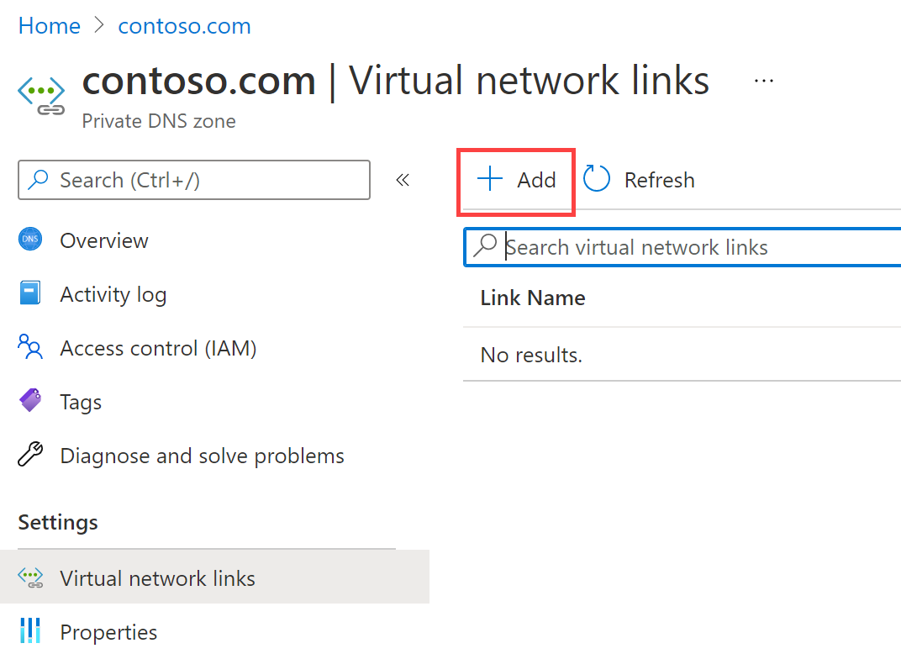

---
Exercise:
  title: 模块 01 - 第 6 单元 在 Azure 中配置 DNS 设置
  module: Module 01 - Introduction to Azure Virtual Networks
---

# 模块 01 - 第 6 单元 在 Azure 中配置 DNS 设置

## 练习场景

在本单元中，你将为 Contoso Ltd 配置 DNS 名称解析。你将创建一个名为 contoso.com 的专用 DNS 区域，链接 VNet 进行注册和解析，然后创建两个虚拟机并测试配置。


通过学习本练习，你将能够：

+ 任务 1：创建专用 DNS 区域
+ 任务 2：链接子网进行自动注册
+ 任务 3：创建虚拟机以测试配置
+ 任务 4：验证 DNS 区域中是否存在记录

   >**注意：** 我们提供 **[交互式实验室模拟](https://mslabs.cloudguides.com/guides/AZ-700%20Lab%20Simulation%20-%20Configure%20DNS%20settings%20in%20Azure)** ，让你能以自己的节奏点击浏览实验室。 你可能会发现交互式模拟与托管实验室之间存在细微差异，但演示的核心概念和思想是相同的。

### 预计用时：25 分钟

**重要说明：** 本练习需要上一个实验室中的虚拟网络。 这可以使用 [template](https://github.com/MicrosoftLearning/AZ-700-Designing-and-Implementing-Microsoft-Azure-Networking-Solutions/tree/master/Allfiles/Exercises/M01/template.json) 文件进行安装。 将安装所有虚拟网络，但只需要 CoreServicesVNet。 

## 任务 1：创建专用 DNS 区域

1. 转到 [Azure 门户](https://portal.azure.com/)。

1. 在 Azure 主页上的搜索栏中，输入“dns”，然后选择“专用 DNS 区域”。  
   

1. 在专用 DNS 区域中，选择“+ 创建”。

1. 使用下表中的信息创建专用 DNS 区域。

    | Tab         | **选项**                             | **值**            |
    | --------------- | -------------------------------------- | -------------------- |
    | 基础          | 资源组（如有需要可新建） | `ContosoResourceGroup` |
    |                 | 名称                                   | `Contoso.com`          |
    | 审阅 + 创建 | 检查设置，然后选择“创建” |                      |

1. 等待部署完成，然后选择“转到资源”。

1. 验证是否已创建区域。

## 任务 2：链接子网进行自动注册

1. 在 Contoso.com 中的“**DNS 管理**”下，选择“**虚拟网络链接**”。

1. 在“Contoso.com \| 虚拟网络”链接上，选择“+ 添加”****。

    

1. 使用下表中的信息添加虚拟网络链接。

    | **选项**                          | 值                               |
    | ----------------------------------- | --------------------------------------- |
    | 链接名称                           | `CoreServicesVnetLink`                   |
    | 订阅                        | 无需更改                     |
    | 虚拟网络                     | CoreServicesVnet (ContosoResourceGroup) |
    | 启用自动注册            | 选定                                |
    | 检查设置，然后选择“确定”。 |                                         |

1. 选择“刷新”。

1. 验证是否已创建 CoreServicesVnetLink，以及是否已启用自动注册。

## 任务 3：创建虚拟机以测试配置

在本部分中，你将创建两个测试 VM 来测试专用 DNS 区域配置。

1. 在 Azure 门户中，选择右上角的 Cloud Shell 图标。 如有必要，请配置 Shell。  
    + 选择“PowerShell”****。
    + 选择“**不需要存储帐户**”和“**订阅**”，然后选择“**应用**”。
    + 等待终端创建并显示提示。 

1. 在 Cloud Shell 窗格的工具栏中，选择“**管理文件**”图标，在下拉菜单中选择“**上传**”并上传模板文件：**azuredeploy.json** 和 **azuredeploy.parameters.json**。

   >**备注：** 如果是使用自己的订阅进行操作，可从 GitHub 实验室存储库获取[模板文件](https://github.com/MicrosoftLearning/AZ-700-Designing-and-Implementing-Microsoft-Azure-Networking-Solutions/tree/master/Allfiles/Exercises)。
   
1. 部署以下 ARM 模板以创建此练习所需的 VM：

   >注意：系统会提示你提供管理员密码。 在稍后的步骤中需要用到此密码。 

   ```powershell
   $RGName = "ContosoResourceGroup"
   
   New-AzResourceGroupDeployment -ResourceGroupName $RGName -TemplateFile azuredeploy.json -TemplateParameterFile azuredeploy.parameters.json
   ```
  
1. 部署完成后，转到 Azure 门户主页，然后选择“虚拟机”。

1. 验证是否已创建两个虚拟机。

## 任务 4：验证 DNS 区域中是否存在记录

1. 在 Azure 门户主页上，选择“专用 DNS 区域”。

1. 在专用 DNS 区域中，选择“contoso.com”。

1. 验证是否为两个 VM 列出了主机 (A) 记录，如下所示：

    

1. 记下 VM 的名称和 IP 地址。

### 连接到 VM 以测试名称解析

1. 在 Azure 门户主页上，选择“虚拟机”。

1. 选择“TestVM1”。

1. 在 TestVM1 上，选择“**连接 &gt; 连接**”，然后下载 RDP 文件。 确保文件下载成功。

1. 找到 RDP 文件，然后双击以执行该文件。

1. 选择“**连接**”并提供模板部署期间提供的 **TestUser** 密码。

1. 选择“**确定**”，然后在警告页上选择“**是**”。

1. 在 TestVM1 上，打开命令提示符并输入命令 `ipconfig /all`。

1. 注意 IP 地址是否与 DNS 区域中的地址相同。

1. 输入命令 `ping TestVM2.contoso.com`。 由于 VM 上启用了 Windows 防火墙，命令将超时。

1. 请改用 `nslookup TestVM2.contoso.com` 命令来验证是否收到 VM2 的成功名称解析记录。 这演示了专用区域名称解析。 

## 使用 Copilot 扩展学习

Copilot 可帮助你了解如何使用 Azure 脚本工具。 Copilot 还可以帮助了解实验室中未涵盖的领域或需要更多信息的领域。 打开 Edge 浏览器并选择“Copilot”（右上角）或导航到*copilot.microsoft.com*。 花几分钟时间尝试这些提示。
+ Azure DNS 与 Azure 专用 DNS 有何区别？ 提供何时使用 Azure 专用 DNS 的示例。
+ 创建 Azure DNS 区域时自动注册的目的是什么？

## 通过自定进度的培训了解详细信息

+ [Azure DNS 简介](https://learn.microsoft.com/training/modules/intro-to-azure-dns/)。 本模块说明 Azure DNS 的功能、工作原理以及何时应选择使用 Azure DNS 作为解决方案来满足组织的需求。
+ [在 Azure DNS 上托管域](https://learn.microsoft.com/training/modules/host-domain-azure-dns/)。 在本模块中，你将创建一个 DNS 区域和 DNS 记录，以便将域映射到 IP 地址。 还需要进行测试，以确保域名会解析为 Web 服务器。

## 关键结论

恭喜你完成本实验室的内容。 下面是本实验室的主要重点。 

+ Azure DNS 是一种云服务，可用于承载和管理域名系统 (DNS) 域，也称为 DNS 区域。 
+ Azure DNS 公用区域托管将由 Internet 上的任何主机来解析的记录的域名区域数据。
+ 借助 Azure 专用 DNS 区域，你可以为专用 Azure 资源配置专用 DNS 区域命名空间。
+ DNS 区域是 DNS 记录的集合。 DNS 记录提供关于域的信息。
