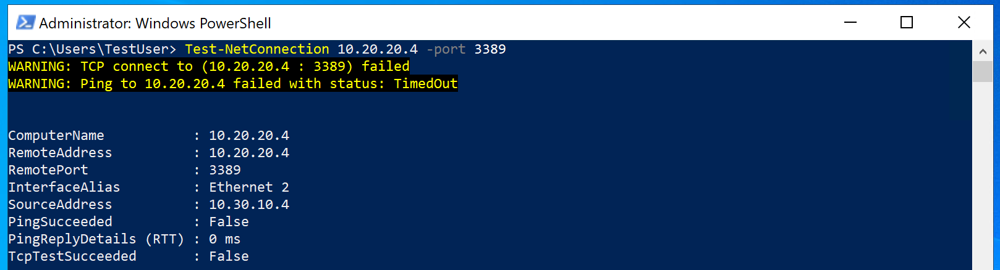

---
Exercise:
  title: 模块 01 - 第 8 单元 使用全局虚拟网络对等互连连接两个 Azure 虚拟网络
  module: Module 01 - Introduction to Azure Virtual Networks
---
# 模块 01 第 8 单元 - 使用全局虚拟网络对等互连连接两个 Azure 虚拟网络

## 练习场景 
在本单元中，你将通过添加对等互连来允许通信流，以配置 CoreServicesVnet 和 ManufacturingVnet 之间的连接。 


在本单元中，你将学习以下内容：

+ 任务 1：创建虚拟机以测试配置
+ 任务 2：使用 RDP 连接到测试 VM
+ 任务 3：测试 VM 之间的连接
+ 任务 4：在 CoreServicesVnet 与 ManufacturingVnet 之间创建 VNet 对等互连
+ 任务 5：测试 VM 间的连接
+ 任务 6：清理资源

**注意：** 我们提供 **[交互式实验室模拟](https://mslabs.cloudguides.com/guides/AZ-700%20Lab%20Simulation%20-%20Connect%20two%20Azure%20virtual%20networks%20using%20global%20virtual%20network%20peering)** ，让你能以自己的节奏点击浏览实验室。 你可能会发现交互式模拟与托管实验室之间存在细微差异，但演示的核心概念和思想是相同的。

#### 预计用时：20 分钟

## 任务 1：创建虚拟机以测试配置

在本部分中，你将在 Manufacturing VNet 上创建一个测试 VM，用来测试是否可以从 ManufacturingVnet 访问另一个 Azure 虚拟网络中的资源。

### 创建 ManufacturingVM

1. 在 Azure 门户的“Cloud Shell”窗格中打开“PowerShell”会话 。
  > **注意：** 如果这是你首次打开 Cloud Shell，系统会提示你创建存储帐户。 选择“创建存储”。

1. 在 Cloud Shell 窗格的工具栏中，选择“上传/下载文件”图标，在下拉菜单中选择“上传”，将文件 ManufacturingVMazuredeploy.json 和 ManufacturingVMazuredeploy.parameters.json 从源文件夹 F:\Allfiles\Exercises\M01 逐个上传到 Cloud Shell 主目录    。

1. 部署以下 ARM 模板以创建此练习所需的 VM：

   >注意：系统会提示你提供管理员密码。

   ```powershell
   $RGName = "ContosoResourceGroup"
   
   New-AzResourceGroupDeployment -ResourceGroupName $RGName -TemplateFile ManufacturingVMazuredeploy.json -TemplateParameterFile ManufacturingVMazuredeploy.parameters.json
   ```
  
1. 部署完成后，转到 Azure 门户主页，然后选择“虚拟机”。

1. 验证是否已创建虚拟机。

## 任务 2：使用 RDP 连接到测试 VM

1. 在 Azure 门户主页上，选择“虚拟机”。

1. 选择“ManufacturingVM”。

1. 在“ManufacturingVM”中，选择“连接”&gt;“RDP”。

1. 在“ManufacturingVM | 连接”中，选择“下载 RDP 文件”。

1. 将 RDP 文件保存到桌面。

1. 使用 RDP 文件和用户名 TestUser 以及部署期间提供的密码连接到 ManufacturingVM。

1. 在 Azure 门户主页上，选择“虚拟机”。

1. 选择“TestVM1”。

1. 在 TestVM1 中，选择“连接”&gt;“RDP”。

1. 在“TestVM1 | 连接”中，选择“下载 RDP 文件”。

1. 将 RDP 文件保存到桌面。

1. 使用 RDP 文件和用户名 TestUser 以及部署期间提供的密码连接到 TestVM1。

1. 在这两个 VM 上的“选择设备的隐私设置”中，选择“接受”。

1. 在这两个 VM 上的“网络”中，选择“是”。

1. 在 TestVM1 上，打开 PowerShell 提示符，然后运行以下命令：ipconfig

1. 记录 IPv4 地址。 

 

## 任务 3：测试 VM 间的连接

1. 在“ManufacturingVM”上，打开 PowerShell 提示符。

1. 使用以下命令验证 CoreServicesVnet 上是否不存在与 TestVM1 的连接。 请确保对 TestVM1 使用 IPv4 地址。

   ```powershell
    Test-NetConnection 10.20.20.4 -port 3389
    ```


1. 测试连接应失败，且你将看到如下所示的结果：

 

## 任务 4：在 CoreServicesVnet 和 ManufacturingVnet 之间创建 VNet 对等互连

1. 在 Azure 主页上，选择“虚拟网络”，然后选择“CoreServicesVnet”。

1. 在“CoreServicesVnet”中的“设置”下，选择“对等互连”。
   

1. 在“CoreServicesVnet”|“对等互连”上，选择“+ 添加”。

1. 使用下表中的信息创建对等互连。

| **节**                          | **选项**                                    | 值                             |
| ------------------------------------ | --------------------------------------------- | ------------------------------------- |
| 此虚拟网络                 |                                               |                                       |
|                                      | 对等互连链接名称                             | 将 CoreServicesVnet 连接到 ManufacturingVnet |
|                                      | 到远程虚拟网络的流量             | 允许（默认）                       |
|                                      | 从远程虚拟网络转接的流量 | 允许（默认）                       |
|                                      | 虚拟网络网关或路由服务器       | “无”（默认）                        |
| 远程虚拟网络               |                                               |                                       |
|                                      | 对等互连链接名称                             | 将 ManufacturingVnet 连接到 CoreServicesVnet |
|                                      | 虚拟网络部署模型              | 资源管理器                      |
|                                      | 我知道我的资源 ID                         | 未选定                          |
|                                      | 订阅                                  | 选择提供的订阅      |
|                                      | 虚拟网络                               | ManufacturingVnet                     |
|                                      | 到远程虚拟网络的流量             | 允许（默认）                       |
|                                      | 从远程虚拟网络转接的流量 | 允许（默认）                       |
|                                      | 虚拟网络网关或路由服务器       | “无”（默认）                        |
| 检查设置，然后选择“添加”。 |                                               |                                       |
|                                      |                                               |                                       |

 >**注意**：如果你没有“MOC 订阅”，请使用之前一直使用的订阅。 这只是一个名称而已。

1. 在“CoreServicesVnet”|“对等互连”中，验证是否列出了“将 CoreServicesVnet 连接到 ManufacturingVnet”对等互连。

1. 在“虚拟网络”下，选择“ManufacturingVnet”，然后验证是否列出了“将 ManufacturingVnet 连接到 CoreServicesVnet”对等互连。

 

## 任务 5：测试 VM 间的连接

1. 在“ManufacturingVM”上，打开 PowerShell 提示符。

1. 使用以下命令验证 CoreServicesVnet 上现是否存在与 TestVM1 的连接。 

   ```powershell
    Test-NetConnection 10.20.20.4 -port 3389
    ```


1. 测试连接应成功，且你将看到如下所示的结果：

 

祝贺你！ 通过添加对等互连，你已成功配置 VNet 之间的连接。 

## 任务 6：清理资源

   >**注意**：记得删除所有不再使用的新建 Azure 资源。 删除未使用的资源可确保不会出现意外费用。

1. 在 Azure 门户的“Cloud Shell”窗格中打开“PowerShell”会话 。 （如有必要，使用默认设置创建 Cloud Shell 存储。）

1. 通过运行以下命令，删除在此模块的实验室中创建的所有资源组：

   ```powershell
   Remove-AzResourceGroup -Name 'ContosoResourceGroup' -Force -AsJob
   ```

    >**注意**：该命令以异步方式执行（由 -AsJob 参数决定），因此，虽然你可以随后立即在同一个 PowerShell 会话中运行另一个 PowerShell 命令，但需要几分钟才能实际删除资源组。
