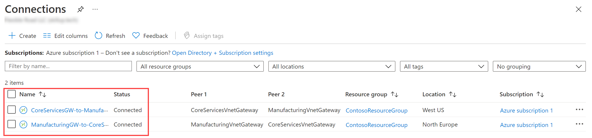

---
Exercise:
  title: 模块 02 - 第 3 单元 - 创建和配置虚拟网络网关
  module: Module 02 - Design and implement hybrid networking
---


# 模块 02 第 3 单元 - 创建和配置虚拟网络网关

## 练习场景

在本练习中，配置一个虚拟网关以连接 Contoso Core Services VNet 和 Manufacturing VNet。


通过学习本练习，你将能够：

+ 任务 1：创建 CoreServicesVnet 和 ManufacturingVnet
+ 任务 2：创建 CoreServicesVM
+ 任务 3：创建 ManufacturingVM
+ 任务 4：使用 RDP 连接到 VM
+ 任务 5：测试 VM 间的连接
+ 任务 6：创建 CoreServicesVnet 网关
+ 任务 7：创建 ManufacturingVnet 网关
+ 任务 8：将 CoreServicesVnet 连接到 ManufacturingVnet
+ 任务 9：将 ManufacturingVnet 连接到 CoreServicesVnet
+ 任务 10：验证连接是否成功
+ 任务 11：测试 VM 间的连接

>**注意：** 我们提供 **[交互式实验室模拟](https://mslabs.cloudguides.com/guides/AZ-700%20Lab%20Simulation%20-%20Create%20and%20configure%20a%20virtual%20network%20gateway)** ，让你能以自己的节奏点击浏览实验室。 你可能会发现交互式模拟与托管实验室之间存在细微差异，但演示的核心概念和思想是相同的。

### 预计用时：70 分钟（包括约 45 分钟的部署等待时间）

## 任务 1：创建 CoreServicesVnet 和 ManufacturingVnet

1. 在 Azure 门户中，选择右上角的 Cloud Shell 图标。 如有必要，请配置 Shell。  
    + 选择“PowerShell”****。
    + 选择“**不需要存储帐户**”和“**订阅**”，然后选择“**应用**”。
    + 等待终端创建并显示提示。 

1. 在 Cloud Shell 窗格的工具栏中，选择“**管理文件**”图标，在下拉菜单中选择“**上传**”，将 **azuredeploy.json** 和 **azuredeploy.parameters.json** 文件从源文件夹 **F:\Allfiles\Exercises\M02** 逐个上传到 Cloud Shell 主目录

1. 部署以下 ARM 模板来创建本练习所需的虚拟网络和子网：

   ```powershell
   $RGName = "ContosoResourceGroup"
   #create resource group if it doesnt exist
   New-AzResourceGroup -Name $RGName -Location "eastus"
   New-AzResourceGroupDeployment -ResourceGroupName $RGName -TemplateFile azuredeploy.json -TemplateParameterFile azuredeploy.parameters.json
   ```
   
## 任务 2：创建 CoreServicesVM

1. 在 Azure 门户的“Cloud Shell”窗格中打开“PowerShell”会话 。

1. 在 Cloud Shell 窗格的工具栏中，选择“**管理文件**”图标，在下拉菜单中选择“**上传**”，将 **CoreServicesVMazuredeploy.json** 和 **CoreServicesVMazuredeploy.parameters.json** 文件从源文件夹 **F:\Allfiles\Exercises\M02** 逐个上传到 Cloud Shell 主目录。

1. 部署以下 ARM 模板以创建此练习所需的 VM：

   >注意：系统会提示你提供管理员密码。

   ```powershell
   $RGName = "ContosoResourceGroup"
   
   New-AzResourceGroupDeployment -ResourceGroupName $RGName -TemplateFile CoreServicesVMazuredeploy.json -TemplateParameterFile CoreServicesVMazuredeploy.parameters.json
   ```
  
1. 部署完成后，转到 Azure 门户主页，然后选择“虚拟机”。

1. 验证是否已创建虚拟机。

## 任务 3：创建 ManufacturingVM

1. 在 Azure 门户的“Cloud Shell”窗格中打开“PowerShell”会话 。

1. 在 Cloud Shell 窗格的工具栏中，选择“**管理文件**”图标，在下拉菜单中选择“**上传**”，将 **ManufacturingVMazuredeploy.json** 和 **ManufacturingVMazuredeploy.parameters.json** 文件从源文件夹 **F:\Allfiles\Exercises\M02** 逐个上传到 Cloud Shell 主目录。

1. 部署以下 ARM 模板以创建此练习所需的 VM：

   >注意：系统会提示你提供管理员密码。

   ```powershell
   $RGName = "ContosoResourceGroup"
   
   New-AzResourceGroupDeployment -ResourceGroupName $RGName -TemplateFile ManufacturingVMazuredeploy.json -TemplateParameterFile ManufacturingVMazuredeploy.parameters.json
   ```
  
1. 部署完成后，转到 Azure 门户主页，然后选择“虚拟机”。

1. 验证是否已创建虚拟机。

## 任务 4：使用 RDP 连接到 VM

1. 在 Azure 门户主页上，选择“虚拟机”。

1. 选择“ManufacturingVM”。

1. 在“**ManufacturingVM**”上，选择“**连接**”，然后选择“**RDP**”。

1. 选择“下载 RDP 文件”。

1. 将 RDP 文件保存到桌面。

1. 使用 RDP 文件和用户名 TestUser 以及部署期间提供的密码连接到 ManufacturingVM。******** 连接后，最小化 RDP 会话。

1. 在 Azure 门户主页上，选择“虚拟机”。

1. 选择 CoreServicesVM。

1. 在“**CoreServicesVM**”上，选择“**连接**”，然后选择“**RDP**”。

1. 选择“下载 RDP 文件”。

1. 将 RDP 文件保存到桌面。

1. 使用 RDP 文件和用户名 TestUser 以及部署期间提供的密码连接到 CoreServicesVM。********

1. 在这两个 VM 上的“选择设备的隐私设置”中，选择“接受”。

1. 在这两个 VM 上的“网络”中，选择“是”。

1. 在 CoreServicesVM 上，打开 PowerShell 并运行以下命令：ipconfig****

1. 记录 IPv4 地址。

## 任务 5：测试 VM 间的连接

1. 在“ManufacturingTestVM”上，打开 PowerShell。

1. 使用以下命令验证 CoreServicesVnet 上是否不存在与 CoreServicesTestVM 的连接。 请务必使用 CoreServicesTestVM 的 IPv4 地址。

   ```Powershell
   Test-NetConnection 10.20.20.4 -port 3389
   ```

1. 测试连接应失败，且你将看到如下所示的结果：

   

## 任务 6：创建 CoreServicesVnet 网关

1. 在“搜索资源、服务和文档(G+/)”中，输入“虚拟网关”，然后从结果中选择“虚拟网关”。
   

1. 在“虚拟网关”中，选择“+ 创建”。

1. 使用下表中的信息创建虚拟网关：

   | Tab         | **节**       | **选项**                                  | **值**                    |
   | --------------- | ----------------- | ------------------------------------------- | ---------------------------- |
   | 基本信息          | 项目详细信息   | 订阅                                | 无需更改          |
   |                 |                   | ResourceGroup                               | ContosoResourceGroup         |
   |                 | 实例详细信息  | 名称                                        | CoreServicesVnetGateway      |
   |                 |                   | 区域                                      | 美国东部                      |
   |                 |                   | 网关类型                                | VPN                          |
   |                 |                   | SKU                                         | VpnGw1                       |
   |                 |                   | Generation                                  | 第 1 代                  |
   |                 |                   | 虚拟网络                             | CoreServicesVnet             |
   |                 |                   | 子网                                      | GatewaySubnet (10.20.0.0/27) |
   |                 |                   | 公共 IP 地址类型                      | 标准                     |
   |                 | 公共 IP 地址 | 公共 IP 地址                           | 新建                   |
   |                 |                   | 公共 IP 地址名称                      | CoreServicesVnetGateway-ip   |
   |                 |                   | 启用主动-主动模式                   | 已禁用                     |
   |                 |                   | 配置 BGP                               | 已禁用                     |
   | 查看 + 创建 |                   | 检查设置，然后选择“创建”。 |                              |

   >**备注**：创建虚拟网络网关可能最多需要 15-30 分钟。 无需等待部署完成。 继续创建下一个网关。 

## 任务 7：创建 ManufacturingVnet 网关

### 创建 GatewaySubnet

   >**备注：** 模板为 CoreServicesVnet 创建了 GatewaySubnet。 在此处手动创建子网。 

1. 搜索并选择 **ManufacturingVnet**。

1. 在“**设置**”边栏选项卡中，选择“**子网**”，然后选择“**+ 子网**”。 

    | 参数 | 值 |
    | --------------- | ----------------- | 
    | 子网用途 | **虚拟网络网关** |
    | 大小 | **/27（32 个地址）** |

1. 选择 **添加** 。 

### 创建虚拟网络网关

1. 在“搜索资源、服务和文档(G+/)”中，输入“虚拟网关”，然后从结果中选择“虚拟网关”。

1. 在“虚拟网关”中，选择“+ 创建”。

1. 使用此信息和“**设置**”选项卡创建虚拟网络网关。 

   | Tab         | **节**       | **选项**                                  | **值**                    |
   | --------------- | ----------------- | ------------------------------------------- | ---------------------------- |
   | 基本信息          | 项目详细信息   | 订阅                                | 无需更改          |
   |                 |                   | ResourceGroup                               | ContosoResourceGroup         |
   |                 | 实例详细信息  | 名称                                        | ManufacturingVnetGateway     |
   |                 |                   | 区域                                      | 北欧                 |
   |                 |                   | 网关类型                                | VPN                          |
   |                 |                   | SKU                                         | VpnGw1                       |
   |                 |                   | Generation                                  | 第 1 代                  |
   |                 |                   | 虚拟网络                             | ManufacturingVnet            |
   |                 |                   | 子网                                      | GatewaySubnet (10.30.0.0/27) |
   |                 |                   | 公共 IP 地址类型                      | 标准                     |
   |                 | 公共 IP 地址 | 公共 IP 地址                           | 新建                   |
   |                 |                   | 公共 IP 地址名称                      | ManufacturingVnetGateway-ip  |
   |                 |                   | 启用主动-主动模式                   | 已禁用                     |
   |                 |                   | 配置 BGP                               | 已禁用                     |
   | 查看 + 创建 |                   | 检查设置，然后选择“创建”。 |                              |

   >**备注**：创建虚拟网络网关可能最多需要 15-30 分钟。

## 任务 8：将 CoreServicesVnet 连接到 ManufacturingVnet

1. 在“搜索资源、服务和文档(G+/)”中，输入“虚拟网关”，然后从结果中选择“虚拟网关”。

1. 在“虚拟网关”中，选择“CoreServicesVnetGateway”。

1. 在“CoreServicesGateway”中，选择“连接”，然后选择“+ 添加”。

   >**备注**：完全部署虚拟网络网关之前，将无法完成此配置。

1. 使用此信息和“**设置**”选项卡创建虚拟网络网关。 


   | **选项**                     | **值**                         |
   | ------------------------------ | --------------------------------- |
   | 名称                           | CoreServicesGW-ManufacturingGW |
   | 连接类型                | VNet 到 VNet                      |
   | 区域                         | 美国东部                           |
   | 第一个虚拟网关  | CoreServicesVnetGateway           |
   | 第二个虚拟网关 | ManufacturingVnetGateway          |
   | 共享密钥 (PSK)               | abc123                            |
   | 使用 Azure 专用 IP 地址   | 未选定                      |
   | 启用 BGP                     | 未选定                      |
   | IKE 协议                   | IKEv2                             |
   | 订阅                   | 无需更改               |
   | 资源组                 | 无需更改               |


1. 若要创建连接，选择“**查看 + 创建**”，然后选择“**创建**”。

## 任务 9：将 ManufacturingVnet 连接到 CoreServicesVnet

1. 在“搜索资源、服务和文档(G+/)”中，输入“虚拟网关”，然后从结果中选择“虚拟网关”。

1. 在"虚拟网关"中，选择“ManufacturingVnetGateway”。

1. 在“CoreServicesGateway”中，选择“连接”，然后选择“+ 添加”。

1. 使用下表中的信息创建连接：

   | **选项**                     | **值**                         |
   | ------------------------------ | --------------------------------- |
   | 名称                           | ManufacturingGW-to-CoreServicesGW |
   | 连接类型                | VNet 到 VNet                      |
   | 位置                       | 北欧                      |
   | 第一个虚拟网关  | ManufacturingVnetGateway          |
   | 第二个虚拟网关 | CoreServicesVnetGateway           |
   | 共享密钥 (PSK)               | abc123                            |
   | 使用 Azure 专用 IP 地址   | 未选定                      |
   | 启用 BGP                     | 未选定                      |
   | IKE 协议                   | IKEv2                             |
   | 订阅                   | 无需更改               |
   | 资源组                 | 无需更改               |


1. 若要创建连接，选择“**查看 + 创建**”，然后选择“**创建**”。

## 任务 10：验证连接是否成功

1. 在“**搜索资源、服务和文档(G+/)**”中，输入“**VPN**”，然后从结果中选择“**连接**”。

1. 等待，直到两个连接的状态都为“已连接”。 你可能需要刷新屏幕。

   

## 任务 11：测试 VM 间的连接

1. 在“ManufacturingTestVM”上，打开 PowerShell。

1. 使用以下命令验证 CoreServicesVnet 上现在是否存在与 CoreServicesTestVM 的连接。 请务必使用 CoreServicesTestVM 的 IPv4 地址。

   ```Powershell
   Test-NetConnection 10.20.20.4 -port 3389
   ```

1. 测试连接应成功，且你将看到如下所示的结果：

   

1. 关闭远程桌面连接。

## 使用 Copilot 扩展学习

Copilot 可帮助你了解如何使用 Azure 脚本工具。 Copilot 还可以帮助了解实验室中未涵盖的领域或需要更多信息的领域。 打开 Edge 浏览器并选择“Copilot”（右上角）或导航到*copilot.microsoft.com*。 花几分钟时间尝试这些提示。
+ Azure VPN 网关的主要类型有哪些，每种类型的使用原因是什么？
+ 选择 Azure VPN 网关 SKU 时，应考虑哪些因素？ 提供示例。
+ 是否存在与 Azure VPN 网关相关的成本？


## 通过自定进度的培训了解详细信息

+ [使用 VPN 网关将本地网络连接到 Azure](https://learn.microsoft.com/training/modules/connect-on-premises-network-with-vpn-gateway/)。 在本模块中，你将如何使用 CLI 来预配 VPN 网关。
+ [排查 Microsoft Azure 中 VPN 网关的问题](https://learn.microsoft.com/training/modules/troubleshoot-vpn-gateways/)。 在本模块中，你将了解如何监视和排查站点到站点以及点到站点 VPN 的问题。

## 关键结论

恭喜你完成本实验室的内容。 下面是本实验室的主要重点。 

+ Azure VPN 网关是一项服务，用于提供本地网络与 Azure 虚拟网络之间的安全连接。
+ 站点到站点 (S2S) 连接用于通过 IPsec/IKE VPN 隧道将本地网络连接到 Azure 虚拟网络。 非常适合混合云方案。
+ 点到站点 (P2S) 连接用于将单个客户端连接到来自远程位置的 Azure 虚拟网络。 VPN 协议包括 OpenVPN、IKEv2 或 SSTP。 适用于远程工作者。
+ VNet 到 VNet 连接用于通过 IPsec/IKE VPN 隧道连接两个或多个 Azure 虚拟网络。 适用于多区域或多 VNet 部署。
+ 不同的 VPN 网关 SKU 提供不同级别的性能、吞吐量和功能。 

