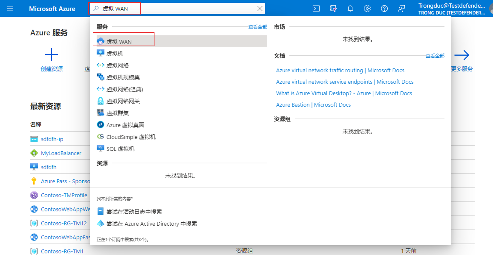
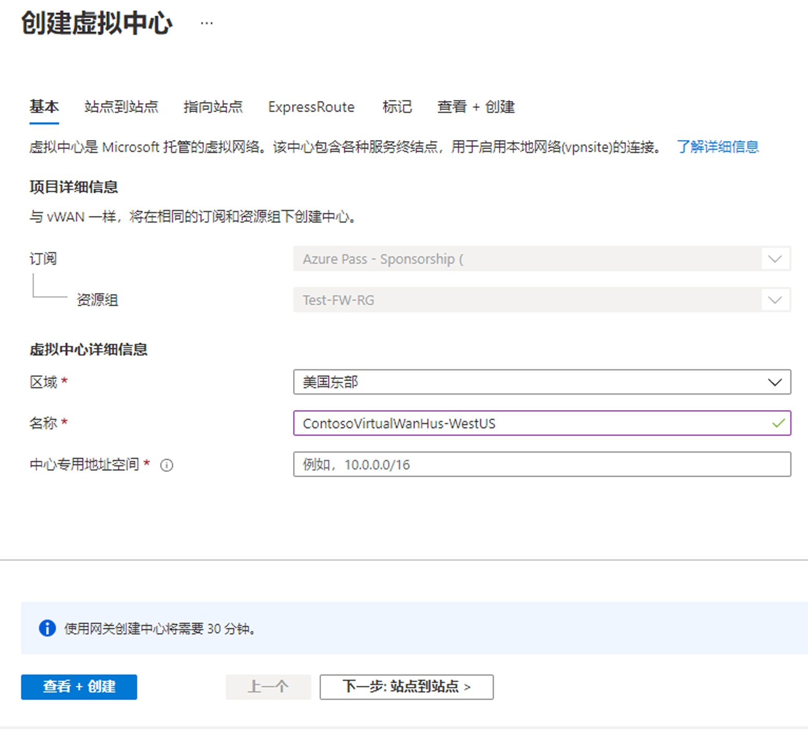
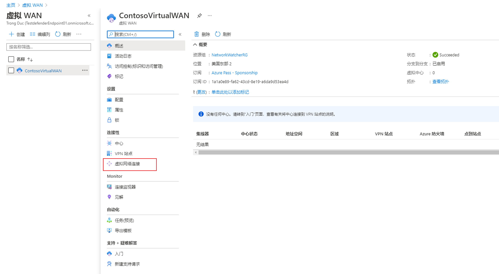

---
Exercise:
  title: 模块 02 - 第 7 单元 使用 Azure 门户创建虚拟 WAN
  module: Module 02 - Design and implement hybrid networking
---

# <a name="m02-unit-7-create-a-virtual-wan-by-using-azure-portal"></a>模块 02-第 7 单元 使用 Azure 门户创建虚拟 WAN


在此练习中，创建适用于 Contoso 的虚拟 WAN。

通过学习本练习，你将能够：

+ 任务 1：创建虚拟 WAN
+ 任务 2：使用 Azure 门户创建中心
+ 任务 3：将 VNet 连接到虚拟中心
+ 任务 4：清理资源


#### <a name="estimated-time-65-minutes-including-45-minutes-deployment-waiting-time"></a>预计用时：65 分钟（包括约 45 分钟的部署等待时间）

## <a name="task-1-create-a-virtual-wan"></a>任务 1：创建虚拟 WAN

1. 从浏览器导航到 Azure 门户并使用 Azure 帐户登录。

2. 在门户的搜索框中键入“虚拟 WAN”，然后从结果列表中选择“虚拟 WAN”。

   

 

3. 在“虚拟 WAN”页上，选择“+ 创建”。 

4. 在“创建 WAN”页的“基本信息”选项卡上，填写以下字段：

   - 订阅：使用现有订阅

   - 资源组：ContosoResourceGroup

   - 资源组位置：从下拉列表中选择一个资源位置。 WAN 是一个全局资源，不会驻留在某个特定区域。 但是，必须选择一个区域来管理和查找所创建的 WAN 资源。

   - 名称：ContosoVirtualWAN

   - 类型：标准 

5. 填写完字段后，选择“查看 + 创建”。

6. 验证通过后，选择“创建”以创建虚拟 WAN。

## <a name="task-2-create-a-hub-by-using-azure-portal"></a>任务 2：使用 Azure 门户创建中心

中心包含了用于站点到站点、ExpressRoute 或点到站点功能的网关。 在虚拟中心创建站点到站点 VPN 网关需要 30 分钟时间。 必须先创建虚拟 WAN，然后再创建中心。

1. 找到创建的虚拟 WAN。 
2. 在“虚拟 WAN”页上的“连接”下，选择“中心”。
3. 在“中心”页上，选择“+ 新建中心”以打开“创建虚拟中心”页。
   
4. 在“创建虚拟中心”页上的“基本信息”选项卡内，填写以下字段：
   - 区域：美国西部
   - 名称：ContosoVirtualWANHub-WestUS
   - 中心专用地址空间：10.60.0.0/24
   - 虚拟中心容量：2 个路由基础结构单元
5. 在完成时选择“下一步:站点到站点”。
6. 在“站点到站点”选项卡上填写以下字段：
   - 是否要创建站点到站点(VPN 网关)?：是
   - “AS 编号”字段是无法编辑的。
   - 网关缩放单元：1 个缩放单元 = 500 Mbps x 2
7. 选择“查看 + 创建”以进行验证。
8. 选择“创建”以创建中心。 
9. 30 分钟后，刷新以在“中心”页上查看该中心。 

## <a name="task-3-connect-a-vnet-to-the-virtual-hub"></a>任务 3：将 VNet 连接到虚拟中心

1. 找到创建的虚拟 WAN。 

2. 在 ContosoVirtualWAN 的“连接”下，选择“虚拟网络连接”。

   

3. 在“ContosoVirtualWAN”|“虚拟网络连接”上，选择“+ 添加连接”。

4. 在“添加连接”中，使用以下信息创建连接。

   - 连接名称：ContosoVirtualWAN-to-ResearchVNet

   - 中心：ContosoVirtualWANHub-WestUS

   - 订阅：无更改

   - 资源组：ContosoResourceGroup

   - 虚拟网络：ResearchVNet

   - 传播到“无”：是

   - 关联路由表：默认

5. 选择“创建” 。

 

祝贺你！ 你已创建虚拟 WAN 和虚拟 WAN 中心，且已将 ResearchVNet 连接到中心。

## <a name="task-4-clean-up-resources"></a>任务 4：清理资源

   >**注意**：记得删除所有不再使用的新建 Azure 资源。 删除未使用的资源可确保不会出现意外费用。

1. 在 Azure 门户的“Cloud Shell”窗格中打开“PowerShell”会话。

1. 通过运行以下命令，删除在此模块的实验室中创建的所有资源组：

   ```powershell
   Remove-AzResourceGroup -Name 'ContosoResourceGroup' -Force -AsJob
   ```

    >**注意**：该命令以异步方式执行（由 -AsJob 参数决定），因此，虽然你可以随后立即在同一个 PowerShell 会话中运行另一个 PowerShell 命令，但需要几分钟才能实际删除资源组。
