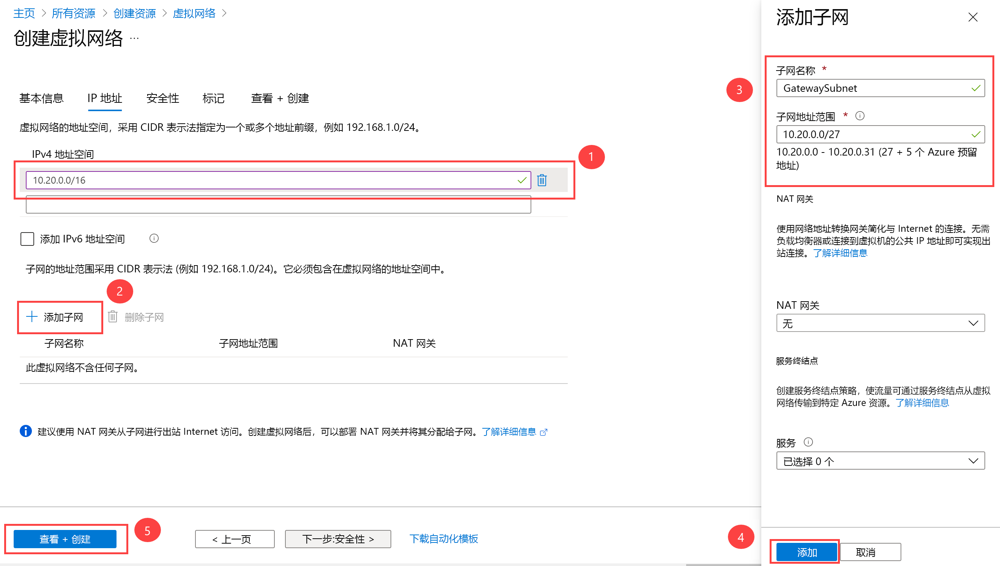

---
Exercise:
  title: 模块 03 - 第 4 单元 配置 ExpressRoute 网关
  module: Module 03 - Design and implement Azure ExpressRoute
---
# 模块 03-第 4 单元 配置 ExpressRoute 网关

## 练习场景

若要通过 ExpressRoute 连接 Azure 虚拟网络和本地网络，必须首先创建虚拟网络网关。 虚拟网络网关有两个用途：在网络之间交换 IP 路由和路由网络流量。

### 预计用时：60 分钟（包括约 45 分钟的部署等待时间）

网关类型

创建虚拟网络网关时，需要指定几项设置。 其中一个必要设置“-GatewayType”指定是否将网关用于 ExpressRoute 或 VPN 流量。 两种网关类型是：

- **VPN** - 若要通过公共 Internet 发送加密流量，请使用网关类型“VPN”。 这也称为 VPN 网关。 站点到站点连接、点到站点连接和 VNet 到 VNet 连接都使用 VPN 网关。
- **ExpressRoute** - 若要在专用连接上发送网络流量，请使用网关类型“ExpressRoute”。 这也称为 ExpressRoute 网关，是配置 ExpressRoute 时使用的网关类型。

对于每种网关类型，每个虚拟网络只能有一个虚拟网络网关。 例如，一个虚拟网络网关使用 -GatewayType VPN，另一个使用 -GatewayType ExpressRoute。

### 工作技能

通过学习本练习，你将能够：

- 任务 1：创建 VNet 和网关子网
- 任务 2：创建虚拟网络网关。

## 任务 1：创建 VNet 和网关子网

1. 在任意 Azure 门户页上的“搜索资源、服务和文档”中，输入“虚拟网络”，然后从结果中选择“虚拟网络” 。

1. 在“虚拟网络”页上选择“+ 创建”。

1. 在“创建虚拟网络”窗格上的“基本信息”选项卡上，使用下表中的信息创建 VNet：

   | 设置          | 值                        |
   | -------------------- | -------------------------------- |
   | 虚拟网络名称 | CoreServicesVnet                 |
   | 资源组       | ContosoResourceGroup             |
   | 位置             | 美国东部                          |

1. 选择“下一步: IP 地址”。

1. 在“IP 地址”选项卡上的“IPv4 地址空间”中，输入 10.20.0.0/16，然后选择“+ 添加子网”。

1. 在“添加子网”窗格中，使用下表中的信息创建子网：

   | 设置                  | **值**               |
   | ---------------------------- | ----------------------- |
   | 子网用途               | 虚拟网络网关 |
   | 网关子网地址空间 | 10.20.0.0/27            |

请注意，将自动填充子网名称。

1. 然后选择“添加”。

1. 在“创建虚拟网络”页面上，选择“审阅 + 创建”。

   

1. 确认 VNet 通过验证，然后选择“创建”。

   >**备注：** 如果使用的是双堆栈虚拟网络，并计划通过 ExpressRoute 使用基于 IPv6 的专用对等互连，请选择“添加 IPv6 地址空间”并输入 IPv6 地址范围值。

## 任务 2：创建虚拟网络网关。

1. 在任意 Azure 门户页上的“搜索资源、服务和文档 (G+/)”中，输入“虚拟网络网关”，然后从结果中选择“虚拟网络网关” 。

1. 在“虚拟网络网关”页上，选择“+ 创建”。

1. 在“创建虚拟网络网关”页上，使用下表中的信息创建网关：

   | 设置               | **值**                  |
   | ------------------------- | -------------------------- |
   | **项目详细信息**       |                            |
   | 资源组            | ContosoResourceGroup       |
   | **实例详细信息**      |                            |
   | 名称                      | CoreServicesVnetGateway    |
   | 区域                    | 美国东部                    |
   | 网关类型              | ExpressRoute               |
   | SKU                       | 标准                   |
   | 虚拟网络           | CoreServicesVnet           |
   | 子网                    | GatewaySubnet              |
   
1. 选择“查看 + 创建”  。

1. 确认网关配置通过验证，然后选择“创建”。

1. 完成部署后，选择“转到资源”。

   >**注：** 部署网关最多可能需要耗费 45 分钟。

## 使用 Copilot 扩展学习

Copilot 可帮助你了解如何使用 Azure 脚本工具。 Copilot 还可以帮助了解实验室中未涵盖的领域或需要更多信息的领域。 打开 Edge 浏览器并选择“Copilot”（右上角）或导航到*copilot.microsoft.com*。 花几分钟时间尝试这些提示。
+ Azure ExpressRoute 与 虚拟 WAN 有何不同？ 你能否结合使用各种技术？ 提供示例。
+ 在 ExpressRoute 提供程序模型和 ExpressRoute Direct 之间进行选择时，应考虑哪些因素？
+ 创建汇总 Azure ExpressRoute SKU 及其功能的表。

## 通过自定进度的培训了解详细信息

+ [Azure ExpressRoute 简介](https://learn.microsoft.com/training/modules/intro-to-azure-expressroute/)。 在本模块中，了解 Azure ExpressRoute 是什么及其提供的功能。
+ [设计和实现 ExpressRoute](https://learn.microsoft.com/training/modules/design-implement-azure-expressroute/)。 在本模块中，了解如何设计和实现 Azure ExpressRoute、ExpressRoute Global Reach 和 ExpressRoute FastPath。

## 关键结论

恭喜你完成本实验室的内容。 下面是本实验室的主要重点。 
+ 借助 Azure ExpressRoute，组织可以将其本地网络直接连接到 Microsoft Azure 和 Microsoft 365 云。 Azure ExpressRoute 使用由 Microsoft 合作伙伴提供的专用高带宽连接。
+ Microsoft 保证 ExpressRoute 专用连接的可用性至少为 99.95%。 连接是专用的，通过专线传输，第三方无法拦截流量。
+ 在本地网络和 Microsoft 云之间创建连接时，可以采用四种不同的方式：CloudExchange 归置、点到点以太网连接、任意位置之间的 (IPVPN) 连接 和 ExpressRoute Direct。
+ ExpressRoute 功能由 SKU 决定：本地版、标准版和高级版。 

