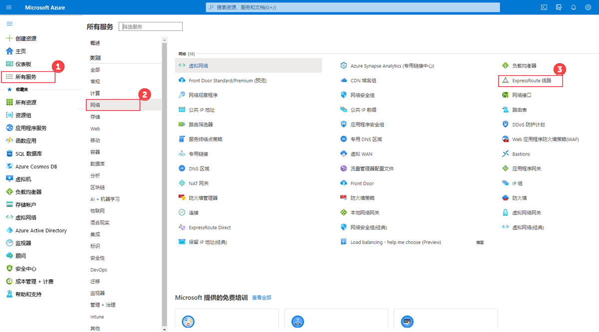
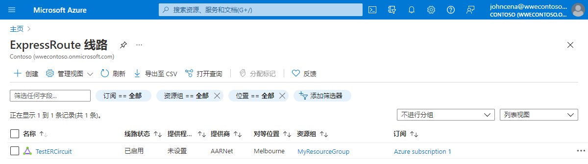
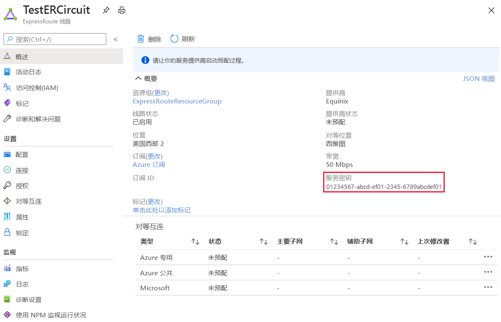
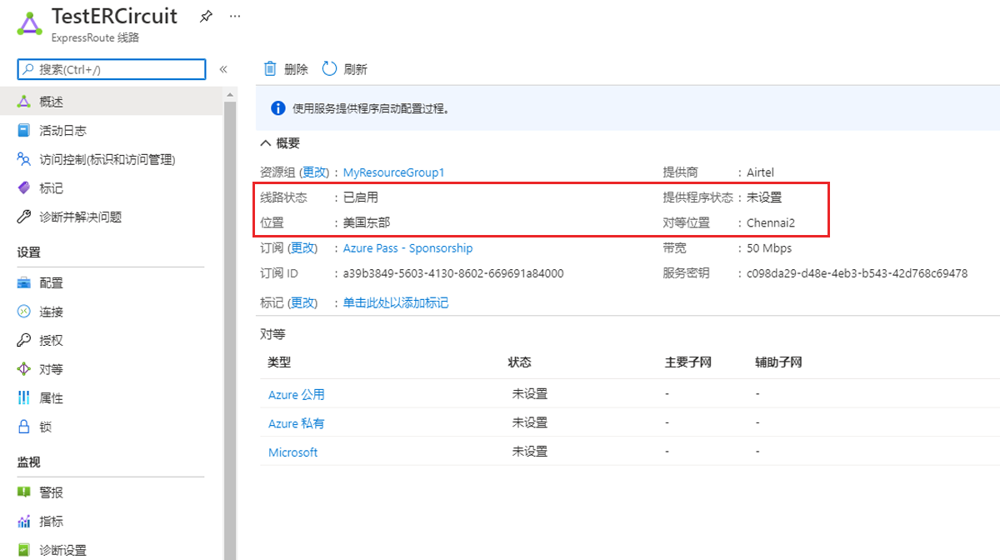
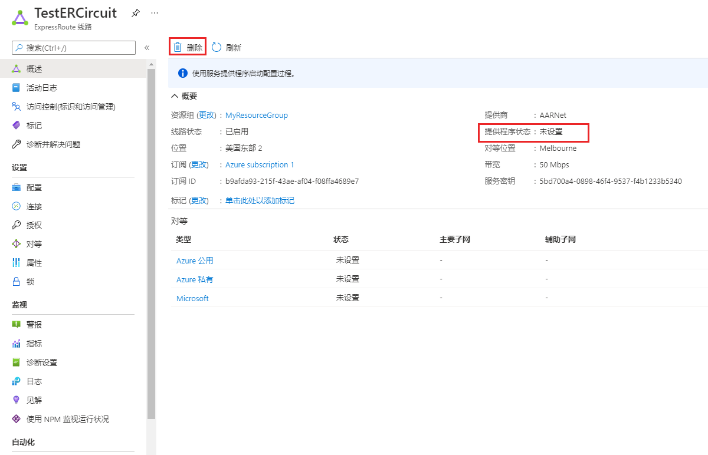

---
Exercise:
  title: 模块 03 - 第 5 单元 预配 ExpressRoute 线路
  module: Module 03 - Design and implement Azure ExpressRoute
---
# 模块 03-第 5 单元 预配 ExpressRoute 线路

## 练习场景

在本练习中，你将使用 Azure 门户和 Azure 资源管理器部署模型创建 ExpressRoute 线路。

**注意：** 我们提供 **[交互式实验室模拟](https://mslabs.cloudguides.com/guides/AZ-700%20Lab%20Simulation%20-%20Provision%20an%20ExpressRoute%20circuit)** ，让你能以自己的节奏点击浏览实验室。 你可能会发现交互式模拟与托管实验室之间存在细微差异，但演示的核心概念和思想是相同的。

### 预计用时：15 分钟


通过学习本练习，你将能够：

+ 任务 1：创建和预配 ExpressRoute 线路
+ 任务 2：检索服务密钥
+ 任务 3：取消预配 ExpressRoute 线路
+ 任务 4：清理资源

## 任务 1：创建和预配 ExpressRoute 线路

1. 从浏览器导航到 [Azure 门户](https://portal.azure.com/)并使用 Azure 帐户登录。

   > [!Important]
   >
   > 从发布服务密钥的那一刻起，将对 ExpressRoute 线路进行计费。 确保连接服务提供商准备好预配线路后就执行此操作。

1. 在 Azure 门户菜单中，选择“+ 创建资源”****。 选择“网络”，然后选择“ExpressRoute”，如下图所示。 如果列表中未显示 ExpressRoute，请使用“搜索市场”对其进行搜索：

   

1. 在“创建 ExpressRoute”页上，使用以下项提供线路的“资源组”、“区域”和“名称”   。ExpressRouteResourceGroup、美国东部 2、TestERCircuit。 然后选择“下一步: 配置 &gt;”。

1. 在此页上填写值时，对于此示例，请确保指定正确的 SKU 层（标准）数据计量计费模型（按流量计费）提供程序 (Equinix) 对等互连位置 (Seattle) 和带宽 (50Mbps)    。

1. 选择“查看 + 创建”  。

1. 确认 ExpressRoute 配置通过验证，然后选择“创建”。


+ 端口类型确定你是连接到服务提供商还是直接在对等位置连接到 Microsoft 的全球网络。
+ 新建或从经典线路中导入确定是要创建新线路还是要将经典线路迁移到 Azure 资源管理器。
+ 提供商指你将向其请求提供服务的 Internet 服务提供商。
+ “对等互连位置”  是与 Microsoft 建立对等互连的实际位置。

> [!Important]
>
> “对等互连位置”指明了与 Microsoft 建立对等互连的[实际位置](https://docs.microsoft.com/en-us/azure/expressroute/expressroute-locations)。 此位置与“Location”属性 没有 关系，后者指的是 Azure 网络资源提供商所在的地理位置。 尽管两者之间没有关系，但最好是选择地理上与线路对等互连位置靠近的网络资源提供商。

+ **SKU** 确定是启用 ExpressRoute 本地版、ExpressRoute 标准版还是 ExpressRoute 高级版加载项。 可以指定“本地”以获取本地 SKU，指定“标准”以获取标准 SKU，或指定“高级”以获取高级版加载项  。 可以更改 SKU 以启用高级版加载项。

> [!Important]
>
> 不能将 SKU 从“标准”/“高级”更改为“本地” 。

+ **计费模型**确定计费类型。 可以指定“Metered”**** 以获取数据流量套餐，指定“Unlimited”**** 以获取无限制流量套餐。 可以将计费类型从“按流量计费”更改为“不限流量” 。

> [!Important]
>
> 无法将类型从“不限流量”更改为“按流量计费”。

+ **允许经典操作**将允许经典虚拟网络链接到线路。

## 任务 2：检索服务密钥

1. 可以通过选择“所有服务”&gt;“网络”&gt;“ExpressRoute 线路”，来查看创建的所有线路。

   

1. 在订阅中创建的所有 ExpressRoute 线路都将在此处显示。

   

1. “线路”页显示线路的属性。 服务密匙字段中显示服务密匙。 服务提供商将需要“服务密钥”来完成预配过程。 服务密钥为线路专属。 **必须将服务密钥发送给连接服务提供商进行预配。**

   

1. 在此页上，“提供商状态”指明了服务提供商端的当前预配状态。 “线路状态”指明了 Microsoft 端的状态。

1. 创建新的 ExpressRoute 线路时，线路将为以下状态：

   + 提供程序状态：未预配
   + 线路状态：已启用

   + 当连接服务提供商正在为你启用线路时，线路将更改为以下状态：
     + 提供商状态：正在预配
     + 线路状态：已启用
   + 若要使用 ExpressRoute 线路，该线路必须处于以下状态：
     + 提供商状态：已预配
     + 线路状态：已启用
   + 应定期检查预配状态和线路状态。



祝贺你！ 已经创建了一个 ExpressRoute 线路，并找到了该服务密钥，这需要完成对线路的预配。

## 任务 3：取消预配 ExpressRoute 线路

如果 ExpressRoute 线路服务提供商预配状态为“正在预配”或“已预配”，则必须与服务提供商合作，在他们那一端取消预配线路。 在服务提供商取消对线路的预配并向我们发送通知之前，Microsoft 将继续保留资源并向你收费。

> [!Note]
>
> 在取消预配前，必须取消所有虚拟网络与 ExpressRoute 线路的链接。 如果此操作失败，请检查是否有虚拟网络链接到了该线路。
>
> 如果服务提供商已取消预配线路（服务提供商预配状态设置为“未预配”），则可以删除线路。 这样就会停止对线路的计费。

## 任务 4：清理资源

可以选择“删除”图标来删除 ExpressRoute 线路。 请先确保提供程序状态为“未预配”，然后再继续操作。



   >**注意**：记得删除所有不再使用的新建 Azure 资源。 删除未使用的资源可确保不会出现意外费用。

1. 在 Azure 门户的“Cloud Shell”窗格中打开“PowerShell”会话 。

1. 通过运行以下命令，删除在此模块的实验室中创建的所有资源组：

   ```powershell
   Remove-AzResourceGroup -Name 'ContosoResourceGroup' -Force -AsJob
   Remove-AzResourceGroup -Name 'ExpressRouteResourceGroup' -Force -AsJob
   ```

   >**注意**：该命令以异步方式执行（由 -AsJob 参数决定），因此，虽然你可以随后立即在同一个 PowerShell 会话中运行另一个 PowerShell 命令，但需要几分钟才能实际删除资源组。
