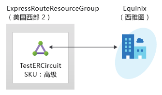
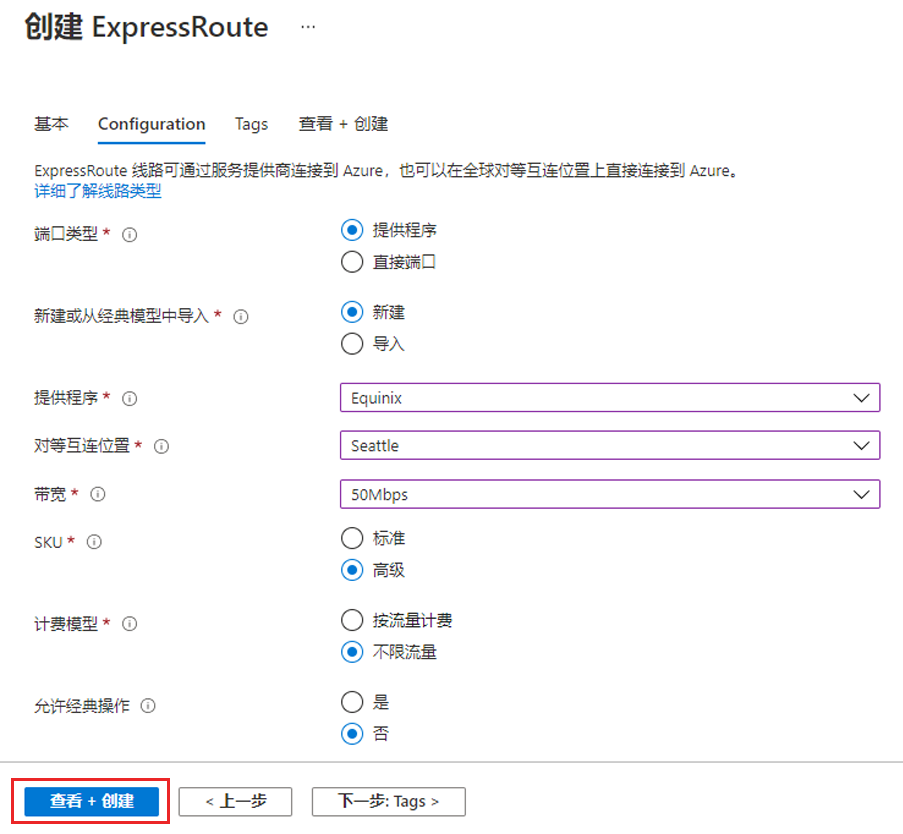

---
Exercise:
    title: '模块 03-第 5 单元 预配 ExpressRoute 线路'
    module: '模块 - 设计和实现 Azure ExpressRoute'
---
# 模块 03-第 5 单元 预配 ExpressRoute 线路

在本练习中，你将使用 Azure 门户和 Azure 资源管理器部署模型创建 ExpressRoute 线路。 



若要观看演示了解如何创建 ExpressRoute 线路，请查看 [Azure ExpressRoute - 如何创建 ExpressRoute 线路 | Azure | 第 9 频道 (msdn.com)](https://channel9.msdn.com/Blogs/Azure/Azure-ExpressRoute-How-to-create-an-ExpressRoute-circuit?term=ExpressRoute&lang-en=true&pageSize=15&skip=15)。


在本练习中，你将：

+ 任务 1：创建和预配 ExpressRoute 线路
+ 任务 2：检索服务密钥
+ 任务 3：取消预配 ExpressRoute 线路
+ 任务 4：清理资源


## 任务 1：创建和预配 ExpressRoute 线路

 

1. 从浏览器导航到 [Azure 门户](https://portal.azure.com/)并使用 Azure 帐户登录。

   > [!注意事项] 
   >
   > 从发布服务密钥的那一刻起，将对 ExpressRoute 线路进行计费。确保连接服务提供商准备好预配线路后就执行此操作。

2. 在 Azure 门户菜单中，选择“**+ 创建资源**”。选择“**网络**”，然后选择“**ExpressRoute**”，如下图中所示。如果列表中未显示“ExpressRoute”，使用“**搜索市场**”进行搜索：

   

3. 在“**创建 ExpressRoute**”页上，使用以下项提供线路的“**资源组**”、“**区域**”和“**名称**”。ExpressRouteResourceGroup、美国东部 2、TestERCircuit.然后选择“**下一步: 配置 >**”。

4. 在此页上填写相应值时，请务必指定正确的 SKU 层（“本地”、“标准”或“高级”）和数据计量计费模型（“不限流量”或“按流量计费”）。



 

- 端口类型确定你是连接到服务提供商还是直接在对等互连位置连接到 Microsoft 的全球网络。
- 新建或从经典线路中导入确定是要创建新线路还是要将经典线路迁移到 Azure 资源管理器。
- 提供商指你将向其请求提供服务的 Internet 服务提供商。
- 对等互连位置是与 Microsoft 建立对等互连的实际位置。

> [!注意事项]
>
> “对等互连位置”指示与 Microsoft 建立对等互连的[实际位置](https://docs.microsoft.com/zh-cn/azure/expressroute/expressroute-locations)。此位置与“Location”属性没有关系，后者指的是 Azure 网络资源提供商所在的地理位置。尽管两者之间没有关系，但最好是选择地理上与线路对等互连位置靠近的网络资源提供商。

- **SKU** 确定是启用 ExpressRoute 本地版、ExpressRoute 标准版还是 ExpressRoute 高级版加载项。可以指定“**本地**”以获取本地 SKU，指定“**标准**”以获取标准 SKU，或指定“**高级**”以获取高级版加载项。可以更改 SKU 以启用高级版加载项。

> [!注意事项]
>
> 不能将 SKU 从“标准”/“高级”更改为“本地”。

- **计费模型**确定计费类型。可以指定“按流量计费”以获取数据流量套餐，指定“**不限流量**”以获取不限流量套餐。可以将计费类型从“**按流量计费**”更改为“**不限流量**”。

> [!注意事项]
>
> 你无法将类型从“不限流量”更改为“按流量计费”。

- “**允许经典操作**”将允许经典虚拟网络链接到线路。

## 任务 2：检索服务密钥
 

1. 选择“**所有服务”>“网络”>“ExpressRoute 线路**”，即可查看创建的所有线路。

   

2. 在订阅中创建的所有 ExpressRoute 线路都将在此处显示。 

   

3. 线路页显示线路的属性。“服务密钥”字段中显示服务密钥。服务提供商将需要使用服务密钥来完成预配过程。服务密钥为线路专属。**务必将服务密钥发送给连接服务提供商进行预配。**

   

4. 在此页上，“**提供商状态**”指明了服务提供商端的当前预配状态。“**线路状态**”指明了 Microsoft 端的状态。 

5. 创建新的 ExpressRoute 线路时，线路将为以下状态：

   - 提供商状态：未预配
   - 线路状态：已启用


   - 在连接服务提供商当前正在为你启用线路时，线路将更改为以下状态：
     - 提供商状态：正在预配
     - 线路状态：已启用
   - 若要使用 ExpressRoute 线路，该线路必须处于以下状态：
     - 提供商状态：已预配
     - 线路状态：已启用
   - 应定期检查预配状态和线路状态的状态。


 
观看该演示，了解如何创建和预配 ExpressRoute 线路：[Azure ExpressRoute - 如何创建 ExpressRoute 线路 | Azure | 第 9 频道 (msdn.com)](https://channel9.msdn.com/Blogs/Azure/Azure-ExpressRoute-How-to-create-an-ExpressRoute-circuit?term=ExpressRoute&lang-en=true&pageSize=15&skip=15)。 

恭喜！你已创建 ExpressRoute 线路并找到了服务密钥，在完成对线路的预配时将需要使用此密钥。

## 任务 3：取消预配 ExpressRoute 线路

如果 ExpressRoute 线路服务提供商预配状态为“**正在预配**”或“**已预配**”，则必须与服务提供商合作，在他们一端将线路解除预配。服务提供商取消预配线路并通知 Microsoft 之前，Microsoft 会继续保留资源并向你收费。

> [!备注]
>
> 在取消预配前，必须取消所有虚拟网络与 ExpressRoute 线路的链接。如果此操作失败，请检查是否有虚拟网络链接到了该线路。
>
> 如果服务提供商已取消预配线路（服务提供商预配状态设置为“未预配”），则可以删除线路。这样就会停止对线路的计费。

## 任务 4：清理资源

可以选择“**删除**”图标来删除 ExpressRoute 线路。请先确保提供商状态为“未预配”，然后再继续操作。


   >**备注**：请记得删除不再使用的所有新创建的 Azure 资源。删除未使用的资源，确保不产生意外费用。

1. 在 Azure 门户中，在“**Cloud Shell**”窗格中打开“**PowerShell**”会话。

1. 运行以下命令，删除在本模块各个实验室中创建的所有资源组：

   ```powershell
   Remove-AzResourceGroup -Name 'ContosoResourceGroup' -Force -AsJob
   Remove-AzResourceGroup -Name 'ExpressRouteResourceGroup' -Force -AsJob
   ```
   >**备注**：该命令以异步方式执行（由 -AsJob 参数决定），因此，虽然你随后可在同一 PowerShell 会话中立即运行另一个 PowerShell 命令，但实际上要花几分钟才能删除资源组。


