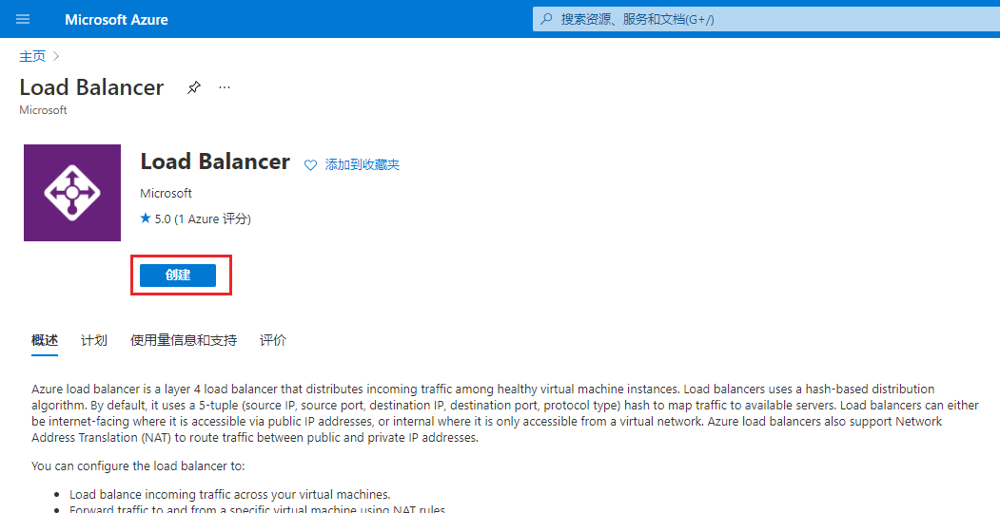

---
Exercise:
    title: '模块 04-第 4 单元 创建并配置 Azure 负载均衡器'
    module: '模块 - 在 Azure 中对非 HTTP(S) 流量进行负载均衡'
---


# 模块 04-第 4 单元 创建并配置 Azure 负载均衡器

在本练习中，你将为虚构的 Contoso Ltd 组织创建内部负载均衡器。 

创建内部负载均衡器的步骤和你在本模块中了解的创建公共负载均衡器的步骤非常类似。关键区别在于，对于公共负载均衡器，前端是通过公共 IP 地址访问的，你从位于虚拟网络外的主机测试连接性；而对于内部负载平衡器，前端是虚拟网络内的专用 IP 地址，你从同一网络内的主机测试连接性。

下图说明了将在本练习中部署的环境。


 
在本练习中，你将：

+ 任务 1：创建虚拟网络
+ 任务 2：创建后端服务器
+ 任务 3：创建负载均衡器
+ 任务 4：创建负载均衡器资源
+ 任务 5：测试负载均衡器

## 任务 1：创建虚拟网络

在本部分中，你将创建虚拟网络和子网。
   
1. 登录 Azure 门户。

2. 在 Azure 门户主页上，导航到全局搜索栏，搜索“**虚拟网络**”并选择服务下的虚拟网络。  
   

3. 在“**虚拟网络**”页上选择“**创建**”。  
   

4. 在“**基本信息**”选项卡上，使用下表中的信息创建虚拟网络。

   | **设置**    | **值**                                  |
   | -------------- | ------------------------------------------ |
   | 订阅   | 选择你的订阅                   |
   | 资源组 | 选择“**新建**”，名称：**IntLB-RG** |
   | 名称           | **IntLB-VNet**                             |
   | 区域         | **（美国）美国东部**                           |


5. 单击“**下一步: IP 地址**”。

6. 在“**IP 地址**”选项卡上的“**IPv4 地址空间**”框中，删除默认值，然后键入“**10.1.0.0/16**”。

7. 在“**IP 地址**”选项卡中，单击“**+ 添加子网**”。

8. 在“**添加子网**”窗格中，提供子网名称“**myBackendSubnet**”，以及子网地址范围“**10.1.0.0/24**”。

9. 单击“**添加**”。

10. 单击“**添加子网**”，然后提供子网名称“**myFrontEndSubnet**”以及子网地址范围“**10.1.2.0/24**”。单击“**添加**”

11. 单击“**下一步: 安全性**”。

12. 在“**BastionHost**”下，选择“**启用**”，然后输入下表中的信息。

    | **设置**                       | **值**                                     |
    | --------------------------------- | --------------------------------------------- |
    | Bastion 名称                      | **myBastionHost**                             |
    | AzureBastionSubnet 地址空间 | **10.1.1.0/24**                               |
    | 公共 IP 地址                 | 选择“**新建**”，名称： **myBastionIP** |


13. 单击“**查看 + 创建**”。

14. 单击“**创建**”。

## 任务 2：创建后端服务器

在本部分中，你将为负载均衡器的后端池创建三台同一可用性集中的 VM，将这些 VM 添加到后端池，然后在这三台 VM 上安装 IIS 以测试负载均衡器。

1. 在 Azure 门户中，在“**Cloud Shell**”窗格中打开“**PowerShell**”会话。

2. 在“Cloud Shell”窗格的工具栏中单击“上传/下载文件”图标，在下拉菜单中单击“上传”，然后将以下文件上传到 Cloud Shell 主目录中：azuredeploy.json、azuredeploy.parameters.vm1.json、azuredeploy.parameters.vm2.json 和 azuredeploy.parameters.vm3.json。

3. 部署以下 ARM 模板以创建本练习所需的虚拟网络、子网和 VM：

   ```powershell
   $RGName = "IntLB-RG"
   
   New-AzResourceGroupDeployment -ResourceGroupName $RGName -TemplateFile azuredeploy.json -TemplateParameterFile azuredeploy.parameters.vm1.json
   New-AzResourceGroupDeployment -ResourceGroupName $RGName -TemplateFile azuredeploy.json -TemplateParameterFile azuredeploy.parameters.vm2.json
   New-AzResourceGroupDeployment -ResourceGroupName $RGName -TemplateFile azuredeploy.json -TemplateParameterFile azuredeploy.parameters.vm3.json
   ```

## 任务 3：创建负载均衡器

在本部分中，你将创建一个内部标准 SKU 负载均衡器。在练习中创建标准 SKU 负载均衡器而不是基本 SKU 负载均衡器的原因是后面的练习中需要标准 SKU 版本的负载均衡器。

1. 在 Azure 门户主页上，单击“**创建资源**”。

2. 在页面顶部的搜索框中，键入“**负载均衡器**”，然后按 **Enter** （**备注：** 请勿从列表中选择）。

3. 在结果页面上，找到并选择“**负载均衡器**”（名称下方写有“Microsoft”和“Azure 服务”）。

4. 单击“**创建**”。
   

5. 在“**基本信息**”选项卡上，使用下表中的信息创建负载均衡器。

   | **设置**           | **值**                |
   | --------------------- | ------------------------ |
   | 订阅          | 选择你的订阅 |
   | 资源组        | **IntLB-RG**             |
   | 名称                  | **myIntLoadBalancer**    |
   | 区域                | **（美国）美国东部**         |
   | 类型                  | **内部**             |
   | SKU                   | **标准**             |


6. 单击“**下一步:  前端 IP 配置**”。
7. 单击“添加前端 IP”
8. 在“**添加前端 IP 地址**”边栏选项卡上，输入下表中的信息。
 
   | **设置**     | **值**                |
   | --------------- | ------------------------ |
   | 名称            | **LoadBalancerFrontEnd** |
   | 虚拟网络 | **IntLB-VNet**           |
   | 子网          | **myFrontEndSubnet**     |
   | 分配      | **动态**              |

9. 单击“**查看 + 创建**”。

10. 单击“**创建**”。

## 任务 4：创建负载均衡器资源

在本部分中，将为后端地址池配置负载均衡器设置，然后创建运行状况探测和负载均衡器规则。

### 创建后端池，并将 VM 添加到该后端池中

后端地址池包含连接到负载均衡器的虚拟 NIC 的 IP 地址。

1. 在 Azure 门户主页上，单击“**所有资源**”，然后单击资源列表中的“**myIntLoadBalancer**”。

2. 在“**设置**”下方，选择“**后端池**”，然后单击“**添加**”。

3. 在“**添加后端池**”页上，输入下表中的信息。

   | **设置**     | **值**            |
   | --------------- | -------------------- |
   | 名称            | **myBackendPool**    |
   | 虚拟网络 | **IntLB-VNet**       |


4. 在“**虚拟机**”下，单击“**添加**”。

5. 选择所有这 3 台 VM（**myVM1**、 **myVM2** 和 **myVM3**）的复选框，然后单击“**添加**”。

6. 单击“**添加**”。
   
   

### 创建运行状况探测

负载均衡器使用运行状况探测监视应用的状态。运行状况探测基于 VM 对运行状况检查的响应，在负载均衡器中添加或删除 VM。这里你将创建运行状况探测来监视 VM 的运行状况。

1. 在“**设置**”下单击“**运行状况探测**”，然后单击“**添加**”。

2. 在“**添加运行状况探测**”页上，输入下表中的信息。

   | **设置**         | **值**         |
   | ------------------- | ----------------- |
   | 名称                | **myHealthProbe** |
   | 协议            | **HTTP**          |
   | 端口                | **80**            |
   | 路径                | **/**             |
   | 间隔            | **15**            |
   | 运行不正常阈值 | **2**             |


3. 单击“**添加**”。
   

 

### 创建负载均衡器规则

负载均衡器规则用于定义如何将流量分配到 VM。定义传入流量的前端 IP 配置和后端 IP 池以接收流量。源端口和目标端口在规则中定义。此时将要创建负载均衡器规则。

1. 在负载均衡器的“**后端池**”页的“**设置**”下方，单击“**负载均衡规则**”，然后单击“**添加**”。

2. 在“**添加负载均衡规则**”页上，输入下表中的信息。

   | **设置**            | **值**                |
   | ---------------------- | ------------------------ |
   | 名称                   | **myHTTPRule**           |
   | IP 版本             | **IPv4**                 |
   | 前端 IP 地址    | **LoadBalancerFrontEnd** |
   | 协议               | **TCP**                  |
   | 端口                   | **80**                   |
   | 后端端口           | **80**                   |
   | 后端池           | **myBackendPool**        |
   | 运行状况探测           | **myHealthProbe**        |
   | 会话持续性    | **无**                 |
   | 空闲超时（分钟） | **15**                   |
   | 浮动 IP            | **已禁用**             |


3. 单击“**添加**”。
   

 


 

 

## 任务 5：测试负载均衡器

在本部分，你将创建测试 VM，然后测试负载均衡器。

### 创建测试 VM

1. 在 Azure 门户主页上，依次单击“**创建资源**”和“**计算**”，然后选择“**虚拟机**”（如果此页中未列出此资源类型，请使用页面顶部的搜索框进行搜索，然后选择此资源类型）。

2. 在“**创建虚拟机**”页的“**基本信息**”选项卡中，使用下表中的信息创建第一台 VM。

   | **设置**          | **值**                                    |
   | -------------------- | -------------------------------------------- |
   | 订阅         | 选择你的订阅                     |
   | 资源组       | **IntLB-RG**                                 |
   | 虚拟机名称 | **myTestVM**                                 |
   | 区域               | **（美国）美国东部**                             |
   | 可用性选项 | **无需基础结构冗余**    |
   | 映像                | **Windows Server 2019 Datacenter - Gen 1**   |
   | 大小                 | **Standard_DS1_v2 - 1 vcpu，3.5 GiB 内存** |
   | 用户名             | **TestUser**                                 |
   | 密码             | **TestPa$$w0rd!**                            |
   | 确认密码     | **TestPa$$w0rd!**                            |


3. 单击“**下一步: 磁盘**”，然后单击“**下一步: 网络**”。 

4. 在“**网络**”选项卡上，使用下表中的信息配置网络设置。

   | **设置**                                                  | **值**                     |
   | ------------------------------------------------------------ | ----------------------------- |
   | 虚拟网络                                              | **IntLB-VNet**                |
   | 子网                                                       | **myBackendSubnet**           |
   | 公共 IP                                                    | 更改到“**无**”            |
   | NIC 网络安全组                                   | **高级**                  |
   | 配置网络安全组                             | 选择现有的“**myNSG**” |
   | 将此虚拟机置于现有负载均衡解决方案之后？ | “**关闭**”（未选中）           |


5. 单击“**查看 + 创建**”。

6. 单击“**创建**”。

7. 待最后一台 VM 部署完毕后，再执行下一任务。

### 连接到测试 VM 以测试负载均衡器

1. 在 Azure 门户主页上，单击“**所有资源**”，然后单击资源列表中的“**myIntLoadBalancer**”。

2. 在“**概述**”页上，记录**专用 IP 地址**，或将其复制到剪贴板。备注：可能需要选择“**查看更多**”才能查看“**专用 IP 地址**”字段。

3. 单击“**主页**”，在 Azure 门户主页上单击“**所有资源**”，然后单击刚创建的“**myTestVM**”虚拟机。

4. 在“**概述**”页上，选择“**连接**”，然后选择“**Bastion**”。

5. 单击“**使用 Bastion**”。

6. 在“**用户名**”框中，键入“**TestUser**”，在“**密码**”框中，键入“**TestPa$$w0rd!**”，然后单击“**连接**”。

7. “**myTestVM**”窗口将在另一个浏览器选项卡中打开。

8. 如果出现“**网络**”窗格，单击“**是**”。

9. 在任务栏中单击 **Internet Explorer** 图标以打开 Web 浏览器。

10. 在“**设置 Internet Explorer 11**”对话框中单击“**确定**”。

11. 在浏览器地址栏中输入（或粘贴）上一步骤中的**专用 IP 地址**（如 10.1.0.4），然后按 Enter。

12. IIS Web 服务器的默认主页会显示在浏览器窗口中。后端池中三台虚拟机中的一台会响应。
    

13. 如果在浏览器中多次单击“刷新”按钮，可以看到响应是随机来自内部负载均衡器的后端池中的不同 VM。
    

## 清理资源

   >**备注**： 请记得删除不再使用的所有新创建的 Azure 资源。删除未使用的资源，确保不产生意外费用。

1. 在 Azure 门户中，在“**Cloud Shell**”窗格中打开“**PowerShell**”会话。

1. 运行以下命令，删除在本模块各个实验室中创建的所有资源组：

   ```powershell
   Remove-AzResourceGroup -Name 'IntLB-RG' -Force -AsJob
   ```

    >**备注**： 该命令异步执行（由 -AsJob 参数确定），因此尽管此后可以立即在同一 PowerShell 会话中运行另一个 PowerShell 命令，但实际上要花几分钟才能删除资源组。
