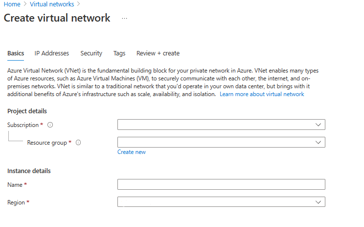

---
Exercise:
  title: 模块 04 - 第 4 单元 创建并配置 Azure 负载均衡器
  module: Module 04 - Load balancing non-HTTP(S) traffic in Azure
---


# 模块 04-第 4 单元 创建并配置 Azure 负载均衡器

在本练习中，你将为虚构的 Contoso Ltd 组织创建一个内部负载均衡器。

### 预计用时：60 分钟（包括约 45 分钟的部署等待时间）

创建内部负载均衡器的步骤与你在此模块中学到的创建公共负载均衡器的步骤非常相似。 主要区别在于，使用公共负载均衡器时，前端可通过公共 IP 地址访问，并从位于虚拟网络外部的主机测试连接；而使用内部负载均衡器时，前端是虚拟网络中的专用 IP 地址，并从来自同一网络内的主机测试连接。


### 工作技能

通过学习本练习，你将能够：

+ 任务 1：创建虚拟网络
+ 任务 2：创建后端服务器
+ 任务 3：创建负载均衡器
+ 任务 4：创建负载均衡器资源
+ 任务 5：测试负载均衡器

## 任务 1：创建虚拟网络

在本部分，你将创建虚拟网络和子网。

1. 登录到 Azure 门户。

2. 在 Azure 门户主页上，导航到“全局搜索”栏，搜索“虚拟网络”，然后在“服务”下选择“虚拟网络”。  

3. 在“虚拟网络”页上选择“创建”。  

4. 在“基本信息”选项卡上，使用下表中的信息创建虚拟网络。

   | **设置**    | 值                                  |
   | -------------- | ------------------------------------------ |
   | 订阅   | 选择订阅                   |
   | 资源组 | 选择“新建”  名称：IntLB-RG |
   | 名称           | IntLB-VNet                             |
   | 区域         | **（美国）美国东部**                           |

5. 选择**下一步**（将带你进入“安全性”选项卡）。

6. 在“**Azure Bastion**”下，选择“**启用 Azure Bastio**”，然后输入下表中的信息。

    | **设置**                   | **值**                                                    |
    | ----------------------------- | ------------------------------------------------------------ |
    | 主机名                     | myBastionHost                                            |
    | 公共 IP 地址             | 选择“**创建公共 IP 地址**” 名称：**myBastionIP** |

7. 选择“**下一步**”（将跳转到“IP 地址”选项卡）。

8. 在“IP 地址”选项卡上的“IPv4 地址空间”框中，将预填充的 IPv4 地址空间替换为********：10.1.0.0/16****。

9. 在“IP 地址”选项卡上的“子网”下，删除默认子网************。

10. 在“**IP 地址**”选项卡上，选择“**+ 添加子网**”。

11. 在“添加子网”窗格中，提供子网名称“myBackendSubnet”，以及起始地址********：10.1.0.0/24****。 选择“添加”****

12. 再次选择“+ 添加子网”，提供子网名称“myFrontEndSubnet”，以及子网地址********：10.1.2.0/24****。 选择“添加”****

13. 验证 AzureBastionSubnet 是否存在，需要时进行添加****。

14. 选择“查看 + 创建”。

15. 选择“创建”。

## 任务 2：创建后端服务器

在本部分中，你将为负载均衡器的后端池创建三个位于同一可用集的 VM，将这些 VM 添加到后端池，然后在这三个 VM 上安装 IIS 以测试负载均衡器。

1. 在 Azure 门户中，选择右上角的 Cloud Shell 图标。 如有必要，请配置 Shell。  
    + 选择“PowerShell”****。
    + 选择“**不需要存储帐户**”和“**订阅**”，然后选择“**应用**”。
    + 等待终端创建并显示提示。 

2. 在 Cloud Shell 窗格的工具栏中，选择“**上传/下载文件**”图标，在下拉菜单中选择“**上传**”，将 azuredeploy.json 和 azuredeploy.parameters.json 文件上传到 Cloud Shell 主目录中。

    > **备注：** 如果在自己的订阅中工作，则[模板文件](https://github.com/MicrosoftLearning/AZ-700-Designing-and-Implementing-Microsoft-Azure-Networking-Solutions/tree/master/Allfiles/Exercises)在 GitHub 实验室存储库中可用。

4. 部署以下 ARM 模板以创建此练习所需的 VM：

   >注意：系统会提示你提供管理员密码。

   ```powershell
   $RGName = "IntLB-RG"
   
   New-AzResourceGroupDeployment -ResourceGroupName $RGName -TemplateFile azuredeploy.json -TemplateParameterFile azuredeploy.parameters.json
   ```

创建这三个 VM 可能需要 5-10 分钟。 无需等待此作业完成，即可继续执行下一个任务。

## 任务 3：创建负载均衡器

在本部分中，你将创建一个内部标准 SKU 负载均衡器。 在此练习中创建标准 SKU 负载均衡器（而不是基本 SKU 负载均衡器）的原因是，之后的练习需要使用标准 SKU 版本的负载均衡器。

1. 在 Azure 门户主页上，选择“创建资源”。

1. 在页面顶部的搜索框中，输入“负载均衡器”，然后按“Enter”（注意：不要从列表中进行选择）  。

1. 在结果页面上，找到并选择“负载均衡器”（名称下显示“Microsoft”和“Azure Service”的那个）。

1. 选择“创建”。

1. 在“基本信息”选项卡上，使用下表中的信息创建负载均衡器。

   | **设置**           | 值                |
   | --------------------- | ------------------------ |
   | 订阅          | 选择订阅 |
   | 资源组        | IntLB-RG             |
   | 名称                  | myIntLoadBalancer    |
   | 区域                | **（美国）美国东部**         |
   | SKU                   | **标准**             |
   | 类型                  | **内部**             |
   | 层                  | **Regional**             |

1. 选择“下一步: 前端 IP 配置”。
   
1. 选择“添加前端 IP”

1. 在“添加前端 IP 地址”边栏选项卡上，输入下表中的信息，并选择“保存”********。

   | **设置**     | **值**                |
   | --------------- | ------------------------ |
   | 名称            | LoadBalancerFrontEnd |
   | 虚拟网络 | IntLB-VNet           |
   | 子网          | myFrontEndSubnet     |
   | 分配      | **动态**              |

1. 选择“查看 + 创建”。

1. 选择“创建”。

## 任务 4：创建负载均衡器资源

在本部分中，将为后端地址池配置负载均衡器设置，然后创建运行状况探测，并指定负载均衡器规则。

### 创建后端池，将 VM 添加到后端池

后端地址池包含连接到负载均衡器的虚拟 NIC 的 IP 地址。

1. 在 Azure 门户主页上，选择“所有资源”，然后在资源列表中选择“myIntLoadBalancer” 。

1. 在“设置”下，依次选择“后端池”、“添加”。

1. 在“添加后端池”页上，输入下表中的信息。

   | **设置**     | **值**            |
   | --------------- | -------------------- |
   | 名称            | myBackendPool    |
   | 虚拟网络 | IntLB-VNet       |

1. 在“虚拟机”下，选择“保存”********。

1. 选中所有 3 个 VM（myVM1、myVM2 和 myVM3）的复选框，然后选择“添加”   。

1. 选择“保存”。
   

### 创建运行状况探测器

负载均衡器使用运行状况探测器监视应用的状态。 运行状况探测器基于 VM 对运行状况检查的响应，在负载均衡器中添加或删除 VM。 你将在此处创建运行状况探测来监视 VM 的运行状况。

1. 在“设置”下，依次选择“运行状况探测”、“添加”。

1. 在“添加运行状况探测”页上，输入下表中的信息。

   | **设置**         | **值**         |
   | ------------------- | ----------------- |
   | 名称                | myHealthProbe |
   | 协议            | **HTTP**          |
   | 端口                | **80**            |
   | 路径                | **/**             |
   | 时间间隔            | **15**            |

1. 选择 **添加** 。
   

### 创建负载均衡器规则

负载均衡器规则用于定义将流量分配给 VM 的方式。 定义传入流量的前端 IP 配置和后端 IP 池以接收流量。 源端口和目标端口在规则中定义。 你将在此处创建负载均衡器规则。

1. 在“设置”下，依次选择“负载均衡规则”、“添加”。************

1. 在“添加负载均衡规则”页上，输入下表中的信息。

   | **设置**            | **值**                |
   | ---------------------- | ------------------------ |
   | 名称                   | myHTTPRule           |
   | IP 版本             | **IPv4**                 |
   | 前端 IP 地址    | LoadBalancerFrontEnd |
   | 后端池           | myBackendPool        |
   | 协议               | **TCP**                  |
   | 端口                   | **80**                   |
   | 后端端口           | **80**                   |
   | 运行状况探测           | myHealthProbe        |
   | 会话暂留    | **无**                 |
   | 空闲超时(分钟) | **15**                   |
   | 浮动 IP            | **已禁用**             |

1. 选择“保存”。
   

## 任务 5：测试负载均衡器

在本部分中，你将创建一个测试 VM，然后测试负载均衡器。

### 创建测试 VM

1. 在 Azure 门户主页上，依次选择“创建资源”、“虚拟”，然后选择“虚拟机”（如果页面上未列出此资源类型，请使用页面顶部的搜索框搜索并选择该资源类型）  。

1. 在“创建虚拟机”页的“基本信息”选项卡上，使用下表中的信息创建第一个 VM。

   | **设置**          | 值                                    |
   | -------------------- | -------------------------------------------- |
   | 订阅         | 选择订阅                     |
   | 资源组       | IntLB-RG                                 |
   | 虚拟机名称 | **myTestVM**                                 |
   | 区域               | **（美国）美国东部**                             |
   | 可用性选项 | 不需要基础结构冗余    |
   | 映像                | Windows Server 2019 Datacenter - Gen 2   |
   | 大小                 | Standard_DS2_v3 - 2 个 vCPU，8 GiB 内存   |
   | 用户名             | TestUser                                 |
   | 密码             | 提供安全密码                |
   | 确认密码     | 提供安全密码                |

1. 选择“下一步: 磁盘”，然后选择“下一步: 网络” 。

1. 在“网络”选项卡上，使用下表中的信息配置网络设置。

   | **设置**                                                  | **值**                     |
   | ------------------------------------------------------------ | ----------------------------- |
   | 虚拟网络                                              | IntLB-VNet                |
   | 子网                                                       | myBackendSubnet           |
   | 公共 IP                                                    | 更改为“无”            |
   | NIC 网络安全组                                   | **高级**                  |
   | 配置网络安全组                             | 选择现有的“myNSG” |
   | 负载均衡选项                                       | 无                      |

1. 选择“查看 + 创建”。

1. 选择“创建”。

1. 等待最后一个 VM 部署完毕，然后再继续执行下一任务。

### 连接到测试 VM 以测试负载均衡器

1. 在 Azure 门户主页上，选择“所有资源”，然后在资源列表中选择“myIntLoadBalancer” 。

1. 在“概述”页上，记下“专用 IP 地址”，或将其复制到剪贴板。 注意：可能需要选择“查看更多”才能看到“专用 IP 地址”字段。

1. 选择“主页”，在 Azure 门户主页上，选择“所有资源”，然后选择刚刚创建的 myTestVM 虚拟机  。

1. 在“概述”页上，选择“连接”，然后选择“Bastion”  。

1. 选择“使用 Bastion”。

1. 在“用户名”框中输入“TestUser”，在“密码”框中输入你创建的密码，然后选择“连接”   。 如果弹出窗口阻止程序在阻止新窗口，请允许弹出窗口阻止程序并再次连接。

1. 将在另一个浏览器标签页中打开“myTestVM”窗口。

1. 如果出现“网络”窗格，请选择“是” 。

1. 选择任务栏中的“Internet Explorer”图标以打开 Web 浏览器。

1. 在“设置 Internet Explorer 11”对话框中选择“确定” 。

1. 将上一步中的“专用 IP 地址”（例如 10.1.0.4）输入（或粘贴）到浏览器的地址栏中，然后按 Enter。

1. IIS Web 服务器的默认 Web 主页将显示在浏览器窗口中。 后端池中的三个虚拟机之一将做出响应。
    

1. 如果多次选择浏览器中的刷新按钮，则将看到响应是从内部负载均衡器后端池中的不同 VM 随机发出的。
    

## 清理资源

   >**注意**：记得删除所有不再使用的新建 Azure 资源。 删除未使用的资源可确保不会出现意外费用。

1. 在 Azure 门户的“Cloud Shell”窗格中打开“PowerShell”会话 。

1. 通过运行以下命令，删除在此模块的实验室中创建的所有资源组：

   ```powershell
   Remove-AzResourceGroup -Name 'IntLB-RG' -Force -AsJob
   ```

   >**注意**：该命令以异步方式执行（由 -AsJob 参数决定），因此，虽然你可以随后立即在同一个 PowerShell 会话中运行另一个 PowerShell 命令，但需要几分钟才能实际删除资源组。

## 使用 Copilot 扩展学习

Copilot 可帮助你了解如何使用 Azure 脚本工具。 Copilot 还可以帮助了解实验室中未涵盖的领域或需要更多信息的领域。 打开 Edge 浏览器并选择“Copilot”（右上角）或导航到*copilot.microsoft.com*。 花几分钟时间尝试这些提示。
+ Azure 公共和专用负载均衡器有何不同？ 提供每种类型的示例方案。
+ 提供一个表，用于比较 Azure 负载均衡器基本 SKU 和标准 SKU。
+ Azure 负载均衡器如何决定处理传入请求？


## 通过自定进度的培训了解详细信息
+ [Azure 负载均衡器简介](https://learn.microsoft.com/training/modules/intro-to-azure-load-balancer/)。 本模块说明 Azure 负载均衡器的功能、工作原理以及何时应选择使用 Azure 负载均衡器作为解决方案来满足组织的需求。
+ [Azure 负载均衡器的入站网络连接故障排除](https://learn.microsoft.com/en-us/training/modules/troubleshoot-inbound-connectivity-azure-load-balancer/)。 在本模块中，你将识别常见 Azure 负载均衡器入站连接问题并进行故障排除。

## 关键结论

恭喜你完成本实验室的内容。 下面是本实验室的主要重点。 
+ “负载均衡”是指在一组后端服务器或资源之间有效地分配传入的网络流量。
+ Azure 负载均衡器将来自负载均衡器前端的入站流分配到后端池实例。 这些流的分布依据为所配置的负载均衡规则和运行状况探测。 后端池实例可以是 Azure 虚拟机 (VM)，也可以是虚拟机规模集。
+ Azure 提供公共和专用负载均衡器。 公共负载均衡器非常适合面向 Internet 的应用程序、出站连接和 Web 应用程序。 专用负载均衡器更适用于内部应用程序、后端服务和混合方案。


