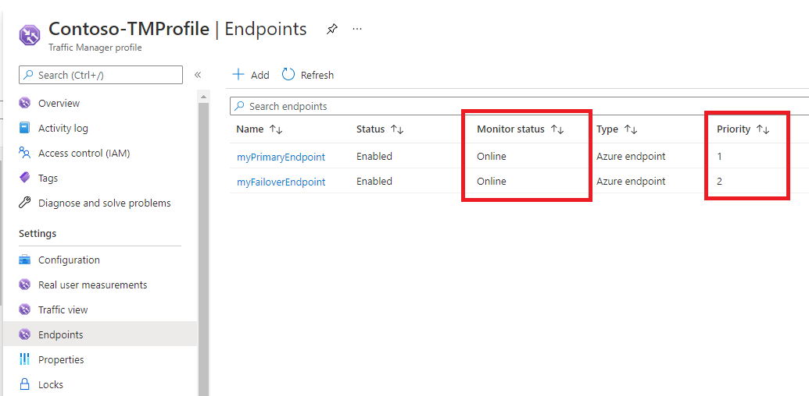

---
Exercise:
  title: 模块 04 - 第 6 单元 使用 Azure 门户创建流量管理器配置文件
  module: Module 04 - Load balancing non-HTTP(S) traffic in Azure
---

# <a name="m04-unit-6-create-a-traffic-manager-profile-using-the-azure-portal"></a>模块 04-第 6 单元 使用 Azure 门户创建流量管理器配置文件

在此练习中，你将创建一个流量管理器配置文件，以便为虚构的 Contoso Ltd 组织的 Web 应用程序提供高可用性。 

#### <a name="estimated-time-35-minutes"></a>预计用时：35 分钟

你需要创建在两个不同的区域（“美国东部”和“西欧”）部署的两个 Web 应用程序实例。 “美国东部”区域将充当流量管理器的主终结点，“西欧”区域将充当故障转移终结点。

需根据终结点优先级创建流量管理器配置文件。 此配置文件将用户流量定向到运行 Web 应用程序的主站点。 流量管理器将持续监视 Web 应用程序，如果美国东部的主站点不可用，它将提供在西欧自动故障转移到备份站点的功能。

下图大致介绍了将在本练习中部署的环境。

    

 通过学习本练习，你将能够：

+ 任务 1：创建 Web 应用
+ 任务 2：创建流量管理器配置文件
+ 任务 3：添加流量管理器终结点
+ 任务 4：测试流量管理器配置文件
+ 任务 5：清理资源


## <a name="task-1-create-the-web-apps"></a>任务 1：创建 Web 应用

在本部分中，将创建部署在两个不同 Azure 区域中的 Web 应用程序的两个实例。

1. 在 Azure 门户主页上，单击“创建资源”，然后选择“Web 应用”（如果页面上未列出此资源类型，请使用页面顶部的搜索框搜索并选择该资源类型）。

2. 在“创建 Web 应用”页的“基本信息”选项卡上，使用下表中的信息创建第一个 Web 应用。

   | **设置**      | 值                                                    |
   | ---------------- | ------------------------------------------------------------ |
   | 订阅     | 选择订阅                                     |
   | 资源组   | 选择“新建”  名称：Contoso-RG-TM1             |
   | 名称             | **ContosoWebAppEastUSxx**（其中 xx 是你的姓名首字母，以确保名称独一无二） |
   | 发布          | **代码**                                                     |
   | 运行时堆栈    | **ASP.NET V4.8**                                             |
   | 操作系统 | **Windows**                                                  |
   | 区域           | **美国东部**                                                  |
   | Windows 计划     | 选择“新建”  名称：ContosoAppServicePlanEastUS |
   | SKU 和大小     | **标准 S1，总共 100 个 ACU，1.75-GB 内存**               |


3. 单击“下一步: 部署”，然后单击“下一页: 监视”。

4. 在“监视”选项卡上，在“启用 Application Insights”中选择“否”选项。

5. 单击“查看 + 创建”。

   

6. 单击“**创建**”。 Web 应用在成功部署后会创建默认的网站。

7. 重复上述步骤 1-6，创建第二个 Web 应用。 除了下表中的信息以外，请使用与之前相同的设置。 

   | **设置**    | **值**                                                    |
   | -------------- | ------------------------------------------------------------ |
   | 资源组 | 选择“新建”  名称：Contoso-RG-TM2             |
   | 名称           | **ContosoWebAppWestEuropexx**（其中 xx 是你的姓名首字母，以确保名称独一无二）  |
   | 区域         | “西欧”                                              |
   | Windows 计划   | 选择“新建”  名称：ContosoAppServicePlanWestEurope |


8. 在 Azure 主页上，单击“所有服务”，在左侧导航菜单中，选择“Web”，然后单击“应用服务”。

9. 你应会看到列出的两个新 Web 应用。

   

 

## <a name="task-2-create-a-traffic-manager-profile"></a>任务 2：创建流量管理器配置文件

现在将创建流量管理器配置文件，以根据终结点优先级定向用户流量。

1. 在 Azure 门户主页上，单击“创建资源”。

2. 在页面顶部的“搜索”框中，键入“流量管理器配置文件”，然后从弹出列表中选择该配置文件。

   

3. 单击“**创建**”。

4. 在“创建流量管理器配置文件”页上，使用下表中的信息创建流量管理器配置文件。

   | **设置**             | **值**                |
   | ----------------------- | ------------------------ |
   | 名称                    | **Contoso-TMProfilexx**（其中 xx 是你的姓名首字母，以确保名称独一无二） |
   | 路由方法          | **Priority**             |
   | 订阅            | 选择订阅 |
   | 资源组          | Contoso-RG-TM1       |
   | 资源组位置 | **美国东部**              |


5. 单击“**创建**”。

 

## <a name="task-3-add-traffic-manager-endpoints"></a>任务 3：添加流量管理器终结点

在本部分中，你将在美国东部添加网站作为主终结点，以路由所有用户流量。 然后，在西欧添加网站作为故障转移终结点。 如果主终结点不可用，流量将自动路由到故障转移终结点。

1. 在 Azure 门户主页上，单击“所有资源”，然后在资源列表中单击“Contoso-TMProfile”。

2. 在“设置”下，选择“终结点”，然后单击“添加”。

   

3. 在“添加终结点”页上，输入下表中的信息。

   | **设置**          | **值**                         |
   | -------------------- | --------------------------------- |
   | 类型                 | **Azure 终结点**                |
   | 名称                 | **myPrimaryEndpoint**             |
   | 目标资源类型 | **应用服务**                   |
   | 目标资源      | ContosoWebAppEastUS（美国东部） |
   | 优先度             | **1**                             |


4. 单击 **添加**。

5. 重复上述步骤 2-4 以创建故障转移终结点。 除了下表中的信息以外，请使用与之前相同的设置。 

   | **设置**     | **值**                                 |
   | --------------- | ----------------------------------------- |
   | 名称            | myFailoverEndpoint                    |
   | 目标资源 | ContosoWebAppWestEurope（西欧） |
   | 优先度        | **2**                                     |


6. 如果将优先级设置为 2，则意味着在配置的主终结点变得不正常时，流量将路由到此故障转移终结点。

7. 这两个新终结点显示在流量管理器配置文件中。 请注意，几分钟后，“监视状态”应更改为“联机”。

   

 

## <a name="task-4-test-the-traffic-manager-profile"></a>任务 4：测试流量管理器配置文件

在本部分中，你将检查流量管理器配置文件的 DNS 名称，然后将主终结点配置为不可用。 然后，将验证 Web 应用是否仍可用，以测试流量管理器配置文件是否已成功将流量发送到故障转移终结点。

1. 在“Contoso-TMProfile”页上，单击“概述”。

2. 在“概述”屏幕上，将“DNS 名称”条目复制到剪贴板（或记到某个位置）。

   

3. 打开 Web 浏览器标签页，在地址栏中粘贴（或输入）DNS 名称条目 (contoso-tmprofile.trafficmanager.net)，然后按 Enter。

4. 应显示 Web 应用的默认网站。 如果收到“404 找不到网站”消息，请先从“Contoso-TMProfilexx”流量管理器配置文件概览页面“禁用配置文件”，再“启用配置文件”   。 然后刷新网页。

   

5. 当前正在将所有流量发送到主终结点，因为已将其“优先级”设置为 1。

6. 若要测试故障转移终结点是否正常工作，需要禁用主站点。

7. 在“Contoso-TMProfile”页上，在“概述”屏幕上选择“myPrimaryEndpoint”。

8. 在“myPrimaryEndpoint”页的“状态”下，单击“已禁用”，然后单击“保存”。

   

9. 关闭“myPrimaryEndpoint”页（单击页面右上角的“X”）。

10. 在“Contoso-TMProfile”页上，“myPrimaryEndpoint”的“监视器状态”现在应为“已禁用”。

11. 打开新的 Web 浏览器会话，在地址栏中粘贴（或输入）DNS 名称条目 (contoso-tmprofile.trafficmanager.net)，然后按 Enter。

12. 验证 Web 应用是否仍可响应。 由于主终结点不可用，因此流量被路由到故障转移终结点，以允许网站仍可正常工作。

 
 ## <a name="task-5-clean-up-resources"></a>任务 5：清理资源

   >**注意**：记得删除所有不再使用的新建 Azure 资源。 删除未使用的资源可确保不会出现意外费用。

1. 在 Azure 门户的“Cloud Shell”窗格中打开“PowerShell”会话。

1. 通过运行以下命令，删除在此模块的实验室中创建的所有资源组：

   ```powershell

   Remove-AzResourceGroup -Name 'Contoso-RG-TM1' -Force -AsJob
   Remove-AzResourceGroup -Name 'Contoso-RG-TM2' -Force -AsJob

   ```

    >**注意**：该命令以异步方式执行（由 -AsJob 参数决定），因此，虽然你可以随后立即在同一个 PowerShell 会话中运行另一个 PowerShell 命令，但需要几分钟才能实际删除资源组。
 

