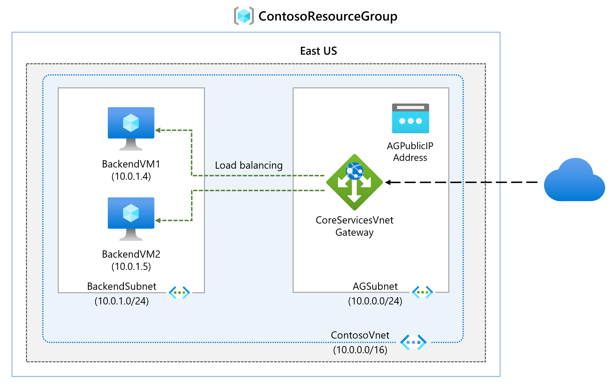
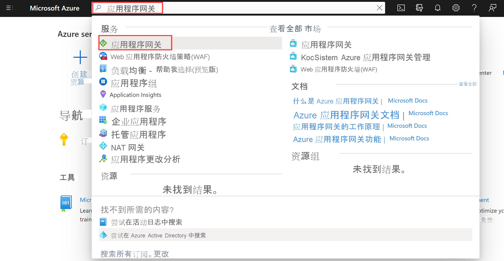
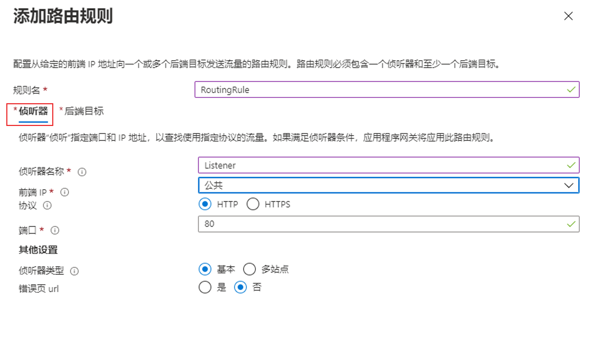
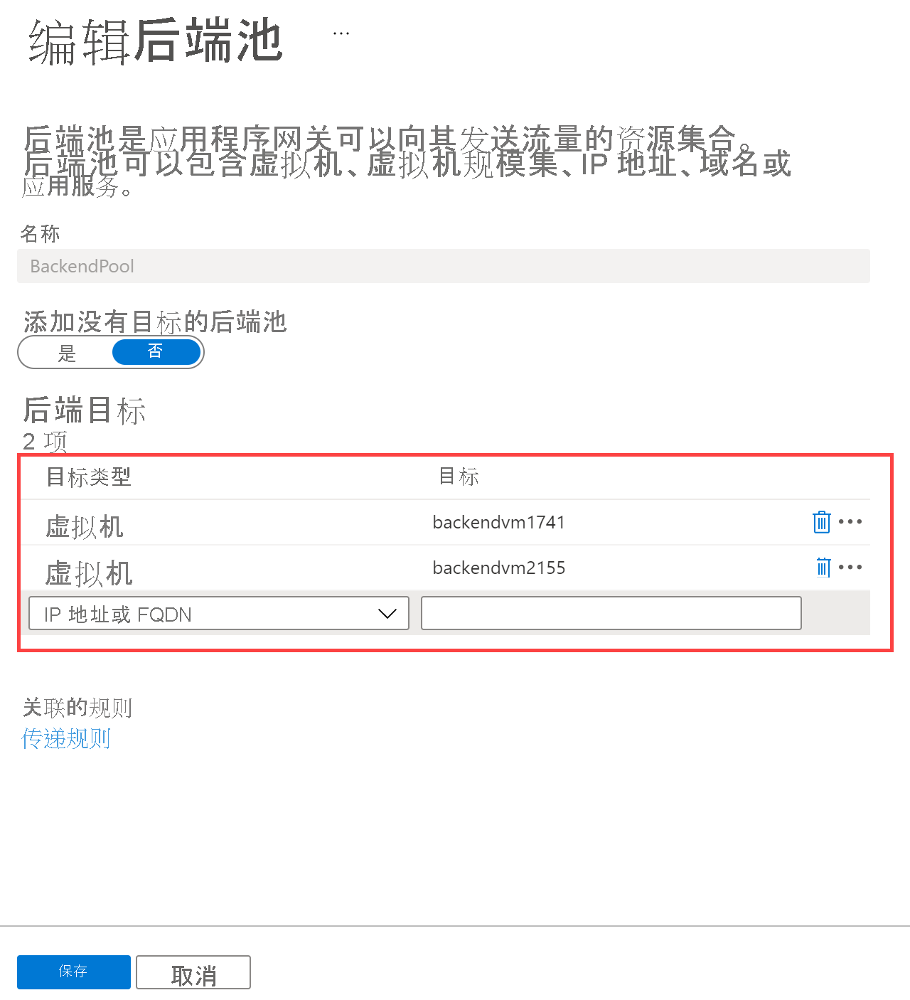
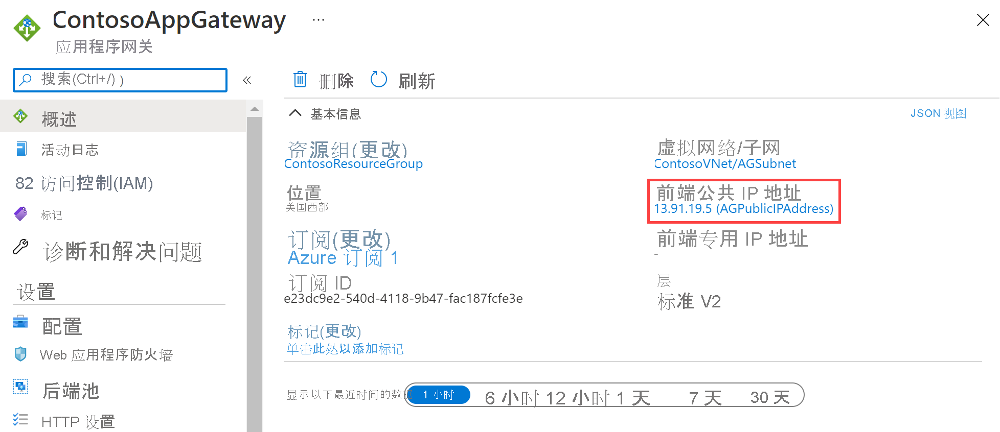
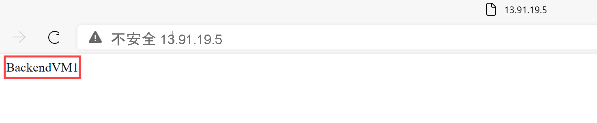

---
Exercise:
  title: 模块 05 - 第 4 单元 部署 Azure 应用程序网关
  module: Module 05 - Load balancing HTTP(S) traffic in Azure
---

# 模块 05-第 4 单元 部署 Azure 应用程序网关

## 练习场景

在本练习中，你将使用 Azure 门户创建一个应用程序网关。 然后对其进行测试以确保其正常运行。




>**注意：** 我们提供 **[交互式实验室模拟](https://mslabs.cloudguides.com/guides/AZ-700%20Lab%20Simulation%20-%20Deploy%20Azure%20Application%20Gateway)** ，让你能以自己的节奏点击浏览实验室。 你可能会发现交互式模拟与托管实验室之间存在细微差异，但演示的核心概念和思想是相同的。

### 预计用时：25 分钟

该应用程序网关将应用程序 Web 流量定向到后端池中的特定资源。 你将向端口分配侦听器，创建规则，并向后端池中添加资源。 为简单起见，本文使用了带有公共前端 IP 的简单设置、一个在应用程序网关上托管单个站点的基本侦听器、一个基本的请求路由规则，以及后端池中的两台虚拟机。

Azure 需要一个虚拟网络才能在创建的资源之间通信。 可以创建新的虚拟网络，或者使用现有的虚拟网络。 在此示例中，将在创建应用程序网关的同时创建新的虚拟网络。 在独立的子网中创建应用程序网关实例。 在本示例中创建两个子网：一个用于应用程序网关，另一个用于后端服务器。

通过学习本练习，你将能够：

+ 任务 1：创建应用程序网关
+ 任务 2：创建虚拟机
+ 任务 3：将后端服务器添加到后端池
+ 任务 4：测试应用程序网关

## 任务 1：创建应用程序网关

1. 使用 Azure 帐户登录到 [Azure 门户](https://portal.azure.com/)。

1. 在任意 Azure 门户页上的“搜索资源、服务和文档 (G+/)”中，输入“应用程序网关”，然后从结果中选择“应用程序网关” 。
    

1. 在“应用程序网关”页上，选择“+ 创建”。

1. 在“创建应用程序网关”的“基本信息”选项卡上，输入或选择以下信息：

   | **设置**         | 值                                    |
   | ------------------- | -------------------------------------------- |
   | 订阅        | 选择订阅。                    |
   | 资源组      | 选择 " 新建 ContosoResourceGroup"       |
   | 应用程序网关 | ContosoAppGateway                            |
   | 区域              | 选择“美国东部”                           |
   | 虚拟网络     | 选择“新建”                        |

1. 在“创建虚拟网络”中，输入或选择以下信息：

   | **设置**       | **值**                          |
   | ----------------- | ---------------------------------- |
   | 名称              | ContosoVNet                        |
   | ADDRESS SPACE |                                    |
   | 地址范围     | 10.0.0.0/16                        |
   | SUBNETS       |                                    |
   | 子网名称       | 将“默认值”更改为“AGSubnet” |
   | 地址范围     | 10.0.0.0/24                        |


1. 选择“确定”以返回到“创建应用程序网关”的“基本信息”选项卡。

1. 接受其他设置的默认值，然后选择“下一步:  前端”。

1. 在“前端”选项卡上，验证“IP 地址类型”是否设置为“公共”  。

1. 对于“公共 IP 地址”，选择“新增”，为“公共 IP 地址名称”输入“AGPublicIPAddress”，然后选择“确定”。

1. 在完成时选择“下一步:**后端**。

1. 在“后端”选项卡上，选择“添加后端池” 。

1. 在打开的“添加后端池”窗口中，输入以下值以创建一个空的后端池：

    | **设置**                      | **值**   |
    | -------------------------------- | ----------- |
    | 名称                             | BackendPool |
    | 添加没有目标的后端池 | 是         |

1. 在“添加后端池”窗口中，选择“添加”以保存后端池配置并返回到“后端”选项卡  。

1. 在“后端”  选项卡上，选择“下一步:  配置”。

1. 在“配置”选项卡上，将连接使用传递规则创建的前端和后端池。

1. 在“传递规则”列中，选择“添加传递规则” 。

1. 在“规则名称”框中，输入“RoutingRule” 。

1. 对于“**优先级**”，请输入“**100**”。 

1. 在“侦听器”选项卡上，输入或选择以下信息：

    | **设置**   | **值**         |
    | ------------- | ----------------- |
    | 侦听器名称 | 侦听器          |
    | 前端 IP   | 选择“**公共 IPv4**” |

1. 接受“侦听器”选项卡上其他设置的默认值。

    

1. 选择“后端目标”选项卡以配置传递规则的其余部分。

1. 在“后端目标”选项卡上，输入或选择以下信息：

    | **设置**      | **值**      |
    | -------------    | -------------- |
    | 目标类型      | 后端池   |
    | 后端设置 | **添加新内容** |

1. 在“添加后端设置”中，输入或选择以下信息：

    | **设置**          | **值**   |
    | ------------------   | ----------- |
    | 后端设置名称 | HTTPSetting |
    | 后端端口         | 80          |

1. 接受“添加后端设置”窗口中其他设置的默认值，然后选择“添加”以返回到“添加传递规则”。

1. 选择“添加”以保存传递规则，然后返回到“配置”选项卡。

1. 在完成时选择“下一步:  标记”，然后选择“下一步:  查看 + 创建”。

1. 查看“审阅 + 创建”选项卡上的设置

1. 选择“创建”以创建虚拟网络、公共 IP 地址和应用程序网关。

1. Azure 可能需要数分钟时间来创建应用程序网关。 等待部署成功完成。

### 为后端服务器添加子网

1. 搜索并选择“**ContosoVNet**”。 验证是否已创建 **AGSubnet**。 

1. 要创建 **BackendSubnet**，请选择“**设置**”，然后选择“**子网**”。 完成后，请务必“**添加**”子网。
   
   | **设置**       | **值**                          |
   | ----------------- | ---------------------------------- |
   | 子网名称       | BackendSubnet                      |
   | 地址范围     | 10.0.1.0/24                        |

## 任务 2：创建虚拟机

1. 在 Azure 门户中，选择 Cloud Shell 图标（右上角）。 如有必要，请配置 Shell。  
    + 选择“PowerShell”****。
    + 选择“**不需要存储帐户**”和“**订阅**”，然后选择“**应用**”。
    + 等待终端创建并显示提示。
      
1. 在 Cloud Shell 窗格的工具栏上，选择“**管理文件**”，然后选择“**上传**”。 上传以下文件：**backend.json**、**backend.parameters.json** 和 **install-iis.ps1**。可从存储库 **\Allfiles\Exercises\M05** 文件夹下载这些文件。

1. 部署以下 ARM 模板以创建此练习所需的 VM：

>注意：系统会提示你提供管理员密码。 

   ```powershell
   $RGName = "ContosoResourceGroup"
   
   New-AzResourceGroupDeployment -ResourceGroupName $RGName -TemplateFile backend.json -TemplateParameterFile backend.parameters.json
   ```
>**备注**：请花时间查看 **backend.json** 文件。 正在部署两个虚拟机。 这需要几分钟时间。 

1. 命令应成功完成，并列出 **BackendVM1** 和 **BackendVM2**。

### 在每台虚拟机上安装 IIS

1. 每台后端服务器都需要安装 IIS。

1. 在 PowerShell 提示符处继续操作，并使用提供的脚本在 **BackendVM1**上安装 IIS。

   ```powershell
   Invoke-AzVMRunCommand -ResourceGroupName 'ContosoResourceGroup' -Name 'BackendVM1' -CommandId 'RunPowerShellScript' -ScriptPath 'install-iis.ps1'
   ```

>**备注**：等待时，请查看 PowerShell 脚本。 请注意，正在自定义 IIS 主页以提供虚拟机名称。

1. 再次运行命令，这次针对 **BackendVM2**。

   ```powershell
   Invoke-AzVMRunCommand -ResourceGroupName 'ContosoResourceGroup' -Name 'BackendVM2' -CommandId 'RunPowerShellScript' -ScriptPath 'install-iis.ps1'
   ```
>**备注：** 每个命令需要几分钟时间完成。

## 任务 3：将后端服务器添加到后端池

1. 在 Azure 门户菜单上，选择“所有资源”，或搜索并选择“所有资源”。 然后选择“ContosoAppGateway”。

1. 在“设置”下，选择“后端池”。

1. 选择“BackendPool”。

1. 在“编辑后端池”页的“后端目标”下，在“目标类型”中，选择“虚拟机”。

1. 在“**目标**”下，选择 **BackendVM1-nic。**

1. 在“目标类型”中，选择“虚拟机” 。

1. 在“**目标**”下，选择 **BackendVM2-nic。**

   

1. 选择“**保存**”，等待添加目标。 

1. 检查以确保后端服务器正常运行。 选择“**监控**”，然后选择“**后端运行状况**”。 两个目标应为“正常”。 

   

## 任务 4：测试应用程序网关

虽然不需 IIS 即可创建应用程序网关，但本练习中安装了它，用来验证 Azure 是否已成功创建应用程序网关。

### 使用 IIS 测试应用程序网关

1. 在“概览”页上找到应用程序网关的公共 IP 地址。****

   

1. 复制公共 IP 地址，然后将其粘贴到浏览器的地址栏中，以便浏览该 IP 地址。

1. 检查响应。 有效响应验证应用程序网关是否已成功创建，以及是否能够成功连接后端。

   

1. 多次刷新浏览器就会看到与 BackendVM1 和 BackendVM2 的连接。

## 清理资源

>**注意**：记得删除所有不再使用的新建 Azure 资源。 删除未使用的资源可确保不会出现意外费用。

1. 在 Azure 门户的“Cloud Shell”窗格中打开“PowerShell”会话 。

1. 通过运行以下命令，删除在此模块的实验室中创建的所有资源组：

   ```powershell
   Remove-AzResourceGroup -Name 'IntLB-RG' -Force -AsJob
   ```

>**注意**：该命令以异步方式执行（由 -AsJob 参数决定），因此，虽然你可以随后立即在同一个 PowerShell 会话中运行另一个 PowerShell 命令，但需要几分钟才能实际删除资源组。

## 使用 Copilot 扩展学习

Copilot 可帮助你了解如何使用 Azure 脚本工具。 Copilot 还可以帮助了解实验室中未涵盖的领域或需要更多信息的领域。 打开 Edge 浏览器并选择“Copilot”（右上角）或导航到*copilot.microsoft.com*。 花几分钟时间尝试这些提示。
+ Azure 应用程序网关如何路由请求？
+ Azure 应用程序网关包括哪些安全功能？
+ 比较 Azure 应用程序网关和 Azure 负载平衡器。 举例说明何时使用每种产品。


## 通过自定进度的培训了解详细信息

+ [Azure 应用程序网关简介](https://learn.microsoft.com/training/modules/intro-to-azure-application-gateway/)。 本模块说明 Azure 应用程序网关的功能、工作原理以及何时应选择使用 Azure 应用程序网关作为解决方案来满足组织的需求。
+ [使用应用程序网关对 Web 服务流量进行负载均衡](https://learn.microsoft.com/training/modules/load-balancing-https-traffic-azure/)。 在本模块中，你将了解如何使用基于 URL 路径的路由创建和配置应用程序网关。
+ [在 Azure 中对 HTTP 流量进行负载均衡](https://learn.microsoft.com/training/modules/load-balancing-https-traffic-azure/)。 在本模块中，你将了解如何设计和实现 Azure 应用程序网关。

## 关键结论

恭喜你完成本实验室的内容。 下面是本实验室的主要重点。 
+ Azure 应用程序网关是一种 Web 流量（OSI 第 7 层）负载均衡器，可用于管理 Web 应用程序的流量。
+ 应用程序网关可以根据 HTTP 请求的其他属性（例如 URI 路径或主机头）进行路由决策。
+ 对于在单一区域托管的应用程序，以及需要基于 URL 的路由时，请使用应用程序网关。 
