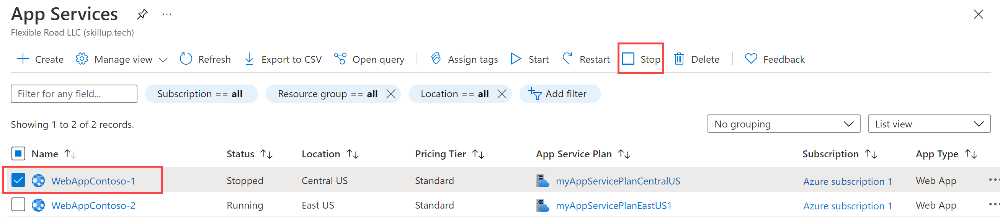

---
Exercise:
    title: '模块 05-单元 6 - 使用 Azure 门户为高度可用的 Web 应用程序创建 Front Door'
    module: '模块 - 在 Azure 中对 HTTP(S) 流量进行负载均衡'
---


# 模块 05-单元 6 - 使用 Azure 门户为高度可用的 Web 应用程序创建 Front Door

 

在本练习中，你将设置 Azure Front Door 配置，该配置汇集了在不同 Azure 区域中运行的两个 Web 应用程序实例。此配置将流量定向到运行该应用程序的最近的站点。Azure Front Door 会持续监视该 Web 应用程序。当最近的站点不可用时，你将演示自动故障转移到下一个可用站点。下图中显示了网络配置：


在本练习中，你将：

+ 任务 1：创建 Web 应用的两个实例
+ 任务 2：为应用程序创建 Front Door
+ 任务 3：通过实际操作查看 Azure Front Door
+ 任务 4：清理资源


## 任务 1：创建 Web 应用的两个实例

本练习要求两个 Web 应用程序实例在不同的 Azure 区域中运行。这两个 Web 应用程序实例在“主动/主动”模式下运行，因此其中的任何一个实例都可以接收流量。此配置不同于“主动/备用”配置，在后一种配置中，后者只有一个实例充当故障转移节点。

1. 登录到 Azure 门户 ([https://portal.azure.com](https://portal.azure.com/))。

2. 在 Azure 主页上，使用全局搜索类型“**WebApp**”并选择服务下的“**应用服务**”。

3. 单击“**+ 创建**”以创建 Web 应用。

4. 在“创建 Web 应用”页面的“**基本**”信息选项卡上，输入或选择以下信息。

   | **设置**      | **值**                                                    |
   | ---------------- | ------------------------------------------------------------ |
   | 订阅     | 选择你的订阅。                                    |
   | 资源组   | 选择资源组 ContosoResourceGroup               |
   | 名称             | 为 Web 应用输入唯一名称。本示例使用 WebAppContoso-1。 |
   | 发布          | 选择“**代码**”。                                             |
   | 运行时堆栈    | 选择“**[.NET Core 3.1 (LTS)]**”。                              |
   | 操作系统 | 选择“**Windows**”。                                          |
   | 区域           | 选择“**美国中部**”。                                       |
   | Windows 计划     | 选择“**新建**”，然后在文本框中输入 myAppServicePlanCentralUS。 |
   | SKU 和大小     | 选择“**标准 S1: 总共 100 个 ACU，1.75 GB 内存**”。        |

5. 选择“**查看 + 创建**”，查看“摘要”，然后选择“**创建**”。   
   ‎完成部署可能需要几分钟时间。

6. 创建第二个 Web 应用。在 Azure 门户主页上，搜索“**WebApp**”。

7. 单击“**+ 创建**”以创建 Web 应用。

8. 在“创建 Web 应用”页面的“**基本**”信息选项卡上，输入或选择以下信息。

   | **设置**      | **值**                                                    |
   | ---------------- | ------------------------------------------------------------ |
   | 订阅     | 选择你的订阅。                                    |
   | 资源组   | 选择资源组 ContosoResourceGroup               |
   | 名称             | 为 Web 应用输入唯一名称。本示例使用 WebAppContoso-2。 |
   | 发布          | 选择“**代码**”。                                             |
   | 运行时堆栈    | 选择“**[.NET Core 3.1 (LTS)]**”。                              |
   | 操作系统 | 选择“**Windows**”。                                          |
   | 区域           | 选择“**美国东部**”。                                          |
   | Windows 计划     | 选择“**新建**”，然后在文本框中输入 myAppServicePlanEastUS。 |
   | SKU 和大小     | 选择“**标准 S1: 总共 100 个 ACU，1.75 GB 内存**”。        |

9. 选择“**查看 + 创建**”，查看“摘要”，然后选择“**创建**”。   
   ‎完成部署可能需要几分钟时间。

## 任务 2：为应用程序创建 Front Door

配置 Azure Front Door，以根据两个 Web 应用服务器之间的最小延迟来定向用户流量。若要开始，请为 Azure Front Door 添加前端主机。

1. 在任何 Azure 门户页面的“**搜索资源、服务和文档(G+/)**”中，输入 front door，然后从结果中选择“**Front Door**”。

   

2. 在 Front Door 页面上，选择“**+ 创建**”。

3. 在“创建 Front Door”中，输入或选择以下信息。

   | **设置**             | **值**                                    |
   | ----------------------- | -------------------------------------------- |
   | 订阅            | 选择你的订阅。                    |
   | 资源组          | 选择 ContosoResourceGroup                  |
   | 资源组位置 | 接受默认设置                       |

4. 选择“**下一步: 配置**”。

5. 在“配置”选项卡的“**前端/域**”中，选择“**+**”以添加前端主机。

   

6. 输入全局唯一的**主机名**，如 contoso-frontend，然后选择“**添加**”。

7. 接下来，创建一个后端池，在其中包含你的两个 Web 应用。  
   ‎在“创建 Front Door”中的“**后端池**”中，选择“+”以添加后端池。

   

8. 输入全局唯一的**主机名**，如 BackendPool。

9. 在“**后端**”下，选择“**+ 添加后端**”。

10. 在“添加后端”中，输入或选择以下信息。

    | **设置**       | **值**                                                    |
    | ----------------- | ------------------------------------------------------------ |
    | 后端主机类型 | 选择“**应用服务**”。                                      |
    | 订阅      | 选择你的订阅。                                    |
    | 后端主机名 | 选择所创建的第一个 Web 应用。在本示例中，Web 应用是 **WebAppContoso-1**。 |

11. 将所有其他字段保留为默认值，然后选择“**添加**”。

12. 再次选择“**+ 添加后端**”，输入或选择以下信息。

    | **设置**       | **值**                                                    |
    | ----------------- | ------------------------------------------------------------ |
    | 后端主机类型 | 选择“应用服务”。                                          |
    | 订阅      | 选择你的订阅。                                    |
    | 后端主机名 | 选择所创建的第二个 Web 应用。在本示例中，Web 应用是 **WebAppContoso-2**。 |

13. 将所有其他字段保留为默认值，然后选择“**添加**”。

14. 在“**添加后端池**”边栏选项卡上，选择“**添加**”以完成后端池的配置。

15. 最后，添加一个传递规则。传递规则将前端主机映射到后端池。该规则会将针对 contoso-frontend.azurefd.net 的请求转发到 myBackendPool。

16. 在“创建 Front Door”的“**传递规则**”中，选择“**+**”以配置传递规则。

    

17. 在“添加规则”中，在“**名称**”中输入 LocationRule。 

18. 接受所有默认值，然后选择“**添加**”以添加路由规则。

19. 选择“**查看 + 创建**”，然后选择“**创建**”。

**必须确保 Front Door 中的每个前端主机都具有传递规则，且其中包含与之关联的默认路径 (\*)。也就是说，在所有传递规则中，对于在默认路径 (\*) 中定义的每个前端主机，必须至少有一个传递规则。如果不这样做，可能会导致最终用户流量无法正确路由**。

 

## 任务 3：通过实际操作查看 Azure Front Door

创建 Front Door 后，需要花费几分钟时间来全局部署配置。完成后，访问你创建的前端主机。 

1. 在 Azure 门户中，导航到 Front Door 前端。选择“**前往资源**”。或者在“搜索资源、服务和文档 (G+/)”中，输入 **front door**，然后从结果中选择“**Front Doors**”，然后选择你的 Front Door。

2. 在 Front Door 页面上，注意 **Frontend 主机** URL。本练习使用 contoso-frontend.azurefd.net，但可对它进行更改以确保名称唯一。

   

3. 在浏览器中，转到前端主机 URL (contoso-frontend.azurefd.net)。你的请求将从后端池中的指定服务器自动路由到离你最近的服务器。

4. 你将看到以下信息页面：

   

5. 若要实际测试即时全局故障转移，请尝试以下步骤：

6. 切换到 Azure 门户，搜索并选择“**应用服务**”。 

7. 选择一个 Web 应用，然后选择“**停止**”，再选择“**是**”以进行验证。

   

8. 切换回你的浏览器并选择“刷新”。应会看到相同的信息页。

**Web 应用停止时可能会有延迟。如果在浏览器中看到错误页面，请刷新页面**。

1. 切换回 Azure 门户，找到另一个 Web 应用，然后将其停止。

2. 切换回你的浏览器并选择“刷新”。此时，应会看到一条错误消息。

   

   恭喜！你已经配置并测试了 Azure Front Door。
   
  
   
   ## 任务 4：清理资源
   
   >**备注**：请记得删除不再使用的所有新创建的 Azure 资源。删除未使用的资源，确保不产生意外费用。

1. 在 Azure 门户中，在“**Cloud Shell**”窗格中打开“**PowerShell**”会话。

1. 运行以下命令，删除在本模块各个实验室中创建的所有资源组：

   ```powershell

   Remove-AzResourceGroup -Name 'ContosoResourceGroup' -Force -AsJob

   ```

    >**备注**：该命令以异步方式执行（由 -AsJob 参数决定），因此，虽然你随后可在同一 PowerShell 会话中立即运行另一个 PowerShell 命令，但实际上要花几分钟才能删除资源组。
