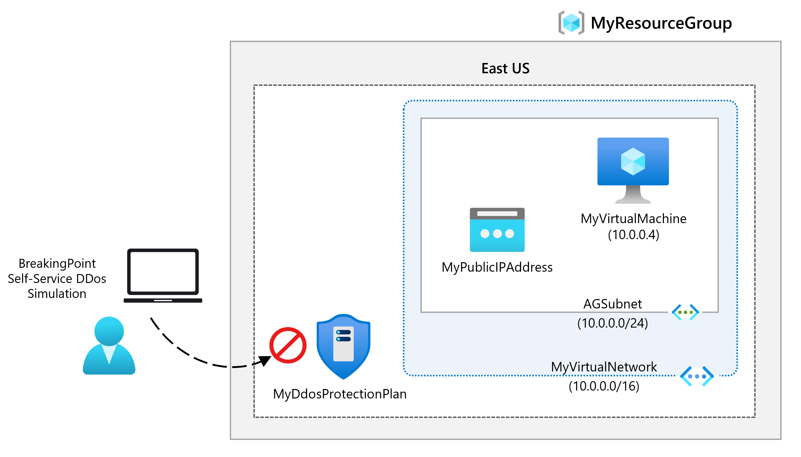

---
Exercise:
  title: 模块 06 - 第 4 单元 使用 Azure 门户在虚拟网络上配置 DDoS 防护
  module: Module 06 - Design and implement network security
---

# 模块 06-单元 4 使用 Azure 门户在虚拟网络上配置 DDoS 防护

## 练习场景

作为 Contoso 网络安全团队的负责人，你将在虚拟网络上运行模拟 DDoS 攻击。 以下步骤将引导你完成创建虚拟网络、配置 DDoS 防护以及创建攻击，你可以借助遥测和指标的帮助进行观察和监视。



通过学习本练习，你将能够：

+ 任务 1：创建资源组
+ 任务 2：创建 DDoS 防护计划
+ 任务 3：在新的虚拟网络上启用 DDoS 防护
+ 任务 4：配置 DDoS 遥测
+ 任务 5：配置 DDoS 诊断日志
+ 任务 6：配置 DDoS 警报
+ 任务 7：使用模拟合作伙伴进行测试
+ 任务 8：清理资源

**注意：** 我们提供 **[交互式实验室模拟](https://mslabs.cloudguides.com/guides/AZ-700%20Lab%20Simulation%20-%20Configure%20Azure%20DDoS%20Protection%20on%20a%20virtual%20network)** ，让你能以自己的节奏点击浏览实验室。 你可能会发现交互式模拟与托管实验室之间存在细微差异，但演示的核心概念和思想是相同的。

### 估计时间：40 分钟

## 任务 1：创建资源组

1. 登录到 Azure 帐户。

1. 在 Azure 门户主页上，选择“资源组”。

1. 选择“创建”。

1. 在“基本信息”选项卡上的“资源组”中，输入“MyResourceGroup”。

1. 对于“区域”，请选择“美国东部”。

1. 选择“查看 + 创建”。

1. 选择“创建”。

## 任务 2：创建 DDoS 防护计划

1. 在 Azure 门户主页上，在“搜索”框中輸入 DDoS，并在出现“DDoS 防护计划”时选择它 。

1. 选择“+ 新建”。

1. 在“基本信息”选项卡的“资源组”列表中，选择刚创建的资源组。

1. 在“实例名称”框中，输入“MyDdoSProtectionPlan”，然后单击“查看 + 创建”  。

1. 选择“创建”。

## 任务 3：在新的虚拟网络上启用 DDoS 防护

在此，你将在新的虚拟网络而不是现有虚拟网络上启用 DDoS，因此，首先需要创建新的虚拟网络，然后使用你之前创建的计划对其启用 DDoS 防护。

1. 在 Azure 门户主页上，选择“创建资源”，然后在搜索框中输入“虚拟网络”，并在出现“虚拟网络”时选择它  。

1. 在“虚拟网络”页上选择“创建”。

1. 在“基本信息”选项卡上，选择先前创建的资源组。

1. 在“名称”框中，输入“MyVirtualNetwork”，然后选择“安全性”选项卡  。

1. 在“安全性”选项卡的“DDoS 网络保护”旁边，选择“启用”  。

1. 在“DDoS 防护计划”下拉列表中，选择“MyDdosProtectionPlan” 。

   

1. 选择“查看 + 创建”。

1. 选择“创建”。

## 任务 4：配置 DDoS 遥测

创建公共 IP 地址，然后在后续步骤中设置遥测。

1. 在 Azure 门户主页上，选择“创建资源”，然后在搜索框中输入“公共 IP”，然后在出现“公共 IP 地址”时选择它。

1. 在“公共 IP 地址”页上，选择“创建”。

1. 在“创建公共 IP 地址”页的“SKU”下，选择“标准”  。

1. 在“名称”框中，输入“MyPublicIPAddress” 。

1. 在“IP 地址分配”下，选择“静态”。

1. 在“DNS 名称标签”中，输入“mypublicdnsxx”（其中 xx 是使此名称唯一的缩写） 。

1. 选择**创建**。

1. 若要设置遥测，请导航到 Azure 主页，然后选择“所有资源”。

1. 在资源列表中，选择“MyDdosProtectionPlan”。

1. 在“监视”下，选择“指标”。

1. 选择“范围”框，并选中“MyPublicIPAddress”旁的复选框。

    

1. 选择“应用”。

1. 在“指标”框中，选择“删除入站数据包的 DDoS” 。

1. 在“聚合”框中，选择“最大值” 。

    

## 任务 5：配置 DDoS 诊断日志

1. 在 Azure 主页上，选择“所有资源”。

1. 在资源列表中，选择“MyPublicIPAddress”。

1. 在“监视”下，选择“诊断设置” 。

1. 选择“添加诊断设置”。

1. 在“诊断设置”页上的“诊断设置名称”框中，输入“MyDiagnosticSetting”。

1. 在“类别详细信息”下，选中所有 3 个“日志”复选框和“AllMetrics”复选框。

1. 在“目标详细信息”下，选中“发送到 Log Analytics 工作区”复选框。 此时，你可以选择预先存在的 Log Analytics 工作区，但由于尚未为诊断日志设置目标，因此你只需输入设置，然后在本练习的下一步中将其丢弃。

   

1. 正常情况下，现在可以选择“保存”以保存诊断设置。 请注意，此选项仍灰显，因为我们尚未完成设置配置。

1. 依次选择“放弃”、“是”。

## 任务 6：配置 DDoS 警报

在此步骤中，将创建一个虚拟机，为其分配一个公共 IP 地址，然后配置 DDoS 警报。

### 创建 VM

1. 在 Azure 门户主页上，选择“创建资源”，然后在搜索框中输入“虚拟机”，并在出现“虚拟机”时选择它  。

1. 在“虚拟机”页面上，选择“创建”。

1. 在“基本信息”选项卡上，使用下表中的信息创建新 VM。

   | **设置**           | 值                                                    |
   | --------------------- | ------------------------------------------------------------ |
   | 订阅          | 选择订阅                                     |
   | 资源组        | MyResourceGroup                                          |
   | 虚拟机名称  | MyVirtualMachine                                         |
   | 区域                | 你的区域                                                  |
   | 可用性选项  | 不需要基础结构冗余                   |
   | 映像                 | Ubuntu Server 20.04 LTS - 第 2 代（如果需要，请选择“配置 VM 生成链接”） |
   | 大小                  | 选择“查看所有大小”，然后在列表中选择“B1ls”并选择“选择”“(Standard_B1ls - 1 vcpu，0.5 GiB内存)” |
   | 身份验证类型   | **SSH 公钥**                                           |
   | 用户名              | **azureuser**                                                |
   | SSH 公钥源 | 生成新密钥对                                    |
   | 密钥对名称         | myvirtualmachine-ssh-key                                 |
   | 公共入站端口  | 全部不选                                                  |

1. 选择“查看 + 创建”。

1. 选择“创建”。

1. 在“生成新密钥对”对话框中，选择“下载私钥并创建资源” 。

1. 保存私钥。

1. 部署完成后，选择“转到资源”。

### 分配公共 IP 地址

1. 在新虚拟机的“概述”页上的“设置”下，选择“网络”。

1. 在“网络接口”旁边，选择“myvirtualmachine-nic” 。 NIC 的名称可能不同。

1. 在“设置”下选择“IP 配置”。

1. 选择“ipconfig1”。

1. 在“公共 IP 地址”列表中，选择“MyPublicIPAddress” 。

1. 选择“保存”。

   

### 配置 DDoS 警报

1. 在 Azure 主页上，选择“所有资源”。

1. 在资源列表中，选择“MyPublicIPAddress”。

1. 在“监视”下，选择“警报” 。

1. 选择“创建警报规则”。

1. 在“创建警报规则”页的“范围”下，选择“编辑资源”。

1. 对于信号名称，请选择“是否受到 DDoS 攻击”。

1. 在“警报逻辑”下找到“运算符”设置，然后选择“大于或等于”。

1. 在“阈值”中，输入“1”（表示受攻击） 。

1. 导航到“详细信息”选项卡并选择“警报规则名称”，输入 MyDdosAlert。

    

1. 选择“创建警报规则”。

## 任务 7：使用模拟合作伙伴进行测试

1. 查看 [Azure DDoS 模拟测试策略](https://learn.microsoft.com/azure/ddos-protection/test-through-simulations#azure-ddos-simulation-testing-policy)

1. 使用经批准的测试合作伙伴配置 DDoS 测试攻击。 如果使用 BreakingPoint Cloud 进行测试，请使用以下屏幕截图中的设置（可能需要使用试用帐户选择 100k pps 测试大小），但在“目标 IP 地址”框中指定自己的“MyPublicIPAddress”资源的 IP 地址（例如 51.140.137.219）

1. 在 Azure 门户主页上，选择“所有资源”。

1. 在资源列表中，选择“MyPublicIPAddress”资源，然后在“监视”下选择“指标”。

1. 在“指标”框中，从列表中选择“是否受到 DDoS 攻击”。

1. 现在可以看到发生的 DDoS 攻击。 请注意，可能需要整整 10 分钟才能看到结果。

   

## 任务 8：清理资源

>**注意**：记得删除所有不再使用的新建 Azure 资源。 删除未使用的资源可确保不会出现意外费用。

1. 在 Azure 门户的“Cloud Shell”窗格中打开“PowerShell”会话 。

1. 通过运行以下命令，删除在此模块的实验室中创建的所有资源组：

   ```powershell
   Remove-AzResourceGroup -Name 'MyResourceGroup' -Force -AsJob
   ```

    >**注意**：该命令以异步方式执行（由 -AsJob 参数决定），因此，虽然你可以随后立即在同一个 PowerShell 会话中运行另一个 PowerShell 命令，但需要几分钟才能实际删除资源组。
