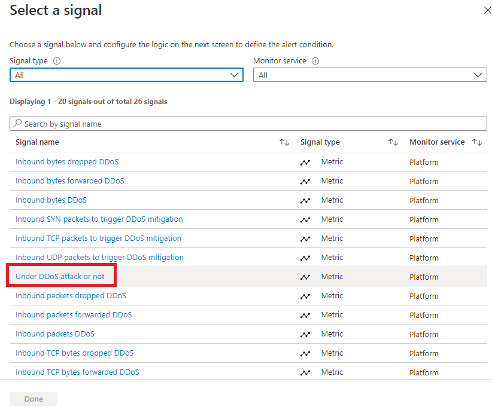

---
Exercise:
    title: '模块 06-单元 4 使用 Azure 门户在虚拟网络上配置 DDoS 防护'
    module: '模块 - 设计和实现网络安全'
---

# 模块 06-单元 4 使用 Azure 门户在虚拟网络上配置 DDoS 防护

作为 Contoso 网络安全团队的负责人，你将在虚拟网络上运行模拟 DDoS 攻击。以下步骤将指导你创建虚拟网络、配置 DDoS 防护以及创建可以借助遥测和指标来观察和监视的攻击。

在本练习中，你将：

+ 任务 1：创建资源组
+ 任务 2：创建 DDoS 防护计划
+ 任务 3：在新的虚拟网络上启用 DDoS 防护
+ 任务 4：配置 DDoS 遥测
+ 任务 5：配置 DDoS 诊断日志
+ 任务 6：配置 DDoS 警报
+ 任务 7：提交 DDoS 服务请求以运行 DDoS 攻击
+ 任务 8：清理资源


## 任务 1：创建资源组

1. 登录到 Azure 帐户。

2. 在 Azure 门户主页上，选择“**资源组**”。

3. 单击“**创建**”。 

4. 在“**基本信息**”选项卡上的“**资源组**”中，输入 **MyResourceGroup**。

   

5. 在“**区域**”中，从列表中选择你所在的区域。

6. 单击“**查看 + 创建**”。

7. 单击“**创建**”。

   

 

## 任务 2：创建 DDoS 防护计划

1. 在 Azure 门户主页的搜索框中键入“**DDoS**”，然后单击出现的“**DDoS 防护计划**”。

2. 单击“**+ 创建**”。

3. 在“**基本**”信息选项卡上的“**资源组**”列表中，选择刚刚创建的资源组。

4. 在“**实例名称**”框中，键入 **MyDdoSProtectionPlan**，然后单击“**查看 + 创建**”。

   

5. 单击“**创建**”。

 

## 任务 3：在新的虚拟网络上启用 DDoS 防护

在这里，你将在新的虚拟网络（而非现有网络）上启用 DDoS，因此，首先需要创建新的虚拟网络，然后使用之前创建的计划在该虚拟网络上启用 DDoS 防护。

1. 在 Azure 门户主页上，选择“**创建资源**”，然后在搜索框中键入“**虚拟网络**”，然后单击出现的单击“**虚拟网络**”。

   

2. 在“**虚拟网络**”页面上，单击“**创建**”。

3. 在“**基本**”信息选项卡上，选择之前创建的资源组。

4. 在“**名称**”框中，键入 **MyVirtualNetwork**，然后单击“**安全**”选项卡。 

   

5. 在“**安全**”选项卡上的“**DDoS 防护标准**”旁边，选择“**启用**”。

6. 在“**DDoS 防护计划**”下拉列表中，选择“**MyDdosProtectionPlan**”。

   

7. 单击“**查看 + 创建**”。

8. 单击“**创建**”。

 

## 任务 4：配置 DDoS 遥测

创建一个公共 IP 地址，然后在接下来的步骤中设置遥测。

1. 在 Azure 门户主页上，选择“**创建资源**”，然后在搜索框中键入“**公共 IP**”，然后单击出现的“**公共 IP 地址**”。

2. 在“**公共 IP 地址**”页面上，单击“**创建**”。

3. 在“**创建公共 IP 地址**”页面上的“**SKU**”下，选择“**基本信息**”。

4. 在“**名称**”框中，键入 **MyPublicIPAddress**。

5. 在“**IP 地址分配**”下，选择“**静态**”。

6. 在“**DNS 名称标签**”中，键入“**mypublicdnsxx**”（其中 xx 是你的姓名首字母以确保唯一性）。

7. 从列表中选择你的资源组。

   

8. 单击“**创建**”。

9. 在 Azure 主页上，单击“**所有资源**”。

10. 在资源列表中，单击 **MyDdosProtectionPlan**。

11. 在“**监视**”下，选择“**指标**”。

12. 选择“**范围**”框，然后选择“**MyPublicIPAddress**”旁边的复选框。

    

13. 单击“**应用**”。

14. 在“**指标**”框中，选择“**丢弃的入站数据包 DDoS**”。

15. 在“**聚合**”框中，选择“**最大值**”。

    

 

## 任务 5：配置 DDoS 诊断日志

1. 在 Azure 主页上，单击“**所有资源**”。

2. 在资源列表中，单击 **MyPublicIPAddress**。

3. 在“**监视**”下，选择“**诊断设置**”。

4. 单击“**添加诊断设置**”。 

5. 在“**诊断设置**”页面上的“**诊断设置名称**”框中，键入 **MyDiagnosticSetting**。 

6. 在“**类别详细信息**”下，选中所有 3 个“**日志**”复选框和“**AllMetrics**”复选框。

7. 在“**目标详细信息**”下，选中“**发送到 Log Analytics 工作区**”复选框。在这里，可以选择已经存在的 Log Analytics 工作区，但由于尚未为诊断日志设置目标，你只需输入设置，然后在本练习的下一步中放弃它们。

   

8. 通常情况下，你会单击“**保存**”以保存诊断设置。请注意，此选项仍然灰显，因为还无法完成设置配置。

9. 单击“**放弃**”，然后单击“**是**”。

 

## 任务 6：配置 DDoS 警报

在此步骤中，你将创建一个虚拟机，为其分配一个公共 IP 地址，然后配置 DDoS 警报。

### 创建 VM

1. 在 Azure 门户主页上，选择“**创建资源**”，然后在搜索框中键入“**虚拟机**”，然后单击出现的“**虚拟机**”。

2. 在“**虚拟机**”页面上，单击“**创建**”。

3. 在“**基本**”信息选项卡上，使用下表中的信息创建新 VM。

   | **设置**           | **值**                                                    |
   | --------------------- | ------------------------------------------------------------ |
   | 订阅          | 选择你的订阅                                     |
   | 资源组        | **MyResourceGroup**                                          |
   | 虚拟机名称  | **MyVirtualMachine**                                         |
   | 区域                | 你所在的区域                                                  |
   | 可用性选项  | **无需基础结构冗余**                   |
   | 映像                 | **Ubuntu Server 18.04 LTS -  Gen 1** （如果需要，请选择“配置 VM 生成”链接） |                     
   | 大小                  | 选择“**查看所有大小**”，然后在列表中选择“**B1ls**”，并选择“**选择**” **（标准_B1ls - 1 个 vcpu，0.5 GiB 内存）** |
   | 身份验证类型   | **SSH 公钥**                                           |
   | 用户名              | **azureuser**                                                |
   | SSH 公钥源 | **生成新密钥对**                                    |
   | 密钥对名称         | **myvirtualmachine-ssh-key**                                 |


4. 单击“**查看 + 创建**”。

5. 单击“**创建**”。

   

6. 在“**生成新密钥对**”对话框中，单击“**下载私钥并创建资源**”。

7. 保存私钥。

8. 部署完成后，单击“**前往资源**”。

### 分配公共 IP 地址

1. 在新虚拟机“**概览**”页面的“**设置**”下，单击“**网络**”。

2. 在“**网络接口**”旁边，单击“**myvirtualmachine**”（例如 myvirtualmachine892）。

3. 在“**设置**”下，单击“**IP 配置**”。

4. 选择“**ipconfig1**”。

5. 在“**公共 IP 地址**”列表中，选择“**MyPublicIPAddress**”。

6. 单击“**保存**”。

   

### 配置 DDoS 警报

1. 在 Azure 主页上，单击“**所有资源**”。

2. 在资源列表中，单击 **MyDdosProtectionPlan**。

3. 在“**监视**”下，选择“**警报**”。

4. 单击“**新警报规则**”。

5. 在“**创建警报规则**”页面的“**范围**”下，单击“**编辑资源**”。

6. 在“**选择资源**”窗格的“**按资源类型筛选**”框中，向下滚动列表并选择“**公共 IP 地址**”。

   

7. 在“**资源**”列表中，选择**MyPublicIPAddress**，然后单击“**完成**”。

8. 在“**创建警报规则**”页面的“**条件**”下，单击“**添加条件**”。

9. 选择“**是否受到 DDoS 攻击**”。

   

10. 在“**运算符**”框中，选择“**大于或等于**”。

11. 在“**阈值**”中，输入“**1**”（表示受到攻击）。

12. 单击“**完成**”。

    

13. 返回“**创建警报规则**”页面，向下滚动到“**警报规则详细信息**”部分，然后在“**警报规则名称**”中输入 MyDdosAlert。

    

14. 单击“**创捷警报规则**”。

 

## 任务 7：提交 DDoS 服务请求以运行 DDoS 攻击

1. 创建一个 [BreakingPoint Cloud](https://breakingpoint.cloud/) 帐户

2. 按照下面屏幕截图中的设置来设置 DDoS 测试（可能需要使用试用帐户选择 100k pps 测试大小），但在“目标 IP 地址”框中指定自己的 **MyPublicIPAddress** 资**源的 IP 地址**（例如 **51.140.137.219**）
   

   

3. 在 Azure 门户主页上，单击“**所有资源**”。

4. 在资源列表中，单击你的 **MyPublicIPAddress** 资源，然后在“**监视**”下单击“**指标**”。 

5. 在“**指标**”框中，从列表中选择“**是否受到 DDoS 攻击**”。

6. 在这里，你可以在发生 DDoS 攻击时看到该攻击。请注意，可能需要整整 10 分钟才能看到结果。

   

 
## 任务 8：清理资源

>**备注**：请记得删除任何新创建且不会再使用的 Azure 资源。删除未使用的资源，确保不产生意外费用。

1. 在 Azure 门户中，在 **Cloud Shell** 窗格中打开“**PowerShell**”会话。

1. 运行以下命令，删除在本模块各个实验室中创建的所有资源组：

   ```powershell
   Remove-AzResourceGroup -Name 'MyResourceGroup' -Force -AsJob
   ```

    >**备注**：该命令异步执行（由 -AsJob 参数确定），因此尽管此后可以立即在同一 PowerShell 会话中运行另一个 PowerShell 命令，但实际上要花几分钟才能删除资源组。
