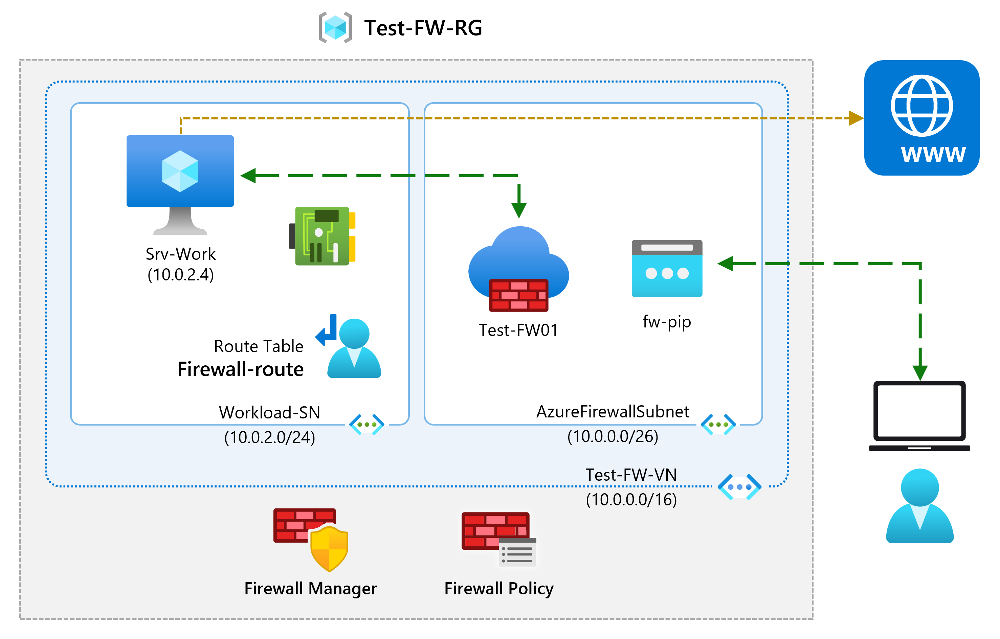
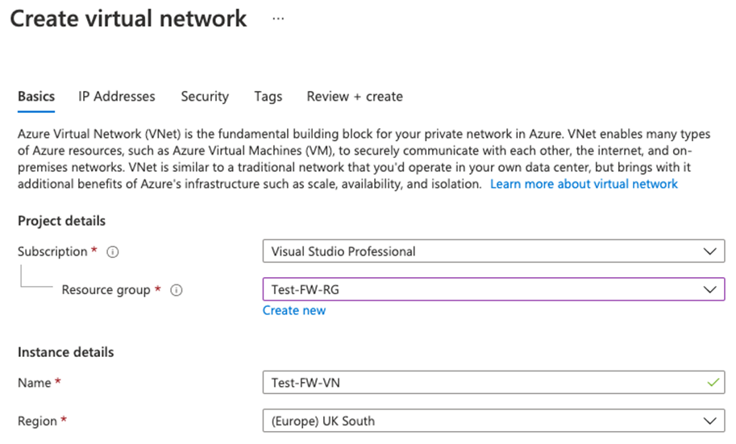
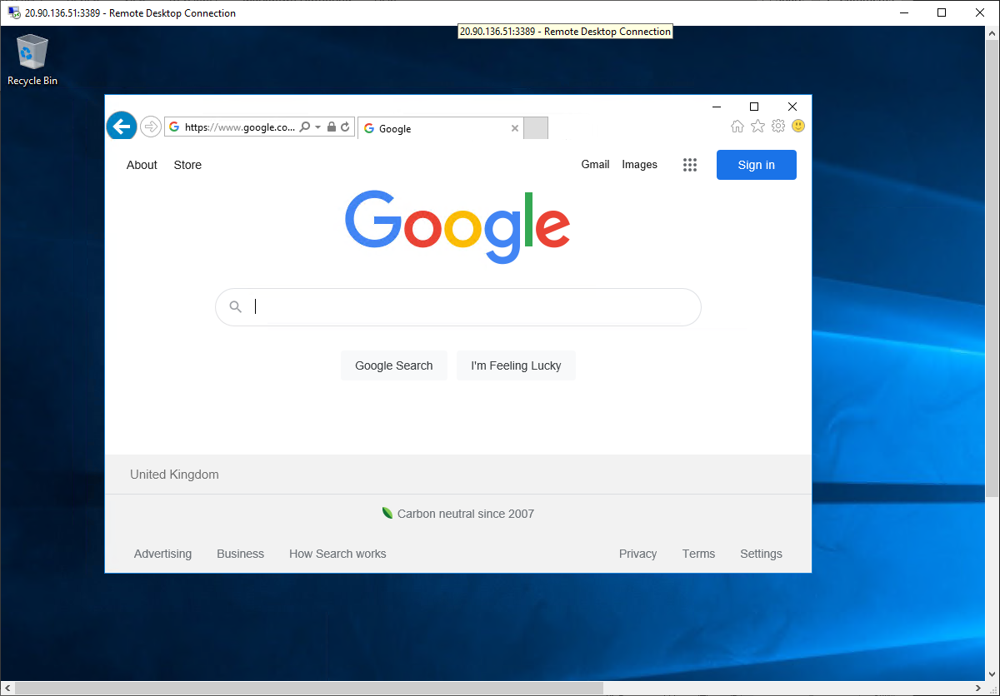

---
Exercise:
  title: 模块 06 - 第 7 单元 使用 Azure 门户部署和配置 Azure 防火墙
  module: 'Module 06 - Design and implement network security '
---

# 模块 06-单元 7 使用 Azure 门户部署和配置 Azure 防火墙

作为 Contoso 的网络安全团队的成员，下一个任务是创建防火墙规则以允许/拒绝对某些网站的访问。 以下步骤将引导你创建资源组、虚拟网络和子网，以及将虚拟机作为环境准备任务，然后部署防火墙和防火墙策略、配置默认路由和应用程序、网络和 DNAT 规则，最后测试防火墙。



通过学习本练习，你将能够：

+ 任务 1：创建资源组
+ 任务 2：创建虚拟网络和子网
+ 任务 3：创建虚拟机
+ 任务 4：部署防火墙和防火墙策略
+ 任务 5：创建默认路由
+ 任务 6：配置应用程序规则
+ 任务 7：配置网络规则
+ 任务 8：配置目标 NAT (DNAT) 规则
+ 任务 9：更改服务器网络接口的主要和辅助 DNS 地址
+ 任务 10：测试防火墙
+ 任务 11：清理资源

**注意：** 我们提供 **[交互式实验室模拟](https://mslabs.cloudguides.com/guides/AZ-700%20Lab%20Simulation%20-%20Deploy%20and%20configure%20Azure%20Firewall%20using%20the%20Azure%20portal)** ，让你能以自己的节奏点击浏览实验室。 你可能会发现交互式模拟与托管实验室之间存在细微差异，但演示的核心概念和思想是相同的。


#### 估计时间：60 分钟

## 任务 1：创建资源组

在此任务中，你将创建一个新的资源组。

1. 登录到 Azure 帐户。

1. 在 Azure 门户主页上，选择“资源组”。

1. 选择“创建”。 

1. 在“基本信息”选项卡上的“资源组”中，输入“Test-FW-RG”。

1. 在“区域”中，从列表中选择你所在的区域。

   

1. 选择“查看 + 创建”。

1. 选择“创建”。

 

## 任务 2：创建虚拟网络和子网

在此任务中，你将创建包含两个子网的单个虚拟网络。

1. 在 Azure 门户主页上的搜索框中，输入“虚拟网络”，并在出现“虚拟网络”时选择它 。

1. 选择“创建”。

1. 选择之前创建的“Test-FW-RG”资源组。

1. 在“名称”框中，输入“Test-FW-VN”。

   

1. 在完成时选择“下一步:IP 地址”。 如果默认情况下不存在，请输入 IPv4 地址空间 10.0.0.0/16。 

1. 在“子网名称”下，选择词语“默认”。

1. 在“编辑子网”对话框中，将名称更改为“AzureFirewallSubnet”。

1. 将“子网地址范围”更改为“10.0.1.0/26”。

1. 选择“保存”。

1. 选择“添加子网”以创建另一个子网，它将托管你将即将创建的工作负载服务器。


    
    
1. 在“编辑子网”对话框中，将名称更改为“Workload-SN”。

1. 将“子网地址范围”更改为“10.0.2.0/24”。

1. 选择 **添加** 。

1. 选择“查看 + 创建”。

1. 选择“创建”。

 

## 任务 3：创建虚拟机

在此任务中，将创建工作负载虚拟机，并将其放置在之前创建的 Workload-SN 子网中。

1. 在 Azure 门户的“Cloud Shell”窗格中打开“PowerShell”会话 。

1. 在 Cloud Shell 窗格的工具栏中，选择“上传/下载文件”图标，在下拉菜单中选择“上传”，将文件 firewall.json 和 firewall.parameters.json 从源文件夹 F:\Allfiles\Exercises\M06 逐个上传到 Cloud Shell 主目录    。

1. 部署以下 ARM 模板以创建此练习所需的 VM：

   >注意：系统会提示你提供管理员密码。

   ```powershell
   $RGName = "Test-FW-RG"
   
   New-AzResourceGroupDeployment -ResourceGroupName $RGName -TemplateFile firewall.json -TemplateParameterFile firewall.parameters.json
   ```
  
1. 部署完成后，转到 Azure 门户主页，然后选择“虚拟机”。

1. 验证是否已创建虚拟机。

1. VM 部署完成后，单击“转到资源”。

1. 在“Srv-Work”的“概述”页右侧的“网络”下，记下此 VM 的“专用 IP 地址”（例如 10.0.2.4）。
 

## 任务 4：部署防火墙和防火墙策略

在此任务中，你要将防火墙部署到配置了防火墙策略的虚拟网络中。

1. 在 Azure 门户主页上，选择“创建资源”，然后在搜索框中输入“防火墙”，并在出现“防火墙”时选择它。

1. 在“防火墙”页上，选择“创建”。

1. 在“基本信息”选项卡上，使用下表中的信息创建防火墙。

   | **设置**          | 值                                                    |
   | -------------------- | ------------------------------------------------------------ |
   | 订阅         | 选择订阅                                     |
   | 资源组       | **Test-FW-RG**                                               |
   | 防火墙名称        | **Test-FW01**                                                |
   | 区域               | 你的区域                                                  |
   | 防火墙 SKU        | **标准**                                                 |
   | 防火墙管理  | **使用防火墙策略来管理此防火墙**            |
   | 防火墙策略      | 选择“新增”<br />名称：fw-test-pol<br />区域：你的区域 |

   

   | 选择虚拟网络 | **使用现有项**                         |
   | ------------------------ | ---------------------------------------- |
   | 虚拟网络          | **Test-FW-VN**                           |
   | 公共 IP 地址        | 选择“新增”<br />名称：fw-pip |


   

1. 检查所有设置，确保它们与下面的屏幕截图匹配。

   

1. 选择“查看 + 创建”。

1. 选择“创建”并等待防火墙部署完成。

1. 完成防火墙部署后，选择“转到资源”。

1. 在“Test-FW01”的“概述”页右侧，记下该防火墙的“防火墙专用 IP”（例如，10.0.1.4）。

1. 在左侧菜单中的“设置”下，选择“公共 IP 配置”。

1. 记下“fw-pip”公共 IP 配置的“IP 地址”下的地址（例如 20.90.136.51）。

 

## 任务 5：创建默认路由

在此任务中，对于“Workload-SN”子网，将配置要通过防火墙的出站默认路由。

1. 在 Azure 门户主页上，选择“创建资源”，然后在搜索框中输入“路由”，并在出现“路由表”时选择它。

1. 在“路由表”页上，选择“创建”。

1. 在“基本信息”选项卡上，使用下表中的信息创建新的路由表。

   | **设置**              | 值                |
   | ------------------------ | ------------------------ |
   | 订阅             | 选择订阅 |
   | 资源组           | **Test-FW-RG**           |
   | 区域                   | 你的区域              |
   | 名称                     | Firewall-route       |
   | 传播网关路由 | **是**                  |


1. 选择“查看 + 创建”。

1. 选择“创建”。

   

1. 部署完成后，选择“转到资源”。

1. 在“Firewall-route”页的“设置”下，选择“子网”，然后选择“关联”。

1. 在“虚拟网络”中，选择“Test-FW-VN” 。

1. 在“子网”中，选择“Workload-SN” 。 请确保仅为此路由选择“Workload-SN” 子网，否则防火墙将无法正常工作

1. 选择“确定”。

1. 在“设置”下，选择“路由”，然后选择“添加”。

1. 在“路由名称”中，输入“fw-dg” 。

1. 在“地址前缀目标”中，输入“0.0.0.0/0” 。

1. 在“下一跃点类型”中，选择“虚拟设备” 。

1. 在“下一跃点地址”中，输入之前记下的防火墙专用 IP 地址（例如，10.0.1.4）

1. 选择“添加”  。

    

 

## 任务 6：配置应用程序规则

在此任务中，你将添加允许对 www.google.com 的出站访问的应用程序规则。

1. 在 Azure 门户主页上，选择“所有资源”。

1. 在资源列表中，选择防火墙策略 fw-test-pol。

1. 在“设置”下，选择“应用程序规则”。

1. 选择“添加规则集合”。

1. 在“添加规则集合”页上，使用下表中的信息创建新的应用程序规则。

   | **设置**            | **值**                                 |
   | ---------------------- | ----------------------------------------- |
   | 名称                   | App-Coll01                            |
   | 规则集合类型   | **应用程序**                           |
   | 优先度               | **200**                                   |
   | 规则集合操作 | **允许**                                 |
   | 规则集合组  | DefaultApplicationRuleCollectionGroup |
   | 规则部分      |                                           |
   | 名称                   | Allow-Google                          |
   | 源类型            | **IP 地址**                            |
   | 源                 | **10.0.2.0/24**                           |
   | 协议               | http、https                            |
   | 目标类型       | **FQDN**                                  |
   | 目标            | **www.google.com**                        |


   

1. 选择 **添加** 。

 

## 任务 7：配置网络规则

在此任务中，你将添加一个网络规则，该规则允许对端口 53 (DNS) 的两个 IP 地址进行出站访问。

1. 在“fw-test-pol”页的“设置”下，选择“网络规则”。

1. 选择“添加规则集合”。

1. 在“添加规则集合”页上，使用下表中的信息创建新的网络规则。

   | **设置**            | **值**                                                    |
   | ---------------------- | ------------------------------------------------------------ |
   | 名称                   | Net-Coll01                                               |
   | 规则集合类型   | **Network**                                                  |
   | 优先度               | **200**                                                      |
   | 规则集合操作 | **允许**                                                    |
   | 规则集合组  | DefaultNetworkRuleCollectionGroup                        |
   | 规则部分      |                                                              |
   | 名称                   | 允许 DNS                                                |
   | 源类型            | **IP 地址**                                               |
   | 源                 | **10.0.2.0/24**                                              |
   | 协议               | **UDP**                                                      |
   | 目标端口      | **53**                                                       |
   | 目标类型       | **IP 地址**                                               |
   | 目标            | 209.244.0.3、209.244.0.4<br />这些是由 Century Link 操作的公共 DNS 服务器 |


    

1. 选择 **添加** 。

 

## 任务 8：配置目标 NAT (DNAT) 规则

在此任务中，你将添加一个 DNAT 规则，该规则允许你通过防火墙将远程桌面连接到 Srv-Work 虚拟机。

1. 在“fw-test-pol”页的“设置”下，选择“DNAT 规则”。

1. 选择“添加规则集合”。

1. 在“添加规则集合”页上，使用下表中的信息创建新的 DNAT 规则。

   | **设置**           | **值**                                                    |
   | --------------------- | ------------------------------------------------------------ |
   | 名称                  | rdp                                                      |
   | 规则集合类型  | **DNAT**                                                     |
   | 优先度              | **200**                                                      |
   | 规则集合组 | DefaultDnatRuleCollectionGroup                           |
   | 规则部分     |                                                              |
   | 名称                  | rdp-nat                                                  |
   | 源类型           | **IP 地址**                                               |
   | 源                | *                                                            |
   | 协议              | **TCP**                                                      |
   | 目标端口     | **3389**                                                     |
   | 目标类型      | **IP 地址**                                               |
   | 目标           | 输入前面提到的 fw-pip 中的防火墙公共 IP 地址。<br />例如 - 20.90.136.51 |
   | 已翻译的地址    | 输入前面提到的 Srv-Work 中的专用 IP 地址。<br />例如 - 10.0.2.4 |
   | 已翻译的端口       | **3389**                                                     |


        

1. 选择“添加”  。

 

## 任务 9：更改服务器网络接口的主要和辅助 DNS 地址

为了在此练习中进行测试，在此任务中，将配置 Srv-Work 服务器的主要和辅助 DNS 地址。 不过，这并不是一项常规的 Azure 防火墙要求。

1. 在 Azure 门户主页上，选择“资源组”。

1. 在资源组列表中，选择资源组“Test-FW-RG”。

1. 在此资源组的资源列表中，选择“Srv-Work”虚拟机的网络接口（例如 srv-work350）。

   

1. 在“设置”下，选择“DNS 服务器”。

1. 在“DNS 服务器”下，选择“自定义”。

1. 在“添加 DNS 服务器”文本框中输入“209.244.0.3”，在下一个文本框中输入“209.244.0.4”  。

1. 选择“保存”。

   

1. 重启 **Srv-Work** 虚拟机。

 

## 任务 10：测试防火墙

在最后一个任务中，你将测试防火墙，以验证规则是否正确配置并正常工作。 通过此配置，可以通过防火墙的公共 IP 地址建立到 Srv-Work 虚拟机的远程桌面连接。

1. 在电脑上打开“远程桌面连接”。

1. 在“计算机”框中，输入防火墙的公共 IP 地址（例如 20.90.136.51），后跟“:3389”（例如 20.90.136.51:3389）   。

1. 在“用户名”框中，输入“TestUser” 。

1. 选择“连接”。

   

1. 在“输入凭据”对话框中，使用部署期间提供的密码登录到 Srv-Work 服务器虚拟机 。

1. 选择“确定”。

1. 选择证书消息上的“是”。

1. 打开 Internet Explorer 并浏览到 https://www.google.com。

1. 在“安全警报”对话框中，选择“确定” 。

1. 在可能弹出的 Internet Explorer 安全警报中，选择“关闭”。

1. 应会看到 Google 主页。

    

1. 浏览到 **https://www.microsoft.com**。

1. 防火墙应会阻止你访问。

    

 
## 任务 11：清理资源 

>**注意**：记得删除所有不再使用的新建 Azure 资源。 删除未使用的资源可确保不会出现意外费用。

1. 在 Azure 门户的“Cloud Shell”窗格中打开“PowerShell”会话 。

1. 通过运行以下命令，删除在此模块的实验室中创建的所有资源组：

   ```powershell
   Remove-AzResourceGroup -Name 'Test-FW-RG' -Force -AsJob
   ```

    >**注意**：该命令以异步方式执行（由 -AsJob 参数决定），因此，虽然你可以随后立即在同一个 PowerShell 会话中运行另一个 PowerShell 命令，但需要几分钟才能实际删除资源组。
