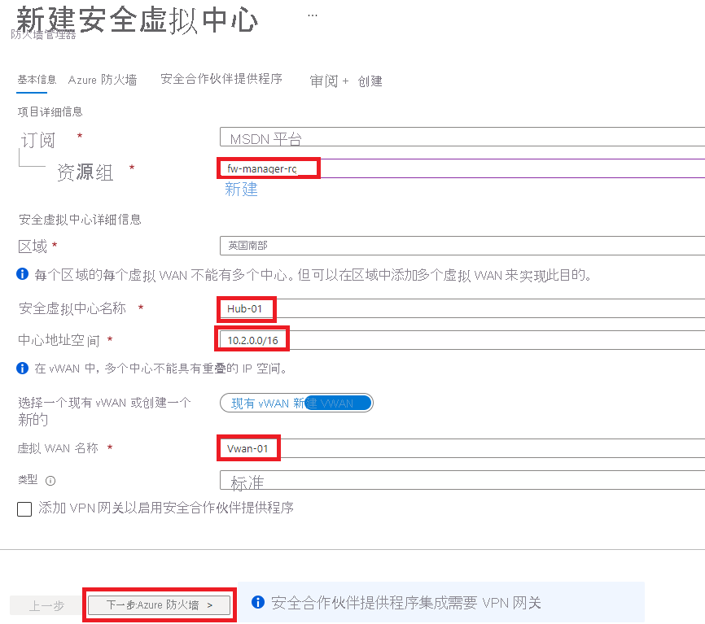
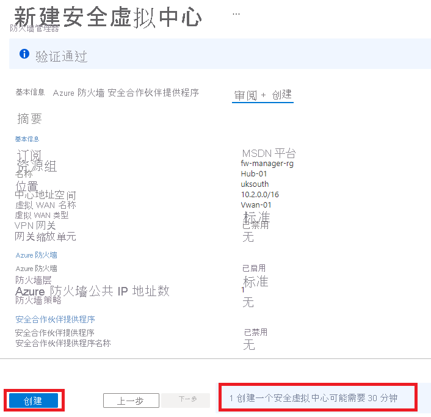
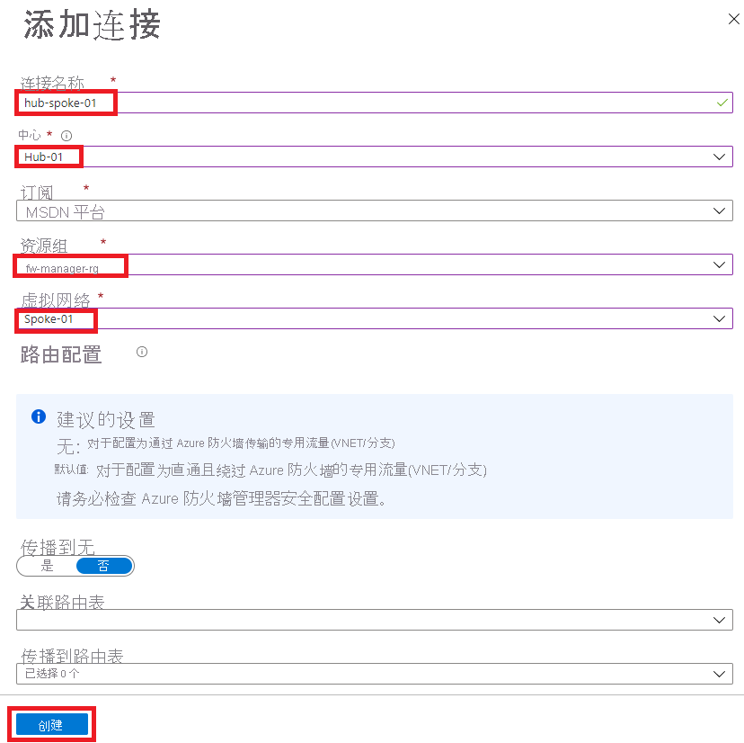
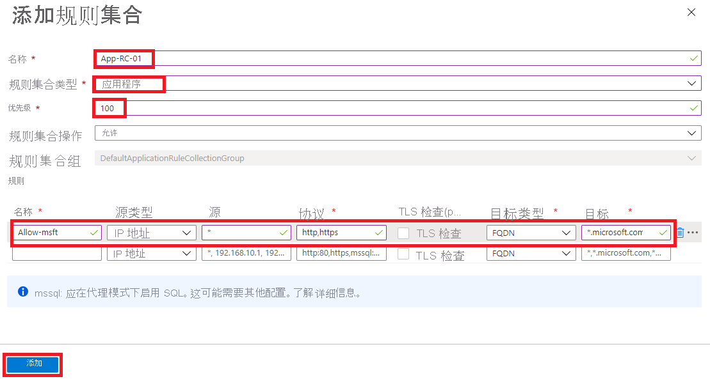
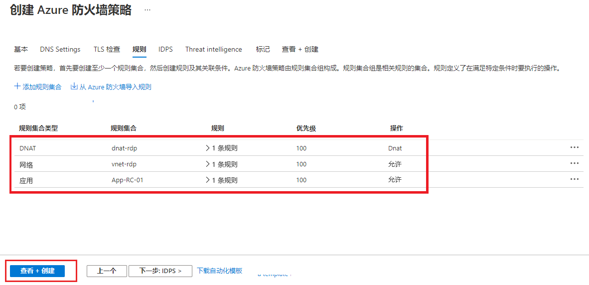
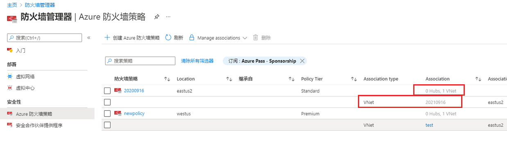
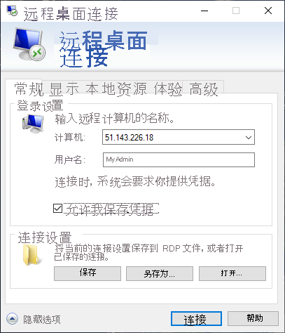
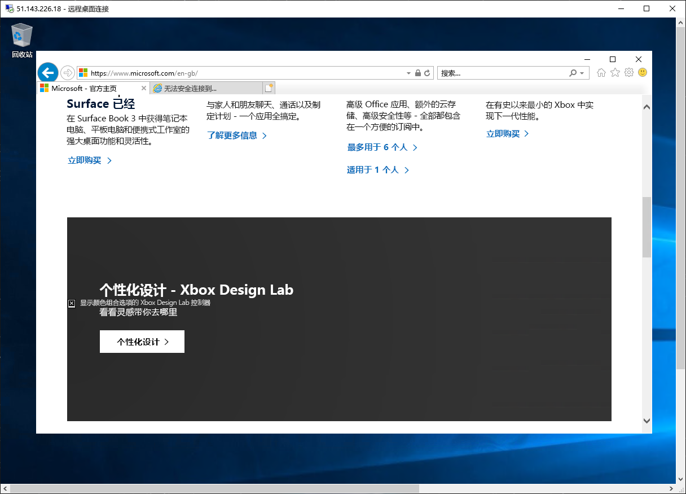
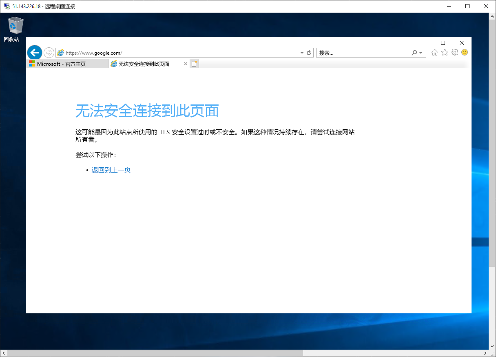
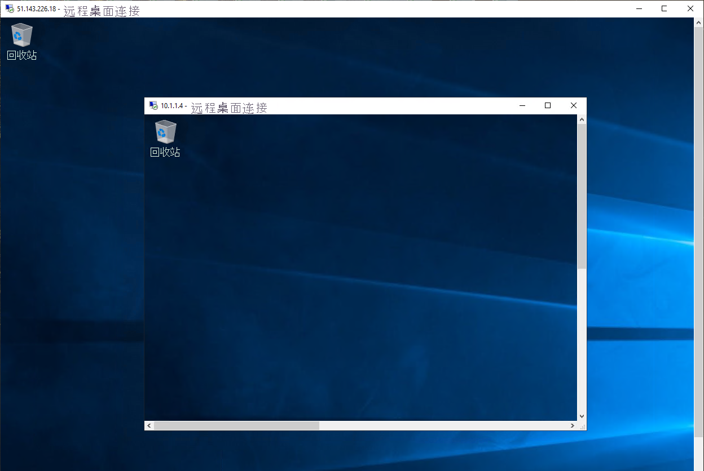

---
Exercise:
  title: 模块 06 - 第 9 单元 使用 Azure 防火墙管理器保护虚拟中心安全
  module: Module 06 - Design and implement network security
---


# 模块 06-单元 9 使用 Azure 防火墙管理器保护虚拟中心安全

在此练习中，你将创建分支虚拟网络并创建安全虚拟中心，然后连接中心和分支虚拟网络，并将流量路由到中心。 接下来，你将部署工作负载服务器，然后创建防火墙策略并保护中心，最后测试防火墙。


**注意：** 我们提供 **[交互式实验室模拟](https://mslabs.cloudguides.com/guides/AZ-700%20Lab%20Simulation%20-%20Secure%20your%20virtual%20hub%20using%20Azure%20Firewall%20Manager)** ，让你能以自己的节奏点击浏览实验室。 你可能会发现交互式模拟与托管实验室之间存在细微差异，但演示的核心概念和思想是相同的。

## 创建中心和辐射体系结构

在此练习部分，你将创建分支虚拟网络和子网，用于放置工作负载服务器。 然后，你将创建安全虚拟中心，并连接中心和分支虚拟网络。

通过学习本练习，你将能够：

+ 任务 1：创建两个分支虚拟网络和子网
+ 任务 2：创建安全虚拟中心
+ 任务 3：连接中心和分支虚拟网络
+ 任务 4：部署服务器
+ 任务 5：创建防火墙策略并保护中心
+ 任务 6：关联防火墙策略
+ 任务 7：将流量路由到中心
+ 任务 8：测试应用程序规则
+ 任务 9：测试网络规则
+ 任务 10：清理资源

#### 预计用时：35 分钟

## 任务 1：创建两个分支虚拟网络和子网

在此任务中，你将创建两个分支虚拟网络，每个虚拟网络都包含一个托管工作负载服务器的子网。 

1. 在 Azure 门户主页上的搜索框中，输入“虚拟网络”，并在出现“虚拟网络”时选择它 。
2. 选择“创建”。
3. 在“资源组”中，选择“新建”，输入 fw-manager-rg 作为名称，然后选择“确定”。
4. 在“名称”中，输入 Spoke-01。
5. 在“区域”中，选择你的区域。
6. 在完成时选择“下一步:IP 地址”。
7. 在“IPv4 地址空间”中，输入“10.0.0.0/16”。 
8. 删除此处列出的任何其他地址空间，例如 10.1.0.0/16。
9. 在“子网名称”下，选择词语“默认”。
10. 在“编辑子网”对话框中，将名称更改为“Workload-01-SN”。
11. 将“子网地址范围”更改为“10.0.1.0/24”。
12. 选择“保存”。
13. 选择“查看 + 创建”。
14. 选择“创建”。

重复上述步骤 1 到 14，创建另一个类似的虚拟网络和子网，但使用以下信息：

- 资源组：fw-manager-rg（选择现有资源组）
- 姓名：**Spoke-02**
- 地址空间：10.1.0.0/16 -（删除列出的任何其他地址）
- 子网名称：**Workload-02-SN**
- 子网地址范围：**10.1.1.0/24**

## 任务 2：创建安全虚拟中心

在此任务中，你将使用防火墙管理器创建安全虚拟中心。

1. 在 Azure 门户主页上，选择“所有服务”。

2. 在搜索框中，输入“防火墙管理器”，然后在出现“防火墙管理器”时选择它。

3. 在“防火墙管理器”页上，从概述页面选择“查看安全虚拟中心” 。

4. 在“虚拟中心”页上，选择“创建新的安全虚拟中心”。

5. 对于**资源组**，请选择 **fw-manager-rg**。

6. 在“区域”中，选择你的区域。

7. 在“安全虚拟中心名称”中，输入 Hub-01 。

8. 在“中心地址空间”中，输入“10.2.0.0/16”。

9. 选择“新建 vWAN”。

10. 在“虚拟 WAN 名称”中，输入“Vwan-01”。

11. 在完成时选择“下一步:Azure 防火墙”。
    

12. 选择“下一步: 安全合作伙伴提供程序”。

13. 选择“下一步: 查看 + 创建”。

14. 选择“创建”。

    > **[!NOTE]** 
    >
    > 部署可能需要 30 分钟。

    

    

15. 部署完成后，从 Azure 门户主页，选择“所有服务”。

16. 在搜索框中，输入“防火墙管理器”，然后在出现“防火墙管理器”时选择它。

17. 在“防火墙管理器”页上，选择“虚拟中心”。

18. 选择“Hub-01”。

19. 选择“公共 IP 配置”。

20. 记下公共 IP 地址（例如 51.143.226.18），稍后将使用它。

## 任务 3：连接中心和分支虚拟网络

在此任务中，你将连接中心和分支虚拟网络。 这通常被称为“对等互连”。

1. 从 Azure 门户主页中，选择“资源组”。
2. 选择 **fw-manager-rg** 资源组，然后选择 **Vwan-01** 虚拟 WAN。
3. 在“连接”下，选择“虚拟网络连接”。
4. 选择“添加连接”。
5. 对于“连接名称”，请输入“hub-spoke-01”。
6. 对于“中心”，选择“Hub-01”。
7. 对于**资源组**，请选择 **fw-manager-rg**。
8. 对于“虚拟网络”，选择“Spoke-01”。
9. 选择“创建”。
   
10. 重复上面的步骤 4 到步骤 9，以创建另一个类似的连接，但使用 hub-spoke-02 的连接名称连接到 Spoke-02 虚拟网络。


 

## 任务 4：部署服务器

1. 在 Azure 门户的“Cloud Shell”窗格中打开“PowerShell”会话 。

1. 在 Cloud Shell 窗格的工具栏中，选择“上传/下载文件”图标，在下拉菜单中选择“上传”，将文件 FirewallManager.json 和 FirewallManager.parameters.json 从源文件夹 F:\Allfiles\Exercises\M06 逐个上传到 Cloud Shell 主目录    。

1. 部署以下 ARM 模板以创建此练习所需的 VM：

   >注意：系统会提示你提供管理员密码。

   ```powershell
   $RGName = "fw-manager-rg"
   
   New-AzResourceGroupDeployment -ResourceGroupName $RGName -TemplateFile FirewallManager.json -TemplateParameterFile FirewallManager.parameters.json
   ```
  
1. 部署完成后，转到 Azure 门户主页，然后选择“虚拟机”。

1. 在 Srv-workload-01 的“概述”页上，在右侧窗格中的“网络”部分下，记下“专用 IP 地址”（例如 10.0.1.4）。

1. 在 Srv-workload-02 的“概述”页上，在右侧窗格中的“网络”部分下，记下“专用 IP 地址”（例如 10.1.1.4）。


## 任务 5：创建防火墙策略并保护中心

在此任务中，你将首先创建防火墙策略，然后保护中心。 防火墙策略定义规则集合，以在一个或多个安全虚拟中心上定向流量。

1. 从 Azure 门户主页中，选择“防火墙管理器”。
   - 如果“防火墙管理器”图标未显示在主页，则选择“所有服务”。 然后在搜索框中，输入“防火墙管理器”，并在出现“防火墙管理器”时选择它。

1. 从“防火墙管理器”的概述页面，选择“查看 Azure 防火墙策略” 。

1. 选择“创建 Azure 防火墙策略”。

1. 在“资源组”中，选择“fw-manager-rg” 。

5. 在“策略详细信息”下的“名称”中，输入“Policy-01”。

1. 在“区域”中，选择你的区域。

1. 在“策略层”中，选择“标准” 。

1. 选择“下一步: DNS 设置”。

1. 选择“下一步: TLS 检查(预览版)”。

1. 选择**下一步：规则**。

1. 在“规则”选项卡上，选择“添加规则集合”。

1. 在“添加规则集合”页面的“名称”中，输入“App-RC-01”。

1. 对于“规则集合类型”，选择“应用程序”。

1. 对于“优先级”，请输入“100”。

1. 确保“规则集合操作”设置为“允许”。

1. 在“规则”下的“名称”中，输入“Allow-msft”。

1. 对于“源类型”，请选择“IP 地址”。

1. 对于“源”，请输入 *。

1. 对于“协议”，请输入 http、https。

1. 确保“目标类型”是“FQDN” 。

1. 对于“目标”，请输入 *.microsoft.com。

1. 选择 **添加** 。

    

1. 若要添加 DNAT 规则，以便可以将远程桌面连接到 Srv-workload-01 VM，请选择“添加规则集合”。

1. 对于“名称”，请输入“dnat-rdp”。

1. 对于“规则集合类型”，请选择“DNAT” 。

1. 对于“优先级”，请输入“100”。

1. 在“规则”下的“名称”中，输入“Allow-rdp”。

1. 对于“源类型”，请选择“IP 地址”。

1. 对于“源”，请输入 *。

1. 对于“协议”，请选择“TCP”。

1. 对于“目标端口”，请输入“3389”。

1. 对于“目标类型”，请选择“IP 地址”。

1. 对于“目标”，请输入前面记下的防火墙虚拟中心公共 IP 地址（例如 51.143.226.18）。

1. 对于“已翻译的地址”，请输入前面记下的 Srv-workload-01 专用 IP 地址（例如，10.0.1.4）。

1. 对于“已翻译的端口”，请输入“3389”。

1. 选择 **添加** 。

1. 若要添加网络规则，以便将远程桌面从 Srv-workload-01 连接到 Srv-workload-02 VM，请选择“添加规则集合”。

1. 对于“名称”，请输入 vnet-rdp。

1. 对于“规则集合类型”，请选择“网络”。

1. 对于“优先级”，请输入“100”。

1. 对于**规则集合操作**，请选择**允许**。

1. 在“规则”下的“名称”中，输入“Allow-vnet”。

1. 对于“源类型”，请选择“IP 地址”。

1. 对于“源”，请输入 *。

1. 对于“协议”，请选择“TCP”。

1. 对于“目标端口”，请输入“3389”。

1. 对于“目标类型”，请选择“IP 地址”。

1. 对于“目标”，输入之前记下的 Srv-workload-02 专用 IP 地址（例如 10.1.1.4）。

1. 选择 **添加** 。

    

1. 现在应列出 3 个规则集合。

1. 选择“查看 + 创建”。

1. 选择“创建”。

## 任务 6：关联防火墙策略

在此任务中，将防火墙策略与虚拟中心关联。

1. 从 Azure 门户主页中，选择“防火墙管理器”。
   - 如果“防火墙管理器”图标未显示在主页，则选择“所有服务”。 然后在搜索框中，输入“防火墙管理器”，并在出现“防火墙管理器”时选择它。
1. 在“防火墙管理器”的“安全性”下，选择“Azure 防火墙策略”  。
1. 选中“Policy-01”复选框。
1. 选择“管理关联&gt;关联中心”。
1. 选中“Hub-01”复选框。
1. 选择 **添加** 。
1. 附加策略后，选择“刷新”。 应显示关联。



 

## 任务 7：将流量路由到中心

在此任务中，必须确保通过防火墙路由网络流量。

1. 在“防火墙管理器”中，选择“虚拟中心” 。
1. 选择“Hub-01”。
1. 在“设置”下，选择“安全配置” 。
1. 在“Internet 流量”中，选择“Azure 防火墙” 。
1. 在“专用流量”中，选择“通过 Azure 防火墙发送” 。
1. 选择“保存” 。 
1. 完成此设置可能需要几分钟时间。
1. 配置完成后，请确保在“INTERNET 流量”和“专用流量”下，这两个中心辐射型连接都显示“受 Azure 防火墙保护”。


## 任务 8：测试应用程序规则

在此练习部分，将远程桌面连接到防火墙公共 IP 地址，即 NATed 连接到 Srv-Workload-01。 然后使用 Web 浏览器测试应用程序规则，并将远程桌面连接到 Srv-Workload-02 来测试网络规则。

在此任务中，你将测试应用程序规则，以确认它是否按预期正常工作。

1. 在电脑上打开“远程桌面连接”。

1. 在“计算机”框中，输入防火墙的公共 IP 地址（例如 51.143.226.18）  。

1. 选择“显示选项”。

1. 在“用户名”框中，输入“TestUser” 。

1. 选择“连接”。

   

1. 在“输入凭据”对话框中，使用部署期间提供的密码登录到 Srv-workload-01 服务器虚拟机 。

1. 选择“确定”。

1. 选择证书消息上的“是”。

1. 打开 Internet Explorer，然后选择“设置 Internet Explorer 11”对话框中选择“确定”。

1. 浏览到 https:// www.microsoft.com 。

1. 在“安全警报”对话框中，选择“确定” 。

1. 在可能弹出的 Internet Explorer 安全警报中，选择“关闭”。

1. 应会看到 Microsoft 主页。

    

1. 浏览到 https:// www.google.com 。

1. 防火墙应会阻止你访问。

    

1. 因此，你已验证可以连接到允许 FQDN 的网络，但被所有其他网络阻止。

## 任务 9：测试网络规则

在此任务中，你将测试网络规则，以确认它是否按预期正常工作。

1. 仍登录到 Srv-workload-01 RDP 会话时，请从此远程计算机打开“远程桌面连接”。

1. 在“计算机”框中，输入 Srv-workload-02 的“专用 IP 地址”（例如 10.1.1.4）   。

1. 在“输入凭据”对话框中，使用用户名 TestUser 和部署期间提供的密码登录到 Srv-workload-02 服务器  。

1. 选择“确定”。

1. 选择证书消息上的“是”。

   

1. 现在，你已验证防火墙网络规则是否正常工作，因为已将远程桌面从一台服务器连接到另一个虚拟网络中的另一台服务器。

1. 关闭这两个 RDP 会话以断开连接。


## 任务 10：清理资源 

>**注意**：记得删除所有不再使用的新建 Azure 资源。 删除未使用的资源可确保不会出现意外费用。

1. 在 Azure 门户的“Cloud Shell”窗格中打开“PowerShell”会话 。

1. 通过运行以下命令，删除在此模块的实验室中创建的所有资源组：

   ```powershell
   Remove-AzResourceGroup -Name 'fw-manager-rg' -Force -AsJob
   ```

    >**注意**：该命令以异步方式执行（由 -AsJob 参数决定），因此，虽然你可以随后立即在同一个 PowerShell 会话中运行另一个 PowerShell 命令，但需要几分钟才能实际删除资源组。
