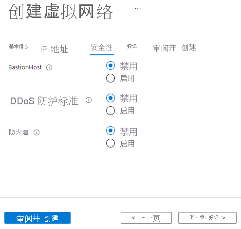
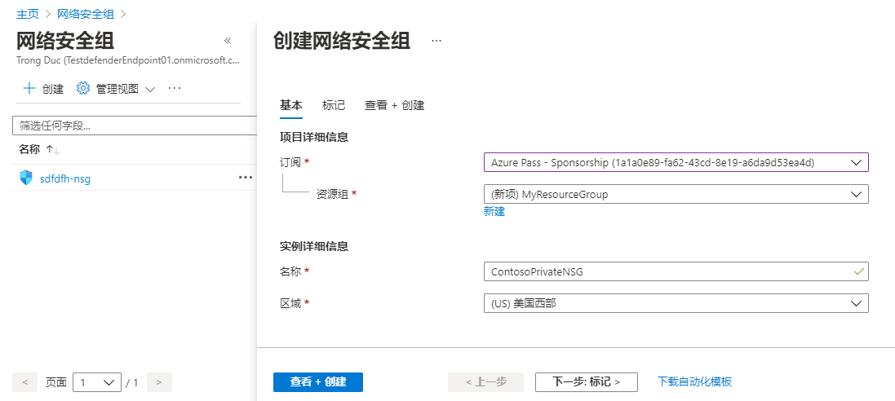
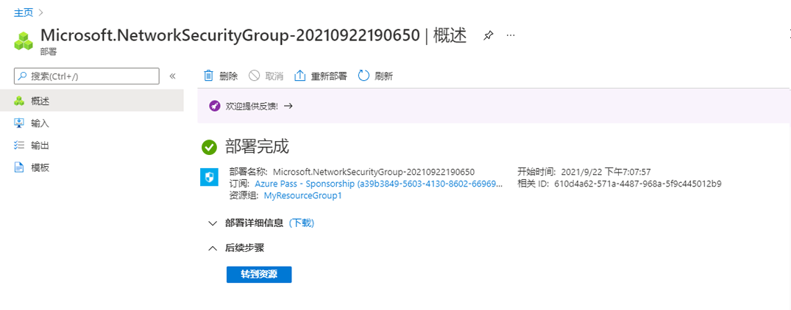
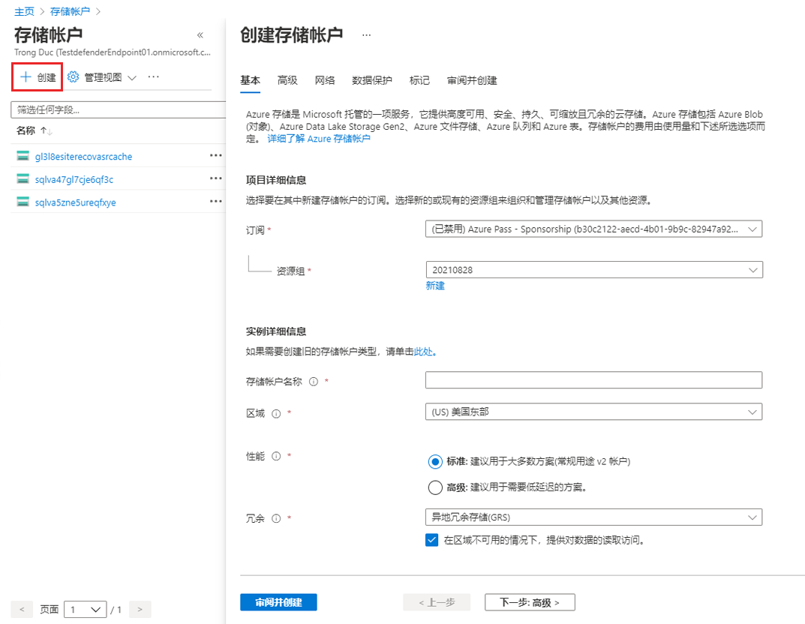
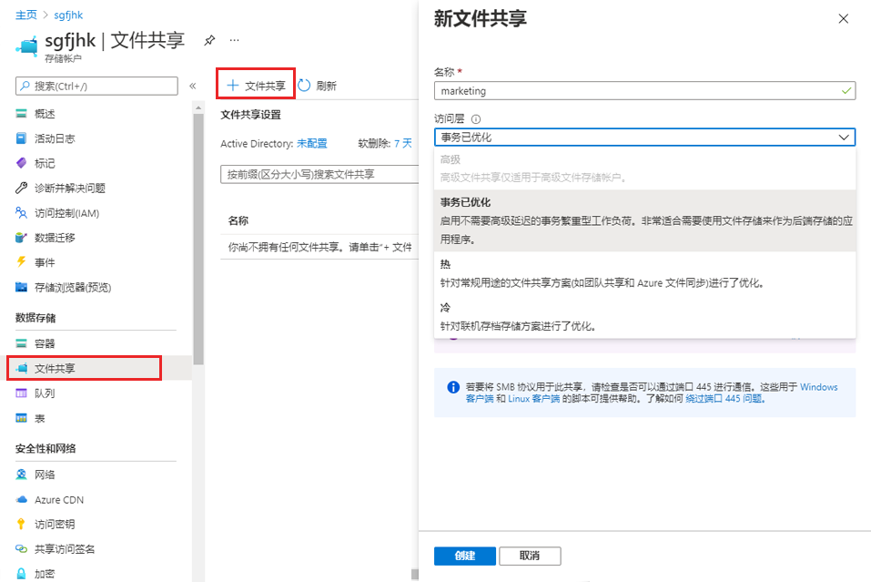
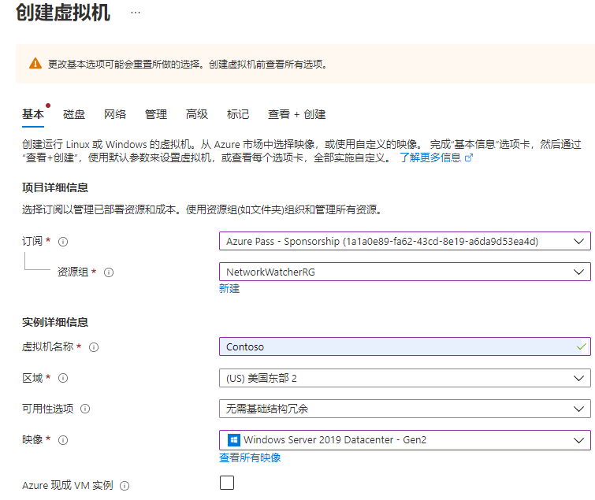
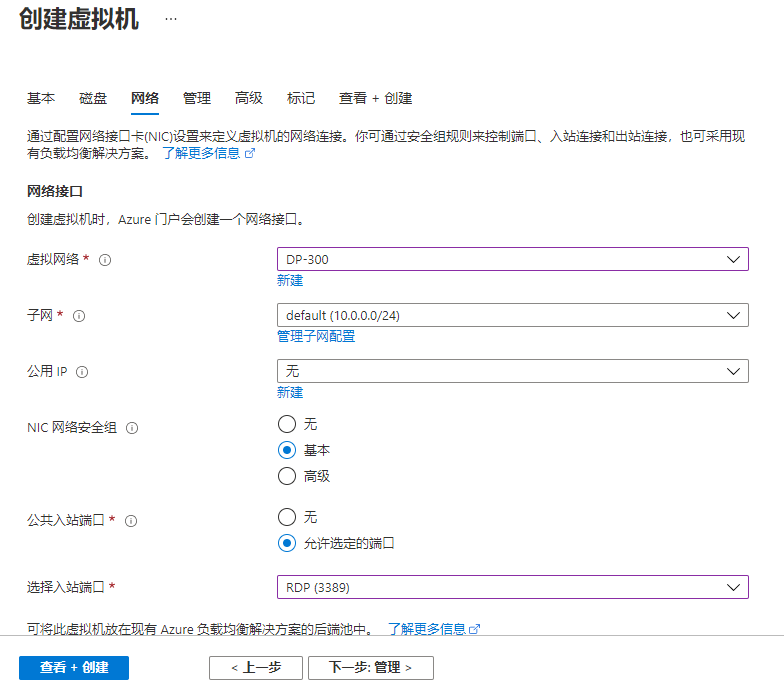

---
Exercise:
    title: '模块 07-第 5 单元 使用虚拟网络服务终结点限制对 PaaS 资源的网络访问'
    module: '模块 - 设计和实现对 Azure 服务的专用访问'
---

# 模块 07-第 5 单元 使用虚拟网络服务终结点限制对 PaaS 资源的网络访问


你可以通过虚拟网络服务终结点将对某些 Azure 服务资源的网络访问限制到虚拟网络子网。你还可以删除对资源的网络访问。服务终结点提供从NIDE 虚拟网络到支持 Azure 服务的直接连接，允许你使用虚拟网络的专用地址空间访问 Azure 服务。通过服务终结点发往 Azure 资源的流量始终留在 Microsoft Azure 骨干网络上。

在本练习中，你将：

+ 任务 1：创建虚拟网络
+ 任务 2：启用服务终结点
+ 任务 3：限制子网的网络访问
+ 任务 4：添加额外的出站规则 
+ 任务 5：允许访问 RDP 连接
+ 任务 6：限制对资源的网络访问
+ 任务 7：在存储帐户中创建一个文件共享
+ 任务 8：限制对子网的网络访问
+ 任务 9：创建虚拟机
+ 任务 10：确认对存储帐户的访问
+ 任务 11：清理资源

## 任务 1：创建虚拟网络

1. 登录 Azure 门户。

2. 在 Azure 门户主页上，搜索虚拟网络，然后从结果中选择“**虚拟网络**”。

3. 选择“**+ 创建**”。

4. 输入或选择下列信息：
   

   | **设置**    | **值**                                     |
   | -------------- | --------------------------------------------- |
   | 订阅   | 选择你的订阅                      |
   | 资源组 | （新的）myResourceGroup                         |
   | 名称           | CoreServicesVNet                              |
   | 位置       | 选择“**美国东部**”                            |

5. 选择“**IP 地址**”选项卡，输入以下值（选择“**默认**”以更改子网名称）：
   

   | **设置**          | **值**   |
   | -------------------- | ----------- |
   | 地址空间        | 10.0.0.0/16 |
   | 子网名称          | 公共      |
   | 子网地址范围 | 10.0.0.0/24 |

6. 选择“**安全性**”选项卡，然后输入以下值：
   

   | **设置**     | **值** |
   | --------------- | --------- |
   | BastionHost     | 已禁用  |
   | DDoS 防护 | 已禁用  |
   | 防火墙        | 已禁用  |

7. 单击“**查看 + 创建**”。验证资源后，选择“**创建**”。 

## 任务 2：启用服务终结点

每个服务，每个子网都启用了服务终结点。创建一个子网并为该子网启用服务终结点。

1. 在门户顶部的“**搜索资源、服务和文档**”对话框中，输入 CoreServicesVNet。搜索结果中显示 CoreServicesVNet 时，选中它。

2. 将子网添加到虚拟网络。在“**设置**”中选择“**子网**”，然后选择“**+ 子网**”，如下图所示： 
   

3. 在“**添加子网**”中，选择或输入以下信息：

   | **设置**                 | **值**                    |
   | --------------------------- | ---------------------------- |
   | 名称                        | 专用                      |
   | 地址范围               | 10.0.1.0/24                  |
   | 服务终结点：服务 | 选择“**Microsoft.Storage**” |

4. 选择“**保存**”。

现在，应已配置两个子网：


 

## 任务 3：限制子网的网络访问

默认情况下，子网中的所有 VM 均可与所有资源进行通信。可以通过创建网络安全组并将其关联到子网来限制与子网中所有资源的通信。

1. 在门户顶部的“**搜索资源、服务和文档**”对话框中，输入“**安全组**”。当“**网络安全组**”出现在搜索结果中时，将其选中。

2. 在网络安全组页中，选择“**+ 创建**”。 

3. 输入或选择下列信息： 
   

   | **设置**    | **值**                                                    |
   | -------------- | ------------------------------------------------------------ |
   | 订阅   | 选择你的订阅                                     |
   | 资源组 | myResourceGroup                                              |
   | 名称           | ContosoPrivateNSG                                            |
   | 位置       | 选择“**美国东部**”                                           |

4. 选择“**查看 + 创建**”，然后单击“**创建**”：

5. 创建 ContosoPrivateNSG 网络安全组后，选择“**前往资源**”。
   

6. 在“**设置**”下，选择“**出站安全规则**”。

7. 选择“**+ 添加**”。

8. 创建一个规则，允许与 Azure 存储服务的出站通信。输入或选择下列信息：
   

   | **设置**             | **值**                 |
   | ----------------------- | ------------------------- |
   | 源                  | 选择 **VirtualNetwork** |
   | 源端口范围      | *                         |
   | 目标             | 选择“**服务标记**”    |
   | 目标服务标记 | 选择“**存储**”        |
   | 服务                 | 自定义                    |
   | 目标端口范围 | *                         |
   | 协议                | 任何                       |
   | 操作                  | 允许                     |
   | 优先级                | 100                       |
   | 名称                    | Allow-Storage-All         |

9. 选择“**添加**”：


## 任务 4：添加额外的出站规则 

创建另一个拒绝与 Internet 通信的出站安全规则。该规则将覆盖所有允许出站网络通信的网络安全组中的默认规则。 

1. 选择“**出站安全规则**”下的“**+ 添加**”。

2. 输入或选择下列信息：
   

   | **设置**             | **值**                 |
   | ----------------------- | ------------------------- |
   | 源                  | 选择 **VirtualNetwork** |
   | 源端口范围      | *                         |
   | 目标             | 选择“**服务标记**”    |
   | 目标服务标记 | 选择“**Internet**”       |
   | 服务                 | 自定义                    |
   | 目标端口范围 | *                         |
   | 协议                | 任何                       |
   | 操作                  | 拒绝                      |
   | 优先级                | 110                       |
   | 名称                    | Deny-Internet-All         |

3. 选择“**添加**”。

## 任务 5：允许访问 RDP 连接

创建一个入站安全规则，允许远程桌面协议 (RDP) 流量从任何位置流向子网。该规则将覆盖默认的安全规则，拒绝来自网络的所有入站流量。允许远程桌面连接到子网，以便在以后的步骤中测试连接性。

1. 在 ContosoPrivateNSG | 出站安全规则上，选择“**设置**”下的“**入站安全规则**”。

2. 选择“**+ 添加**”。

3. 在“添加入站安全规则”中，输入以下值：
   

   | **设置**             | **值**                 |
   | ----------------------- | ------------------------- |
   | 源                  | 任何                       |
   | 源端口范围      | *                         |
   | 目标             | 选择“**VirtualNetwork**” |
   | 服务                 | 自定义                    |
   | 目标端口范围 | 3389                      |
   | 协议                | 任何                       |
   | 操作                  | 允许                     |
   | 优先级                | 120                       |
   | 名称                    | Allow-RDP-All             |

4. 然后选择“**添加**”。

> **警告**：RDP 端口 3389 向 Internet 公开。仅建议在测试过程中使用此选项。对于生产环境，建议使用 VPN 或专用连接。

5. 在“**设置**”下，选择“**子网**”。

6. 选择“**+ 关联**”。

7. 在“**关联子网**”中，选择“**虚拟网络**”，然后在“**选择一个虚拟网络**”下选择“**CoreServicesVNet**”。

8. 在**选择子网**下，选择**个人**，然后选择**确定**。

## 任务 6：限制对资源的网络访问

限制网络访问到 Azure 服务（为服务终结点启用）创建资源的必要步骤因服务而异。有关每种服务的特定步骤，请参阅单一服务文档。作为示例，本练习的其余部分包括限制 Azure 存储帐户的网络访问的步骤。

1. 在 Azure 门户中，选择“存储帐户”。

2. 选择“+ 创建”。

3. 输入或选择以下信息，保留其余默认设置：
   

   | **设置**    | **值**                                                    |
   | -------------- | ------------------------------------------------------------ |
   | 订阅   | 选择你的订阅                                     |
   | 资源组 | myResourceGroup                                              |
   | 名称           | 输入 contostoragewestxx（其中 xx 是你的姓名首字母以确保唯一性） |
   | 性能    | 标准 StorageV2（常规用途 v2）                      |
   | 位置       | 选择“美国东部”                                               |
   | 复制    | 本地冗余存储 (LRS)                              |

4. 单击“**查看 + 创建**”，然后单击“**创建**”。

## 任务 7：在存储帐户中创建一个文件共享

1. 创建存储帐户后，在门户顶部的**搜索资源、服务和文档**对话框中，输入存储帐户名。当搜索结果中显示村粗帐户的名称时，选中。
2. 选择**文件共享**，如下图所示： 
   
3. 选择 **+ 文件共享**。
4. 在“**名称**”下输入“营销”，然后选择“**创建**”。

## 任务 8：限制对子网的网络访问

默认情况下，存储帐户接受来自任何网络上客户端的连接，包括网络。除 CoreServicesVNet 虚拟网络中的“专用”子网之外，拒绝来自 Internet 以及所有虚拟网络中的所有其他子网的网络访问。

1. 在存储帐户的“**安全 + 网络**”下，选择“**网络**”。

2. 选择“**所选网络**”。

3. 选择 **+ 添加现有虚拟网络**。

4. 在“**添加网络**”下，选择以下值：
   

   | **设置**      | **值**                    |
   | ---------------- | ---------------------------- |
   | 订阅     | 选择你的订阅。    |
   | 虚拟网络 | 选择“**CoreServicesVNet**”。 |
   | 子网          | 选择“**专用**”。          |

5. 选择“**添加**”。

6. 选择“**保存**”。

7. 在存储帐户的“**安全和网络**”下，选择“**访问密钥**”。

8. 选择“**显示密钥**”。记下**密钥**值，因为在后续步骤中将文件共享映射到 VM 中的驱动器号时，需要手动输入该值。

## 任务 9：创建虚拟机

要测试对存储帐户的网络访问，请将 VM 部署到每个子网。

1. 在 Azure 门户主页屏幕中，选择虚拟机，选择“**+ 创建**”，然后选择“**+ 虚拟机**”。

2. 在“基本信息”选项卡上，输入或选择以下信息： 
   

   | **设置**           | **值**                                                    |
   | --------------------- | ------------------------------------------------------------ |
   | 项目详细信息       |                                                              |
   | 订阅          | 选择你的订阅。                                    |
   | 资源组        | myResourceGroup                                              |
   | 实例详细信息      |                                                              |
   | 虚拟机名称  | ContosoWestPublic                                            |
   | 区域                | （美国）美国东部                                                 |
   | 可用性选项  | 无需基础结构冗余                        |
   | 映像                 | 选择“**Windows Server 2019 Datacenter**”。                   |
   | 大小                  | Standard_D2s                                                 |
   | 管理员帐户 |                                                              |
   | 用户名              | 输入你选择的用户名。                          |
   | 密码              | 输入你选择的密码。                           |
   | 确认密码      | 再次输入密码。                                       |
   | 入站端口规则    |                                                              |
   | 公共入站端口  | 允许选定的端口                                         |
   | 选择入站端口  | RDP (3389)                                                   |

3. 然后选择“**网络**”选项卡。输入或选择下列信息：
   

   | **设置**                | **值**                  |
   | -------------------------- | -------------------------- |
   | 虚拟网络            | CoreServicesVNet           |
   | 子网                     | 公共 (10.0.0.0/24)       |
   | 公共 IP                  | （新）ContosoWestPublic-ip |
   | NIC 网络安全组 | 基本                      |
   | 公共入站端口       | 允许选定的端口       |
   | 选择入站端口       | RDP (3389)                 |

4. 单击“**查看 + 创建**”。

5. 选择“**创建**”以启动虚拟机部署。部署 VM 需要几分钟时间，但在创建 VM 期间，可以继续执行下一步骤。

6. 创建另一个虚拟机，再次完成步骤 2 到步骤 5，将虚拟机命名为 ContosoWestPrivate 并选择**专用**子网。

VM 部署需要几分钟的时间。在完成创建并在门户中打开设置之前，请勿继续下一步。

 

## 任务 10：确认对存储帐户的访问

1. 完成 ContosoWestPrivate VM 创建后，选择“前往资源”以打开 VM 的边栏选项卡。选择“连接”按钮，然后选择“RDP”。
   
2. 选择“连接”按钮和“RDP”后，选择“下载 RDP 文件”按钮。此时会创建远程桌面协议 (.rdp) 文件，并下载到计算机。
3. 打开下载的 rdp 文件。如果出现提示，请选择“连接”。输入创建 VM 时指定的用户名和密码。可能需要选择“更多选择”，然后选择“使用其他帐户”，以指定在创建 VM 时输入的凭据。
4. 单击“**确定**”。
5. 在登录过程中，你可能会收到证书警告。如果收到警告，请选择“是”或“继续”以继续连接。
6. 在 ContosoWestPrivate VM 上，使用 PowerShell 将 Azure 文件共享映射到驱动器 Z。在运行后面的命令之前，将 <storage-account-key>、<storage-account-name>（例如 contosostoragewestxx）以及 my-file-share（例如“市场营销”）替换为你在“创建一个存储帐户”任务中提供和检索的值。

```Azure CLI
$acctKey = ConvertTo-SecureString -String "<storage-account-key>" -AsPlainText -Force

$credential = New-Object System.Management.Automation.PSCredential -ArgumentList "Azure\<storage-account-name>", $acctKey

New-PSDrive -Name Z -PSProvider FileSystem -Root "\\<storage-account-name>.file.core.windows.net\my-file-share" -Credential $credential
```

Azure 文件共享已成功映射到 Z 驱动器。

7. 通过命令提示符确认 VM 没有与 Internet 的出站连接：

 ping bing.com

你不会收到任何回复，因为与专用子网有关的网络安全组不允许与 Internet 建立出站访问。

8. 关闭与 ContosoWestPrivate VM 建立的远程桌面会话。

### 确认已拒绝对存储帐户的访问

1. 在门户顶部的“**搜索资源、服务和文档**”对话框中，输入 ContosoWestPublic。

2. 搜索结果中显示 **ContosoWestPublic** 时，将其选中。

3. 针对 ContosoWestPublic VM 完成“确认对存储帐户的访问”任务中的步骤 1-6。  
     
   ‎短暂等待后，你会收到“New-PSDrive: 访问被拒绝”错误。访问被拒绝，是因为 ContosoWestPublic VM 部署在公共子网中。公共子网没有为 Azure 存储启用服务终结点。存储帐户仅允许从专用子网访问网络，而不允许从公共子网访问。

4. 通过命令提示符确认公共 VM 确实具有与 Internet 的出站连接：

 ping bing.com    
    
5. 关闭与 ContosoWestPublic VM 建立的远程桌面会话。

6. 在你的计算机上，浏览到 Azure 门户。

7. 输入你在**搜索资源、服务和文档**对话框中创建的存储帐户名。当搜索结果中显示村粗帐户的名称时，选中。

8. 选择“**文件共享**”，然后选择“**市场营销**”文件共享。

9. 你会收到以下屏幕截图中显示的错误：

    

 访问被拒绝，是因为计算机不在 CoreServicesVNet 虚拟网络的专用子网中。

> **警告**：在继续下一步之前，应该删除此实验室教学使用的所有资源。为此，应在“Azure 门户”中，单击“资源组”。选择你创建的任何资源组。在资源组边栏选项卡上，单击“删除资源组”，输入资源组名称，然后单击“删除”。对你创建的任何其他资源组重复该过程。否则可能会导致其他实验室出现问题。

结果：现在你已经完成了本实验室教学。

## 任务 11：清理资源

   >**备注**：请记得删除不再使用的所有新创建的 Azure 资源。删除未使用的资源，确保不产生意外费用。

1. 在 Azure 门户中，在“**Cloud Shell**”窗格中打开“**PowerShell**”会话。

1. 运行以下命令，删除在本模块各个实验室中创建的所有资源组：

   ```powershell
   Remove-AzResourceGroup -Name 'myResourceGroup' -Force -AsJob
   ```

    >**备注**：该命令以异步方式执行（由 -AsJob 参数决定），因此，虽然你随后可在同一 PowerShell 会话中立即运行另一个 PowerShell 命令，但实际上要花几分钟才能删除资源组。
