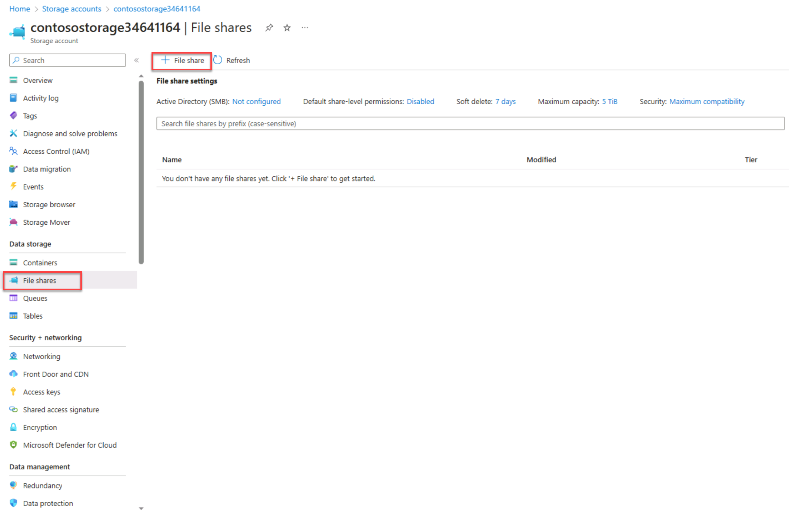

---
Exercise:
  title: 模块 07 - 第 5 单元 使用虚拟网络服务终结点限制对 PaaS 资源的网络访问
  module: Module 07 - Design and implement private access to Azure Services
---

# 模块 07-第 5 单元 使用虚拟网络服务终结点限制对 PaaS 资源的网络访问


通过虚拟网络服务终结点，可将某些 Azure 服务资源限制为仅允许某个虚拟网络子网通过网络进行访问。 还可以删除对资源的 Internet 访问。 服务终结点提供从虚拟网络到受支持 Azure 服务的直接连接，使你能够使用虚拟网络的专用地址空间访问 Azure 服务。 通过服务终结点发往 Azure 资源的流量始终保留在 Microsoft Azure 主干网络上。


通过学习本练习，你将能够：

+ 任务 1：创建虚拟网络
+ 任务 2：启用服务终结点
+ 任务 3：限制子网的网络访问
+ 任务 4：添加其他出站规则 
+ 任务 5：允许访问 RDP 连接
+ 任务 6：限制对资源的网络访问
+ 任务 7：在存储帐户中创建文件共享
+ 任务 8：限制对子网的网络访问
+ 任务 9：创建虚拟机
+ 任务 10：确认对存储帐户的访问权限
+ 任务 11：清理资源

**注意：** 我们提供 **[交互式实验室模拟](https://mslabs.cloudguides.com/guides/AZ-700%20Lab%20Simulation%20-%20Restrict%20network%20access%20to%20PaaS%20resources%20with%20virtual%20network%20service%20endpoints)** ，让你能以自己的节奏点击浏览实验室。 你可能会发现交互式模拟与托管实验室之间存在细微差异，但演示的核心概念和思想是相同的。

#### 预计用时：35 分钟

## 任务 1：创建虚拟网络

1. 登录到 Azure 门户。

1. 在 Azure 主页上搜索虚拟网络，然后从结果中选择“虚拟网络”。

1. 选择“+ 创建”。

1. 输入或选择以下信息：

   | 设置    | 值                                     |
   | -------------- | --------------------------------------------- |
   | 订阅   | 选择订阅                      |
   | 资源组 | (New) myResourceGroup                         |
   | 名称           | CoreServicesVnet                              |
   | 位置       | 选择“美国东部”                            |

1. 选择“IP 地址”选项卡并输入以下值（选择“默认值”更改子网名称） ：

   | 设置          | **值**   |
   | -------------------- | ----------- |
   | 地址空间        | 10.0.0.0/16 |
   | 子网名称          | 公共      |
   | 子网地址范围 | 10.0.0.0/24 |

1. 选择“安全”选项卡并输入以下值：

   | 设置             | **值** |
   | ----------------------- | --------- |
   | BastionHost             | 已禁用  |
   | DDoS 网络保护 | 已禁用  |
   | 防火墙                | 已禁用  |

1. 选择“查看 + 创建”  。 验证资源后，选择“创建”。 

## 任务 2：启用服务终结点

每个服务、每个子网均启用服务终结点。 创建子网并为该子网启用服务终结点。

1. 在门户顶部的“搜索资源、服务和文档”框中，输入 CoreServicesVNet。 当 CoreServicesVNet 出现在搜索结果中时，将其选中。

1. 将子网添加到虚拟网络。 在“设置”下面选择“子网”，然后选择“+ 子网”  ，如下图中所示：

1. 在“添加子网”下，选择或输入以下信息：

   | 设置                 | **值**                    |
   | --------------------------- | ---------------------------- |
   | 名称                        | 专用                      |
   | 地址范围               | 10.0.1.0/24                  |
   | 服务终结点：服务 | 选择“Microsoft.Storage” |

1. 选择“保存”。

你现在应该配置了两个子网：


 

## 任务 3：限制子网的网络访问

默认情况下，子网中的所有虚拟机都可以与所有资源通信。 可以通过创建网络安全组并将其关联到子网来限制与子网中所有资源的通信。

1. 在门户顶部的“搜索资源、服务和文档”框中，输入“安全组”。 当“网络安全组”出现在搜索结果中时，将其选中。

1. 在"网络安全组"中，选择“+ 创建”。 

1. 输入或选择以下信息： 


   | 设置    | 值                                                    |
   | -------------- | ------------------------------------------------------------ |
   | 订阅   | 选择订阅                                     |
   | 资源组 | myResourceGroup                                              |
   | 名称           | ContosoPrivateNSG                                            |
   | 位置       | 选择“美国东部”                                           |

1. 选择“查看 + 创建”，然后选择“创建”：

1. 创建 ContosoPrivateNSG 网络安全组后，选择“转到资源”。

1. 在“设置”下，选择“出站安全规则”。

1. 选择“+ 添加”。

1. 创建一条允许出站通信到 Azure 存储服务的规则。 输入或选择以下信息：

   | 设置             | **值**                 |
   | ----------------------- | ------------------------- |
   | 源                  | 选择“服务标记”    |
   | 源服务标记      | 选择“VirtualNetwork” |
   | 源端口范围      | *                         |
   | 目标             | 选择“服务标记”    |
   | 目标服务标记 | 选择“存储”        |
   | 服务                 | 自定义                    |
   | 目标端口范围 | *                         |
   | 协议                | Any                       |
   | 操作                  | Allow                     |
   | 优先级                | 100                       |
   | 名称                    | Allow-Storage-All         |

1. 选择“添加”：


## 任务 4：添加其他出站规则 

创建另一条出站安全规则，拒绝到 Internet 的通信。 此规则将覆盖所有网络安全组中允许出站 Internet 通信的默认规则。 

1. 在“出站安全规则”下，选择“+ 添加”。

1. 输入或选择以下信息：

   | 设置             | **值**                 |
   | ----------------------- | ------------------------- |
   | 源                  | 选择“服务标记”    |
   | 源服务标记      | 选择“VirtualNetwork” |
   | 源端口范围      | *                         |
   | 目标             | 选择“服务标记”    |
   | 目标服务标记 | 选择“Internet”       |
   | 服务                 | 自定义                    |
   | 目标端口范围 | *                         |
   | 协议                | Any                       |
   | 操作                  | 拒绝                      |
   | 优先级                | 110                       |
   | 名称                    | Deny-Internet-All         |

1. 选择 **添加** 。

## 任务 5：允许访问 RDP 连接

创建一个允许从任何位置向该子网发送远程桌面协议 (RDP) 流量的入站安全规则。 该规则将替代拒绝来自 Internet 的所有入站流量的默认安全规则。 允许与子网建立远程桌面连接，以便可以在后续步骤中测试连接。

1. 在 ContosoPrivateNSG | 出站安全规则的“设置”下，选择“入站安全规则”。

1. 选择“+ 添加”。

1. 在“添加入站安全规则”中，输入以下值：

   | 设置             | **值**                 |
   | ----------------------- | ------------------------- |
   | 源                  | 任意                       |
   | 源端口范围      | *                         |
   | 目标             | 选择“VirtualNetwork” |
   | 服务                 | 自定义                    |
   | 目标端口范围 | 3389                      |
   | 协议                | Any                       |
   | 操作                  | Allow                     |
   | 优先级                | 120                       |
   | 名称                    | Allow-RDP-All             |

1. 然后选择“添加”。

> **警告**：RDP 端口 3389 向 Internet 公开。 建议仅用于测试。 对于生产环境，建议使用 VPN 或专用连接。

1. 在“设置”下，选择“子网”。

1. 选择“+ 关联”。

1. 在“关联子网”下，选择“虚拟网络”，然后选择“选择虚拟网络”下的“CoreServicesVNet”。

1. 在“选择子网”下选择“专用”，然后选择“确定”。

## 任务 6：限制对资源的网络访问

对于通过为服务终结点启用的 Azure 服务创建的资源，限制对其的网络访问时所需的步骤因服务而异。 请参阅各个服务的文档来了解适用于每个服务的具体步骤。 例如，本练习的其余部分包括限制对 Azure 存储帐户的网络访问的步骤。

1. 在 Azure 门户中，选择“存储帐户”。

1. 选择 + 创建。

1. 输入或选择以下信息并接受其余默认值：


   | 设置    | 值                                                    |
   | -------------- | ------------------------------------------------------------ |
   | 订阅   | 选择订阅                                     |
   | 资源组 | myResourceGroup                                              |
   | 名称           | 输入 contostoragewestxx（其中 xx 是你的姓名首字母，以使其具有唯一性） |
   | 性能    | 标准 StorageV2（常规用途 V2）                      |
   | 位置       | 选择“美国东部”                                               |
   | 复制    | 本地冗余存储 (LRS)                              |

1. 选择“查看”，然后选择“创建” 。

## 任务 7：在存储帐户中创建文件共享

1. 创建存储帐户后，在门户顶部的“搜索资源、服务和文档”框中输入该存储帐户的名称。 该存储帐户的名称出现在搜索结果中时，请选择它。
1. 选择“文件共享”，如下图所示：
1. 选择“+ 文件共享”。
1. 在“名称”下输入“市场营销”，然后选择“下一步: 备份”。
   
1. 取消选择“启用备份”，如下图所示：
1. 选择“查看 + 创建”  。 验证资源后，选择“创建”。

## 任务 8：限制对子网的网络访问

默认情况下，存储帐户接受来自任何网络（包括 Internet）中的客户端的网络连接。 除 CoreServicesVNet 虚拟网络中的“专用”子网之外，拒绝来自 Internet 以及所有虚拟网络中的所有其他子网的网络访问。

1. 在存储帐户的“安全 + 网络”下，选择“网络”。

1. 选择“已从所选虚拟网络和 IP 地址启用”。

1. 选择“+添加现有虚拟网络”。

1. 在“添加网络”下，选择以下值：

   | 设置      | 值                    |
   | ---------------- | ---------------------------- |
   | 订阅     | 选择订阅。    |
   | 虚拟网络 | 选择 CoreServicesVNet。 |
   | 子网          | 选择“专用”****。          |

1. 选择“添加”  。

1. 选择“保存” 。

1. 在存储帐户的“安全和网络”下，选择“访问密钥”。

1. 选择“显示密钥”。 记下“密钥”值，因为在后续步骤中将文件共享映射到 VM 中的驱动器号时，需要手动输入该值。

## 任务 9：创建虚拟机

若要测试对存储帐户的网络访问，请向每个子网部署 VM。

1. 在 Azure 门户的“Cloud Shell”窗格中打开“PowerShell”会话 。

1. 在 Cloud Shell 窗格的工具栏中，选择“上传/下载文件”图标，在下拉菜单中选择“上传”，将文件 VMs.json 和 VMs.parameters.json 从源文件夹 F:\Allfiles\Exercises\M07 逐个上传到 Cloud Shell 主目录    。

1. 部署以下 ARM 模板以创建此练习所需的 VM：

   >注意：系统会提示你提供管理员密码。

   ```powershell
   $RGName = "myResourceGroup"
   
   New-AzResourceGroupDeployment -ResourceGroupName $RGName -TemplateFile VMs.json -TemplateParameterFile VMs.parameters.json
   ```
  
1. 部署完成后，转到 Azure 门户主页，然后选择“虚拟机”。


## 任务 10：确认对存储帐户的访问权限

1. ContosoWestPrivate VM 创建完成后，选择“转到资源”，打开 VM 的边栏选项卡。 选择“连接”按钮，然后选择“RDP”。
   
1. 选择“连接”按钮和 RDP 后，选择“下载 RDP 文件”按钮。 此时会创建远程桌面协议 (.rdp) 文件，并下载到计算机。
1. 打开下载的 rdp 文件。 出现提示时，选择“连接”。 输入在创建 VM 时指定的用户名和密码。 可能需要选择“更多选择”  ，然后选择“使用其他帐户”  ，以指定在创建 VM 时输入的凭据。
1. 选择“确定”。
1. 你可能会在登录过程中收到证书警告。 如果收到警告，请选择“是”或“继续”以继续连接。
1. 在 ContosoWestPrivate VM 上，使用 PowerShell 将 Azure 文件共享映射到驱动器 Z。 在运行以下命令之前，将 <storage-account-key>、<storage-account-name>（即 contosostoragexx）和 my-file-share（即 marketing）替换为你在“创建存储帐户”任务中提供和检索的值。


```azurecli
$acctKey = ConvertTo-SecureString -String "<storage-account-key>" -AsPlainText -Force

$credential = New-Object System.Management.Automation.PSCredential -ArgumentList "Azure\<storage-account-name>", $acctKey

New-PSDrive -Name Z -PSProvider FileSystem -Root "\\<storage-account-name>.file.core.windows.net\marketing" -Credential $credential

```

Azure 文件共享已成功映射到驱动器 Z。

1. 通过命令提示符确认 VM 没有与 Internet 建立出站连接：

 ping bing.com


你不会收到回复，因为关联到“专用”子网的网络安全组不允许与 Internet 建立出站访问。

1. 关闭与 ContosoWestPrivate VM 的远程桌面会话。

### 确认已拒绝对存储帐户的访问

1. 在门户顶部的“搜索资源、服务和文档”框中，输入 ContosoPublic。

1. 当 ContosoPublic 出现在搜索结果中时，请将其选中。

1. 完成 ContosoPublic VM 的“确认访问存储帐户”任务中的步骤 1-6。  
     
   ‎短暂等待后，你会收到“New-PSDrive：访问被拒绝”的错误消息。 访问被拒绝，因为 ContosoPublic VM 部署在公共子网中。 “公共”子网没有为 Azure 存储启用服务终结点。 存储帐户仅允许从“专用”子网访问网络，而不允许从“公共”子网访问。

1. 从命令提示符确认公共 VM 确实具有到 Internet 的出站连接：

 ping bing.com    

1. 关闭与 ContosoPublic VM 的远程桌面会话。

1. 在计算机上浏览到 Azure 门户。

1. 在“搜索资源、服务和文档”框中输入创建的存储帐户的名称。 该存储帐户的名称出现在搜索结果中时，请选择它。

1. 选择“文件共享”，然后选择“市场营销”文件共享 。

1. 你会收到如以下屏幕截图中所示的错误：

    

 访问被拒绝，因为计算机不在 CoreServicesVNet 虚拟网络的“专用”子网中。

> **警告**：在继续之前，应删除用于此实验室的所有资源。 为此，在 Azure 门户中，选择“资源组”。 选择已创建的任何资源组。 在“资源组”边栏选项卡上，选择“删除资源组”，输入资源组名称，然后选择“删除”。 对可能创建的任何其他资源组重复此过程。 未执行以上操作可能会导致其他实验室问题。

结果：你已完成此实验室。

## 任务 11：清理资源

   >**注意**：记得删除所有不再使用的新建 Azure 资源。 删除未使用的资源可确保不会出现意外费用。

1. 在 Azure 门户的“Cloud Shell”窗格中打开“PowerShell”会话 。

1. 通过运行以下命令，删除在此模块的实验室中创建的所有资源组：

   ```powershell
   Remove-AzResourceGroup -Name 'myResourceGroup' -Force -AsJob
   ```

    >**注意**：该命令以异步方式执行（由 -AsJob 参数决定），因此，虽然你可以随后立即在同一个 PowerShell 会话中运行另一个 PowerShell 命令，但需要几分钟才能实际删除资源组。
