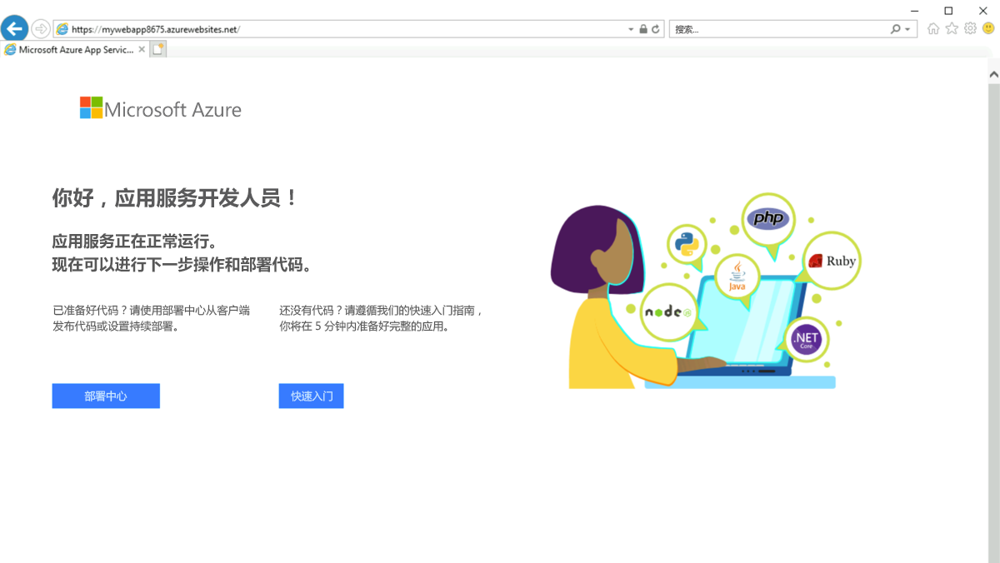

---
Exercise:
  title: 模块 07 -第 6 单元 使用 Azure PowerShell 创建 Azure 专用终结点
  module: Module 07 - Design and implement private access to Azure Services
---

# 模块 07 - 第 6 单元 使用 Azure PowerShell 创建 Azure 专用终结点（可选）

> **备注**：此实验是可选的。 上一个实验室，*使用虚拟网络服务终结点限制对 PaaS 资源的网络访问*，涵盖了此功能。 将来，此实验室将停用。 

## 练习场景

使用专用终结点安全连接到 Azure Web 应用以开始使用 Azure 专用链接。 可以通过很多方法（包括门户、CLI、PowerShell 等）创建终结点。


### 估计时间：45 分钟

你将创建 Azure Web 应用的专用终结点，并部署虚拟机以测试专用连接。

可以为不同类型的 Azure 服务（例如 Azure SQL 和 Azure 存储）创建专用终结点。

**先决条件**

- Azure 订阅中部署了 PremiumV2 层或更高版本应用服务计划的 Azure Web 应用。

- 以下步骤将指导你创建所需的资源组和 Web 应用。

1. 在 M07 文件夹中找到并打开 parameters.json。 在记事本中打开它，找到行 "value":"GEN-UNIQUE"。 将占位符 GEN-UNIQUE 字符串替换为 webapp 名称的唯一值。 保存此更改。

1. 在 Azure 门户的“Cloud Shell”窗格中打开“PowerShell”会话 。

1. 在 Cloud Shell 窗格的工具栏中，选择“**管理文件**”图标，在下拉菜单中选择“**上传**”，将 **template.json** 和 **parameters.json** 文件上传到 Cloud Shell 主目录。

    > **备注：** 如果在自己的订阅中工作，则[模板文件](https://github.com/MicrosoftLearning/AZ-700-Designing-and-Implementing-Microsoft-Azure-Networking-Solutions/tree/master/Allfiles/Exercises)在 GitHub 实验室存储库中可用。

如果选择在本地安装并使用 PowerShell，则本示例需要 Azure PowerShell 模块 5.4.1 或更高版本。 运行 ```Get-Module -ListAvailable Az``` 查找已安装的版本。 如果需要进行升级，请参阅 [Install Azure PowerShell module](https://docs.microsoft.com/en-us/powershell/azure/install-az-ps)（安装 Azure PowerShell 模块）。 如果在本地运行 PowerShell，则还需运行 ```Connect-AzAccount``` 以创建与 Azure 的连接。

### 工作技能

通过学习本练习，你将能够：

- 任务 1：创建资源组
- 任务 2：创建虚拟网络和堡垒主机
- 任务 3：创建测试虚拟机
- 任务 4：创建专用终结点
- 任务 5：配置专用 DNS 区域
- 任务 6：测试与专用终结点的连接

## 任务 1：创建资源组并部署必备 Web 应用

Azure 资源组是在其中部署和管理 Azure 资源的逻辑容器。

使用 [New-AzResourceGroup](https://docs.microsoft.com/en-us/powershell/module/az.resources/new-azresourcegroup) 创建资源组：

```PowerShell
New-AzResourceGroup -Name 'CreatePrivateEndpointQS-rg' -Location 'eastus'
```

部署以下 ARM 模板以创建本练习所需的 PremiumV2 层 Azure Web 应用：

   ```powershell
   $RGName = "CreatePrivateEndpointQS-rg"
   
   New-AzResourceGroupDeployment -ResourceGroupName $RGName -TemplateFile template.json -TemplateParameterFile parameters.json
   ```

如果你收到错误消息（例如在门户中查看部署状态时），例如“具有给定名称 GEN-UNIQUE 的网站已存在。”， 请务必转到上面提到的有关编辑模板的先决条件。

## 任务 2：创建虚拟网络和堡垒主机

你将创建虚拟网络、子网和堡垒主机。

堡垒主机将用于安全地连接到虚拟机，以测试专用终结点。

使用以下命令创建虚拟网络和堡垒主机：

- New-AzVirtualNetwork

- New-AzPublicIpAddress

- New-AzBastion

```PowerShell

## Create backend subnet config. ##

$subnetConfig = New-AzVirtualNetworkSubnetConfig -Name myBackendSubnet -AddressPrefix 10.0.0.0/24

## Create Azure Bastion subnet. ##

$bastsubnetConfig = New-AzVirtualNetworkSubnetConfig -Name AzureBastionSubnet -AddressPrefix 10.0.1.0/24

## Create the virtual network. ##

$parameters1 = @{

 Name = 'MyVNet'

 ResourceGroupName = 'CreatePrivateEndpointQS-rg'

 Location = 'eastus'

 AddressPrefix = '10.0.0.0/16'

 Subnet = $subnetConfig, $bastsubnetConfig

}

$vnet = New-AzVirtualNetwork @parameters1

## Create public IP address for bastion host. ##

$parameters2 = @{

 Name = 'myBastionIP'

 ResourceGroupName = 'CreatePrivateEndpointQS-rg'

 Location = 'eastus'

 Sku = 'Standard'

 AllocationMethod = 'Static'

}

$publicip = New-AzPublicIpAddress @parameters2

## Create bastion host ##

$parameters3 = @{

 ResourceGroupName = 'CreatePrivateEndpointQS-rg'

 Name = 'myBastion'

 PublicIpAddress = $publicip

 VirtualNetwork = $vnet

}

New-AzBastion @parameters3

```

## 任务 3：创建测试虚拟机

在本部分中，你将创建用于测试专用终结点的虚拟机。

使用以下命令创建虚拟机：

- Get-Credential（注意：系统会提示你提供管理员密码。）

- New-AzNetworkInterface

- New-AzVM

- New-AzVMConfig

- Set-AzVMOperatingSystem

- Set-AzVMSourceImage

- Add-AzVMNetworkInterface

```PowerShell
## Register Standard Security Type ##

Register-AzProviderFeature -FeatureName UseStandardSecurityType -ProviderNamespace Microsoft.Compute

## Set credentials for server admin and password. ##

$cred = Get-Credential

## Command to get virtual network configuration. ##

$vnet = Get-AzVirtualNetwork -Name myVNet -ResourceGroupName CreatePrivateEndpointQS-rg

## Command to create network interface for VM ##

$parameters1 = @{

 Name = 'myNicVM'

 ResourceGroupName = 'CreatePrivateEndpointQS-rg'

 Location = 'eastus'

 Subnet = $vnet.Subnets[0]

}

$nicVM = New-AzNetworkInterface @parameters1

## Create a virtual machine configuration.##

$parameters2 = @{

 VMName = 'myVM'

 VMSize = 'Standard_DS1_v2'

}

$parameters3 = @{

 ComputerName = 'myVM'

 Credential = $cred

}

$parameters4 = @{

 PublisherName = 'MicrosoftWindowsServer'

 Offer = 'WindowsServer'

 Skus = '2019-Datacenter'

 Version = 'latest'

}

$vmConfig = New-AzVMConfig @parameters2 | Set-AzVMOperatingSystem -Windows @parameters3 | Set-AzVMSourceImage @parameters4 | Add-AzVMNetworkInterface -Id $nicVM.Id

## Create the virtual machine ##

New-AzVM -ResourceGroupName 'CreatePrivateEndpointQS-rg' -Location 'eastus' -VM $vmConfig 


```

Azure 为未获得公共 IP 地址或位于内部基本 Azure 负载均衡器后端池中的 Azure 虚拟机提供临时 IP。 临时 IP 机制可提供无法配置的出站 IP 地址。

如果将公共 IP 地址分配给某个虚拟机或将该虚拟机置入具有或不具有出站规则的标准负载均衡器的后端池中时，将禁用其原有的临时 IP。 如果向虚拟机的子网分配 Azure 虚拟网络 NAT 网关资源，也会禁用其临时 IP。

有关 Azure 中出站连接的详细信息，请参阅为出站连接使用源网络地址转换 (SNAT)。

## 任务 4：创建专用终结点

在本部分中，你将使用以下命令创建专用终结点和连接：

- New-AzPrivateLinkServiceConnection

- New-AzPrivateEndpoint

```PowerShell
## Place web app into variable. This assumes that only one web app exists in the resource group. ##

$webapp = Get-AzWebApp -ResourceGroupName CreatePrivateEndpointQS-rg

## Create Private Endpoint connection. ##

$parameters1 = @{

 Name = 'myConnection'

 PrivateLinkServiceId = $webapp.ID

 GroupID = 'sites'

}

$privateEndpointConnection = New-AzPrivateLinkServiceConnection @parameters1

## Place virtual network into variable. ##

$vnet = Get-AzVirtualNetwork -ResourceGroupName 'CreatePrivateEndpointQS-rg' -Name 'myVNet'

## Disable private endpoint network policy ##

$vnet.Subnets[0].PrivateEndpointNetworkPolicies = "Disabled"

$vnet | Set-AzVirtualNetwork

## Create private endpoint

$parameters2 = @{

 ResourceGroupName = 'CreatePrivateEndpointQS-rg'

 Name = 'myPrivateEndpoint'

 Location = 'eastus'

 Subnet = $vnet.Subnets[0]

 PrivateLinkServiceConnection = $privateEndpointConnection

}

New-AzPrivateEndpoint @parameters2 
```

## 任务 5：配置专用 DNS 区域

在本部分中，你将使用以下命令创建和配置专用 DNS 区域：

- New-AzPrivateDnsZone

- New-AzPrivateDnsVirtualNetworkLink

- New-AzPrivateDnsZoneConfig

- New-AzPrivateDnsZoneGroup

```PowerShell
## Place virtual network into variable. ##

$vnet = Get-AzVirtualNetwork -ResourceGroupName 'CreatePrivateEndpointQS-rg' -Name 'myVNet'

## Create private dns zone. ##

$parameters1 = @{

 ResourceGroupName = 'CreatePrivateEndpointQS-rg'

 Name = 'privatelink.azurewebsites.net'

}

$zone = New-AzPrivateDnsZone @parameters1

## Create dns network link. ##

$parameters2 = @{

 ResourceGroupName = 'CreatePrivateEndpointQS-rg'

 ZoneName = 'privatelink.azurewebsites.net'

 Name = 'myLink'

 VirtualNetworkId = $vnet.Id

}

$link = New-AzPrivateDnsVirtualNetworkLink @parameters2

## Create DNS configuration ##

$parameters3 = @{

 Name = 'privatelink.azurewebsites.net'

 PrivateDnsZoneId = $zone.ResourceId

}

$config = New-AzPrivateDnsZoneConfig @parameters3

## Create DNS zone group. ##

$parameters4 = @{

 ResourceGroupName = 'CreatePrivateEndpointQS-rg'

 PrivateEndpointName = 'myPrivateEndpoint'

 Name = 'myZoneGroup'

 PrivateDnsZoneConfig = $config

}

New-AzPrivateDnsZoneGroup @parameters4 
```

## 任务 6：测试与专用终结点的连接

在本部分中，你将使用在上一步骤中创建的虚拟机通过专用终结点连接到 Web 应用。

1. 登录到 [Azure 门户](https://portal.azure.com/)

1. 在左侧导航窗格中选择“资源组”。

1. 选择“CreatePrivateEndpointQS-rg”。

1. 选择“myVM”。

1. 在 **myVM**的“概述”页上，选择“连接”，然后选择“堡垒”。

1. 选择蓝色的“使用堡垒”按钮。

1. 输入在创建虚拟机期间输入的用户名和密码。

1. 连接后，在服务器上打开 Windows PowerShell。

1. 输入 nslookup &lt;your- webapp-name&gt;.azurewebsites.net。 将 &lt;your-webapp-name&gt; 替换为在之前的步骤中创建的 Web 应用的名称。 你将收到类似于以下所示内容的消息：

  ```
  Server: UnKnown
  
  Address: 168.63.129.16
  
  Non-authoritative answer:
  
  Name: mywebapp8675.privatelink.azurewebsites.net
  
  Address: 10.0.0.5
  
  Aliases: mywebapp8675.azurewebsites.net 
  ```  

将为 Web 应用名称返回专用 IP 地址 10.0.0.5。 此地址位于你之前创建的虚拟网络的子网中。

1. 在到 myVM 的堡垒连接中，打开 Internet Explorer。
1. 输入 Web 应用的 URL，&lt;&gt;。
1. 如果尚未部署应用程序，将收到默认 Web 应用页面：
1. 关闭到 **myVM** 的连接。

## 清理资源

用完专用终结点和 VM 后，请使用 [Remove-AzResourceGroup](https://docs.microsoft.com/en-us/powershell/module/az.resources/remove-azresourcegroup) 删除资源组和组内所有资源：

```PowerShell
Remove-AzResourceGroup -Name CreatePrivateEndpointQS-rg -Force -AsJob
```

## 使用 Copilot 扩展学习

Copilot 可帮助你了解如何使用 Azure 脚本工具。 Copilot 还可以帮助了解实验室中未涵盖的领域或需要更多信息的领域。 打开 Edge 浏览器并选择“Copilot”（右上角）或导航到*copilot.microsoft.com*。 花几分钟时间尝试这些提示。
+ 提供何时使用专用终结点而不是服务终结点的示例。
+ 如何对专用终结点连接问题进行故障排除？

## 通过自定进度的培训了解详细信息

+ [Azure 专用链接简介](https://learn.microsoft.com/training/modules/introduction-azure-private-link/)。 本模块介绍 Azure 专用链接如何实现与 Azure 服务的专用连接，包括其功能、工作原理及用例。
+ [设计和实现对 Azure 服务的专用访问](https://learn.microsoft.com/en-us/training/modules/design-implement-private-access-to-azure-services/)。 本模块介绍如何使用 Azure 专用链接和虚拟网络服务终结点设计和实现对 Azure 服务的专用访问。

## 关键要点

+ 使用 Azure 专用链接，可以通过虚拟网络中的专用终结点访问 Azure PaaS 服务（例如，Azure 存储和 SQL 数据库）和 Azure 托管的客户拥有的服务/合作伙伴服务。
+ 专用终结点是使用虚拟网络中的专用 IP 地址的网络接口。 此网络接口以私密且安全的方式将你连接到由 Azure 专用链接提供支持的服务。 
