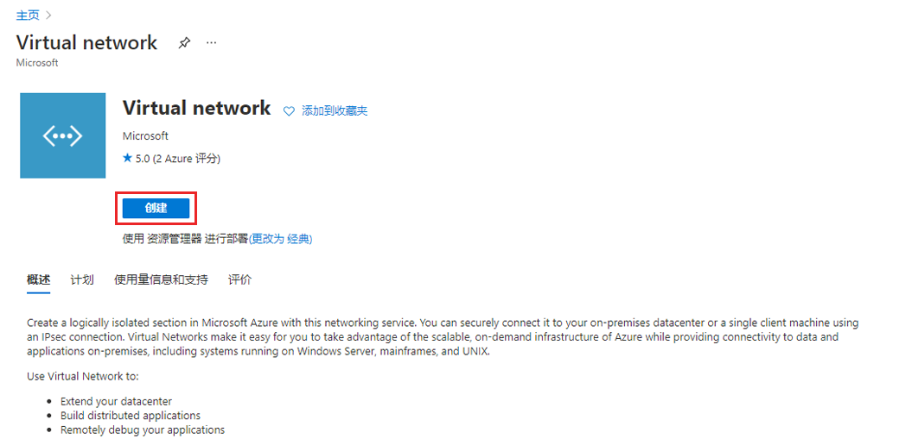
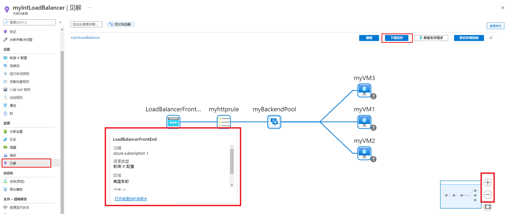

---
Exercise:
    title: '模块 8 - 第 3 单元使用 Azure Monitor 监视负载均衡器资源'
    module: '模块 - 设计和实现网络监视'
---

# 模块 8 - 第 3 单元使用 Azure Monitor 监视负载均衡器资源


在本练习中，你将为虚构的 Contoso Ltd 组织创建内部负载均衡器。然后，你将创建一个 Log Analytics 工作区，并使用 Azure Monitor Insights 查看关于内部负载均衡器的信息。你将查看功能依赖关系视图，然后查看负载均衡器资源的详细指标，并查看负载均衡器的资源运行状况信息。最后，你将配置负载均衡器的诊断设置，以将指标发送到自己创建的 Log Analytics 工作区。 

下图说明了将在本练习中部署的环境。


 在本练习中，你将：

+ 任务 1：创建虚拟网络
+ 任务 2：创建负载均衡器
+ 任务 3：创建后端池
+ 任务 4：创建运行状况探测
+ 任务 5：创建负载均衡器规则
+ 任务 6：创建后端服务器
+ 任务 7：将 VM 添加到后端池
+ 任务 8：在 VM 上安装 IIS
+ 任务 9：测试负载均衡器
+ 任务 10：创建 Log Analytics 工作区
+ 任务 11：使用功能依赖关系视图
+ 任务 12：查看详细指标
+ 任务 13：查看资源运行状况
+ 任务 14：配置诊断设置
+ 任务 15：清理资源


## 任务 1：创建虚拟网络

在本部分中，你将创建虚拟网络和子网。

1. 登录 Azure 门户。

2. 在 Azure 门户主页上，搜索“**虚拟网络**”并选择服务下的虚拟网络。

3. 单击“**+ 创建**”。

   

4. 在“**基本信息**”选项卡上，使用下表中的信息创建虚拟网络。

   | **设置**    | **值**                                           |
   | -------------- | --------------------------------------------------- |
   | 订阅   | 选择你的订阅                            |
   | 资源组 | 选择“**新建**”<br /><br />名称：**IntLB-RG** |
   | 名称           | **IntLB-VNet**                                      |
   | 区域         | **（美国）美国西部**                                    |

5. 单击“**下一步: IP 地址**”。

6. 在“**IP 地址**”选项卡上的“**IPv4 地址空间**”框中，键入“**10.1.0.0/16**”。

7. 在“**子网名称**”上方，选择“**+ 添加子网**”。

8. 在“**添加子网**”窗格中，提供子网名称“**myBackendSubnet**”，以及子网地址范围“**10.1.0.0/24**”。

9. 单击“**添加**”。

10. 单击“**下一步: 安全性**”。

11. 在“**BastionHost**”下，选择“**启用**”，然后输入下表中的信息。

    | **设置**                       | **值**                                              |
    | --------------------------------- | ------------------------------------------------------ |
    | Bastion 名称                      | **myBastionHost**                                      |
    | AzureBastionSubnet 地址空间  | **10.1.1.0/24**                                        |
    | 公共 IP 地址                 | 选择“**新建**”<br /><br />名称: **myBastionIP** |

12. 单击“**查看 + 创建**”。

13. 单击“**创建**”。

## 任务 2：创建负载均衡器

在本部分中，你将创建一个内部标准 SKU 负载均衡器。在练习中创建标准 SKU 负载均衡器而不是基本 SKU 负载均衡器的原因是后面的练习中需要标准 SKU 版本的负载均衡器。

1. 在 Azure 门户主页顶部的搜索框中，键入“**负载均衡器**”并选择服务下的负载均衡器。

2. 单击“**创建**”。

   

3. 在“**基本信息**”选项卡上，使用下表中的信息创建负载均衡器。

   | **设置**           | **值**                |
   | --------------------- | ------------------------ |
   | “基本”选项卡            |                          | 
   | 订阅          | 选择你的订阅 |
   | 资源组        | **IntLB-RG**             |
   | 名称                  | **myIntLoadBalancer**    |
   | 区域                | **（美国）美国西部**         |
   | SKU                   | **标准**             |
   | 类型                  | **内部**             |
   | “前端 IP 配置”选项卡 | + 添加前端 IP 配置 |
   | 虚拟网络       | **IntLB-VNet**           |
   | 子网                | **myBackendSubnet**      |
   | IP 地址分配 | **动态**              |


4. 单击“**查看 + 创建**”。


5. 单击“**创建**”。


## 任务 3：创建后端池

后端地址池包含连接到负载均衡器的虚拟 NIC 的 IP 地址。

1. 在 Azure 门户主页上，单击“**所有资源**”，然后单击资源列表中的“**myIntLoadBalancer**”。

2. 在“**设置**”下方，选择“**后端池**”，然后单击“**添加**”。

3. 在“**添加后端池**”页上，输入下表中的信息。

   | **设置**     | **值**            |
   | --------------- | -------------------- |
   | 名称            | **myBackendPool**    |
   | 虚拟网络 | **IntLB-VNet**       |
   | 关联到   | **虚拟机** |

4. 单击“**添加**”。

   

   

## 任务 4：创建运行状况探测

负载均衡器使用运行状况探测监视应用的状态。运行状况探测基于 VM 对运行状况检查的响应，在负载均衡器中添加或删除 VM。这里你将创建运行状况探测来监视 VM 的运行状况。

1. 在负载均衡器的“**后端池**”页的“**设置**”下方，单击“**运行状况探测**”，然后单击“**添加**”。

2. 在“**添加运行状况探测**”页上，输入下表中的信息。

   | **设置**         | **值**         |
   | ------------------- | ----------------- |
   | 名称                | **myHealthProbe** |
   | 协议            | **HTTP**          |
   | 端口                | **80**            |
   | 路径                | **/**             |
   | 间隔            | **15**            |
   | 运行不正常阈值 | **2**             |

3. 单击“**添加**”。

   


## 任务 5：创建负载均衡器规则

负载均衡器规则用于定义如何将流量分配到 VM。定义传入流量的前端 IP 配置和后端 IP 池以接收流量。源端口和目标端口在规则中定义。此时将要创建负载均衡器规则。

1. 在负载均衡器的“**后端池**”页的“**设置**”下方，单击“**负载均衡规则**”，然后单击“**添加**”。

2. 在“**添加负载均衡规则**”页上，输入下表中的信息。

   | **设置**            | **值**                |
   | ---------------------- | ------------------------ |
   | 名称                   | **myHTTPRule**           |
   | IP 版本             | **IPv4**                 |
   | 前端 IP 地址    | **LoadBalancerFrontEnd** |
   | 协议               | **TCP**                  |
   | 端口                   | **80**                   |
   | 后端端口           | **80**                   |
   | 后端池           | **myBackendPool**        |
   | 运行状况探测           | **myHealthProbe**        |
   | 会话持续性    | **无**                 |
   | 空闲超时（分钟） | **15**                   |
   | 浮动 IP            | **已禁用**             |

3. 单击“**添加**”。

   

## 任务 6：创建后端服务器


在本部分中，你将为负载均衡器的后端池创建三台同一可用性集中的 VM，将这些 VM 添加到后端池，然后在这三台 VM 上安装 IIS 以测试负载均衡器。

1. 在 Azure 门户中，在“**Cloud Shell**”窗格中打开“**PowerShell**”会话。

2. 在“Cloud Shell”窗格的工具栏中单击“上传/下载文件”图标，在下拉菜单中单击“上传”，然后将以下文件从源文件夹“**F:\Allfiles\Exercises\M08**”上传到 Cloud Shell 主目录中：**azuredeploy.json**、**azuredeploy.parameters.vm1.json**、**azuredeploy.parameters.vm2.json** 和 **azuredeploy.parameters.vm3.json**。

3. 部署以下 ARM 模板以创建本练习所需的虚拟网络、子网和 VM：

   ```powershell
   $RGName = "IntLB-RG"
   
   New-AzResourceGroupDeployment -ResourceGroupName $RGName -TemplateFile azuredeploy.json -TemplateParameterFile azuredeploy.parameters.vm1.json
   New-AzResourceGroupDeployment -ResourceGroupName $RGName -TemplateFile azuredeploy.json -TemplateParameterFile azuredeploy.parameters.vm2.json
   New-AzResourceGroupDeployment -ResourceGroupName $RGName -TemplateFile azuredeploy.json -TemplateParameterFile azuredeploy.parameters.vm3.json
   ```
  
    > **备注：** 这将需要几分钟才能完成部署。 

## 任务 7：将 VM 添加到后端池

1. 在 Azure 门户主页上，单击“**所有资源**”，然后单击资源列表中的“**myIntLoadBalancer**”。

2. 在“**设置**”下方，选择“**后端池**”，然后选择“**myBackendPool**”。

3. 在“**关联到**”框中，选择“**虚拟机**”。

4. 在“**虚拟机**”下，单击“**添加**”。

5. 选择所有这 3 台 VM（**myVM1**、**myVM2** 和 **myVM3**）的复选框，然后单击“**添加**”。

6. 在“**myBackendPool**”页上，单击“**保存**”。

   

 

## 任务 8：在 VM 上安装 IIS

1. 在 Azure 门户主页上，单击“**所有资源**”，然后单击资源列表中的“**myVM1**”。
2. 在“**概述**”页上，选择“**连接**”，然后选择“**Bastion**”。
3. 单击“**使用 Bastion**”。
4. 在“**用户名**”框中，键入“**TestUser**”，在“**密码**”框中，键入“**TestPa$$w0rd!**”，然后单击“**连接**”。
5. “**myVM1**”窗口将在另一个浏览器选项卡中打开。
6. 如果出现“**网络**”窗格，单击“**是**”。
7. 单击窗口左下角的“**Windows 启动**”图标，然后单击“**Windows PowerShell**”磁贴。
8. 若要安装 IIS，请在 PowerShell 中运行以下命令：Install-WindowsFeature -name Web-Server -IncludeManagementTools
9. 若要删除现有默认 Web 主页，请在 PowerShell 中运行以下命令：Remove-Item C:\inetpub\wwwroot\iisstart.htm
10. 若要添加新的默认 Web 主页并向其添加内容，请在 PowerShell 中运行以下命令：Add-Content -Path "C:\inetpub\wwwroot\iisstart.htm" -Value $("Hello World from " + $env:computername)
11. 关闭浏览器选项卡，即可关闭与 **myVM1** 建立的 Bastion 会话。
12. 再重复两次上文所述的步骤 1 到 11，在 **myVM2** 和 **myVM3** 虚拟机上安装 IIS 和更新后的默认主页。

 

## 任务 9：测试负载均衡器

在本部分，你将创建测试 VM，然后测试负载均衡器。

### 创建测试 VM

1. 在 Azure 主页上，使用全局搜索类型“**虚拟机**”并选择服务下的虚拟机。 

2. 在“**基本**”选项卡中选择“**+ 创建; + 虚拟机**”，使用下表中的信息创建第一台 VM。

   | **设置**          | **值**                                    |
   | -------------------- | -------------------------------------------- |
   | 订阅         | 选择你的订阅                     |
   | 资源组       | **IntLB-RG**                                 |
   | 虚拟机名称 | **myTestVM**                                 |
   | 区域               | **（美国）美国西部**                             |
   | 可用性选项 | **无需基础结构冗余**    |
   | 映像                | **Windows Server 2019 Datacenter - Gen 1**   |
   | 大小                 | **Standard_DS1_v2 - 1 vcpu，3.5 GiB 内存** |
   | 用户名             | **TestUser**                                 |
   | 密码             | **TestPa$$w0rd!**                            |
   | 确认密码     | **TestPa$$w0rd!**                            |

3. 单击“**下一步: 磁盘**”，然后单击“**下一步: 网络**”。 

4. 在“**网络**”选项卡上，使用下表中的信息配置网络设置。

   | **设置**                                                  | **值**                     |
   | ------------------------------------------------------------ | ----------------------------- |
   | 虚拟网络                                              | **IntLB-VNet**                |
   | 子网                                                       | **myBackendSubnet**           |
   | 公共 IP                                                    | 更改到“**无**”           |
   | NIC 网络安全组                                   | **高级**                  |
   | 配置网络安全组                             | 选择现有的“**myNSG**”|
   | 将此虚拟机置于现有负载均衡解决方案之后？ | “**关闭**”（未选中）           |

5. 单击“**查看 + 创建**”。

6. 单击“**创建**”。

7. 待最后一台 VM 部署完毕后，再执行下一任务。

### 连接到测试 VM 以测试负载均衡器

1. 在 Azure 门户主页上，单击“**所有资源**”，然后单击资源列表中的“**myIntLoadBalancer**”。

2. 在“**概述**”页上，记录**专用 IP 地址**，或将其复制到剪贴板。备注：可能必须选择“**查看更多**”才能查看“**专用 IP 地址**”。

3. 单击“**主页**”，在 Azure 门户主页上单击“**所有资源**”，然后单击刚创建的“**myTestVM**”虚拟机。

4. 在“**概述**”页上，选择“**连接**”，然后选择“**Bastion**”。

5. 单击“**使用 Bastion**”。

6. 在“**用户名**”框中，键入“**TestUser**”，在“**密码**”框中，键入“**TestPa$$w0rd!**”，然后单击“**连接**”。

7. “**myTestVM**”窗口将在另一个浏览器选项卡中打开。

8. 如果出现“**网络**”窗格，单击“**是**”。

9. 在任务栏中单击 **Internet Explorer** 图标以打开 Web 浏览器。

10. 在“**设置 Internet Explorer 11**”对话框中单击“**确定**”。

11. 在浏览器地址栏中输入（或粘贴）上一步骤中的**专用 IP 地址**（如 10.1.0.4），然后按 Enter。

12. IIS Web 服务器的默认主页会显示在浏览器窗口中。后端池中三台虚拟机中的一台会响应。
    

13. 如果在浏览器中多次单击“刷新”按钮，可以看到响应是随机来自内部负载均衡器的后端池中的不同 VM。

    

## 任务 10：创建 Log Analytics 工作区

1. 在 Azure 门户主页上，单击“**全部服务**”，然后在页面顶部的搜索框中键入“**Log Analytics**”，并从筛选后的列表中选择 **Log Analytics 工作区**。

   

2. 单击“**创建**”。 

3. 在“**创建 Log Analytics 工作区**”页的“**基本信息**”选项卡中，使用下表中的信息创建工作区。

   | **设置**    | **值**                |
   | -------------- | ------------------------ |
   | 订阅   | 选择你的订阅 |
   | 资源组 | **IntLB-RG**             |
   | 名称           | **myLAworkspace**        |
   | 区域         | **美国西部**              |

4. 单击“**查看 + 创建**”，然后单击“**创建**”。

   


## 任务 11：使用功能依赖关系视图

1. 在 Azure 门户主页上，单击“**全部资源**”，然后在资源列表中，选择 **myIntLoadBalancer**。

   

2. 在“**监视**”下，选择“**见解**”。

3. 单击页面右上角的“**X**”，暂时关闭“**指标**”窗格。不久后会再打开该窗格。

4. 这个页面视图称为功能依赖关系视图，在这个视图中，你将获得有用的交互式示意图，该图演示所选网络资源（在本例中是负载均衡器）的拓扑。对于标准负载均衡器，后端池资源通过运行状况探测状态进行颜色编码，指示后端池处理流量的当前可用性。

5. 使用页面右下角的“**放大(+)**”和“**缩小(-)**”按钮放大和缩小拓扑关系图（如果有鼠标滚轮，也可以使用鼠标滚轮完成此操作）。也可以通过在页面上拖动拓扑关系图来移动它。

6. 将鼠标悬停在关系图中的 **LoadBalancerFrontEnd** 组件上，然后将鼠标悬停在 **myBackendPool** 组件上。 

7. 请注意，可以使用这些弹出窗口中的链接来查看关于这些负载均衡器组件的信息，并打开组件各自的 Azure 门户边栏选项卡。

8. 将鼠标悬停在 **myVM3** 虚拟机组件上。请注意，可以打开虚拟机的“资源”边栏选项卡，也可以打开“**VM 见解**”页面，或者从网络观察程序运行**连接故障排除**工具，拓扑关系图的这一部分显示了所有这些方式。
   

9. 若要下载拓扑关系图的.SVG 文件副本，请单击“**下载拓扑**”，并将文件保存在“**下载**”文件夹中。 

10. 单击右上角的“**查看指标**”，在屏幕右侧重新打开“指标”窗格。
    

11. 通过“指标”窗格中的条形图和折线图，可以快速了解该负载均衡器资源的一些关键指标。

    

 

## 任务 12：查看详细指标

1. 要查看此网络资源更全面的指标，请单击“**查看详细指标**”。
   

2. 该操作会在 Azure Network Insights 平台中打开一个大的完整的“**指标**”页面。你看到的第一个选项卡是“**概述**”选项卡，该选项卡显示负载均衡器的可用性状态和总体数据吞吐量，以及附加到负载均衡器的每个前端 IP 的前端和后端可用性。这些指标指示前端 IP 是否能正常响应，以及后端池中的计算实例是否单独响应入站连接。
   

3. 单击“**前端和后端可用性**”选项卡，在页面中向下滚动至“运行状况探测状态”图表。如果看**到这些项的值低于 100**，则表明这些资源存在一定程度的中断。
   

4. 单击“**数据吞吐量**”选项卡，在页面中向下滚动至其他数据吞吐量图表。

5. 将鼠标悬停在图表中的一些数据点上，你将看到这些值会发生变化以显示该时间点的准确值。
   

6. 单击“**流分布**”选项卡，在页面中向下滚动至“**VM 流创建和网络流量**”部分下的图表。 

   

 

## 任务 13：查看资源运行状况

1. 要查看负载均衡器资源的运行状况，请在 Azure 门户主页上单击“**全部服务**”，然后选择“**Monitor**”。

2. 在“**Monitor”>“概述**”页面上，单击左侧菜单中的“**服务运行状况**”。

3. 在“**服务运行状况”>“服务问题**”页面上，单击左侧菜单中的“**资源运行状况**”。

4. 在“**服务运行状况”>“资源运行状况**”页面上，在“**资源类型**”下拉列表中向下滚动并选择“**负载均衡器**”。

   

5. 然后从列表中选择负载均衡器的名称。

6. **“资源运行状况**”页面将识别负载均衡器资源的任何重大可用性问题。如果“**运行状况历史记录**”部分下有任何事件，可以展开运行状况事件以查看有关该事件的详细信息。你甚至可以将事件的详细信息保存为 PDF 文件，以供以后查看和报告。

   

 

## 任务 14：配置诊断设置

1. 在 Azure 门户主页上，单击“**资源组**”，然后从列表中选择“**IntLB-RG**”资源组。

2. 在“**IntLB-RG**”页面的资源列表中，单击负载均衡器资源 **myIntLoadBalancer** 的名称。

3. 在“**监视**”下，选择“**诊断设置**”，然后单击“**添加诊断设置**”。

   

4. 在“**诊断设置**”页面上的名称框中键入“**myLBDiagnostics**”。

5. 勾选“**全部指标**”复选框，然后勾选“**发送至 Log Analytics 工作区**”复选框。

6. 从列表中选择自己的订阅，然后在工作区下拉列表中选择“**myLAworkspace (westus)**”。

7. 单击“**保存**”。

   

 

 

## 任务 15：清理资源

   >**备注**：请记得删除不再使用的所有新创建的 Azure 资源。删除未使用的资源，确保不产生意外费用。

1. 在 Azure 门户中，在“**Cloud Shell**”窗格中打开“**PowerShell**”会话。

1. 运行以下命令，删除在本模块各个实验室中创建的所有资源组：

   ```powershell
   Remove-AzResourceGroup -Name 'IntLB-RG' -Force -AsJob
   ```

    >**备注**： 该命令以异步方式执行（由 -AsJob 参数决定），因此，虽然你随后可在同一 PowerShell 会话中立即运行另一个 PowerShell 命令，但实际上要花几分钟才能删除资源组。
