---
Exercise:
  title: 模块 08 - 第 3 单元 使用 Azure Monitor 监视负载均衡器资源
  module: Module 08 - Design and implement network monitoring
---

# 模块 08 - 第 3 单元 使用 Azure Monitor 监视负载均衡器资源

## 练习场景

在本练习中，你将为虚构的 Contoso Ltd 组织创建一个内部负载均衡器。 然后，你将创建一个 Log Analytics 工作区，并使用 Azure Monitor 见解查看有关内部负载均衡器的信息。 你将查看函数依赖关系视图，然后查看负载均衡器资源的详细指标，并查看负载均衡器的资源运行状况信息。 最后，配置负载均衡器的诊断设置，以将指标发送到创建的 Log Analytics 工作区。

下图展示了将在本练习中部署的环境。

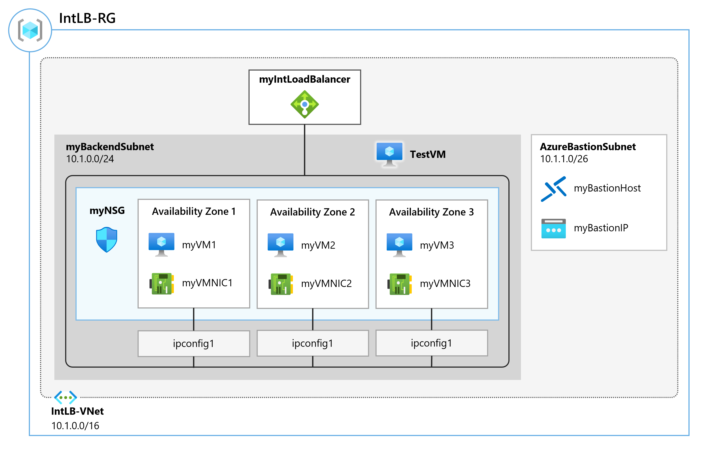

 通过学习本练习，你将能够：

+ 任务 1：创建虚拟网络
+ 任务 2：创建负载均衡器
+ 任务 3：创建后端池
+ 任务 4：创建运行状况探测
+ 任务 5：创建负载均衡器规则
+ 任务 6：创建后端服务器
+ 任务 7：将 VM 添加到后端地址池
+ 任务 8：测试负载均衡器
+ 任务 9：创建 Log Analytics 工作区
+ 任务 10：使用函数依赖关系视图
+ 任务 11：查看详细指标
+ 任务 12：查看资源运行状况
+ 任务 13：配置诊断设置
+ 任务 14：清理资源

**注意：** 我们提供 **[交互式实验室模拟](https://mslabs.cloudguides.com/guides/AZ-700%20Lab%20Simulation%20-%20Monitor%20a%20load%20balancer%20resource%20using%20Azure%20Monitor)** ，让你能以自己的节奏点击浏览实验室。 你可能会发现交互式模拟与托管实验室之间存在细微差异，但演示的核心概念和思想是相同的。

> [!Note]  
> 你可能会发现说明和 Azure 门户界面之间存在细微差异，但核心概念是相同的。

### 预计用时：55 分钟

## 任务 1：创建虚拟网络

在本部分，你将创建虚拟网络和子网。

1. 登录到 Azure 门户。

1. 在 Azure 门户主页上，搜索“虚拟网络”然后选择“服务”下的“虚拟网络”。

1. 选择“+ 新建”。

   

1. 在“基本信息”选项卡上，使用下表中的信息创建虚拟网络。

   | **设置**    | 值                                           |
   | -------------- | --------------------------------------------------- |
   | 订阅   | 选择订阅                            |
   | 资源组 | 选择“新建”<br /><br />名称：IntLB-RG |
   | 名称           | IntLB-VNet                                      |
   | 区域         | （美国）美国西部                                    |

1. 选择“下一步: IP 地址”。

1. 在“IP 地址”选项卡的“IPv4 地址空间”框中，输入“10.1.0.0/16”  。

1. 在“子网名称”上，选择“+ 添加子网” 。

1. 在“添加子网”窗格中，提供子网名称“myBackendSubnet”，以及子网地址范围“10.1.0.0/24”  。

1. 选择“添加”  。

1. 选择“下一步: 安全性”。

1. 在“BastionHost”下，选择“启用”，然后输入下表中的信息。

    | **设置**                       | **值**                                              |
    | --------------------------------- | ------------------------------------------------------ |
    | Bastion 名称                      | myBastionHost                                      |
    | AzureBastionSubnet 地址空间  | **10.1.1.0/24**                                        |
    | 公共 IP 地址                 | 选择“新建”<br /><br />名称：myBastionIP |

1. 选择“查看 + 创建”。

1. 选择“创建”。

## 任务 2：创建负载均衡器

在本部分中，你将创建一个内部标准 SKU 负载均衡器。 在此练习中创建标准 SKU 负载均衡器（而不是基本 SKU 负载均衡器）的原因是，之后的练习需要使用标准 SKU 版本的负载均衡器。

1. 在 Azure 主页的搜索栏中，输入“负载均衡器”
1. 选择“创建负载均衡器”。
1. 在“基本信息”选项卡上，使用下表中的信息创建负载均衡器。

   | **设置**           | **值**                |
   | --------------------- | ------------------------ |
   | “基本信息”选项卡            |                          |
   | 订阅          | 选择订阅 |
   | 资源组        | IntLB-RG             |
   | 名称                  | myIntLoadBalancer    |
   | 区域                | （美国）美国西部         |
   | SKU                   | **标准**             |
   | 类型                  | **内部**             |
   | 前端 IP 配置选项卡 | + 添加前端 IP 配置 |
   | 名称                  | LoadBalancerFrontEnd |
   | 虚拟网络       | IntLB-VNet           |
   | 子网                | myBackendSubnet      |
   | IP 地址分配 | **动态**              |

1. 选择“查看 + 创建”。

1. 选择“创建”。

## 任务 3：创建后端池

后端地址池包含连接到负载均衡器的虚拟 NIC 的 IP 地址。

1. 在 Azure 门户主页上，选择“所有资源”，然后在资源列表中选择“myIntLoadBalancer” 。

1. 在“设置”下，依次选择“后端池”、“添加”。

1. 在“添加后端池”页上，输入下表中的信息。

   | **设置**     | **值**            |
   | --------------- | -------------------- |
   | 名称            | myBackendPool    |
   | 虚拟网络 | IntLB-VNet       |
   | 后端池配置   | **NIC** |

1. 选择“添加”  。

   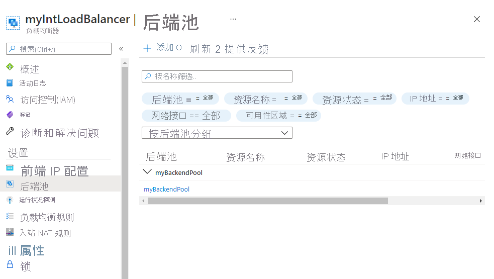

## 任务 4：创建运行状况探测

负载均衡器使用运行状况探测器监视应用的状态。 运行状况探测器基于 VM 对运行状况检查的响应，在负载均衡器中添加或删除 VM。 你将在此处创建运行状况探测来监视 VM 的运行状况。

1. 在负载均衡器的“后端池”页的“设置”下，选择“运行状况探测”，然后选择“添加”   。

1. 在“添加运行状况探测”页上，输入下表中的信息。

   | **设置**         | **值**         |
   | ------------------- | ----------------- |
   | 名称                | myHealthProbe |
   | 协议            | **HTTP**          |
   | 端口                | **80**            |
   | 路径                | **/**             |
   | 时间间隔            | **15**            |

1. 选择“添加”  。

   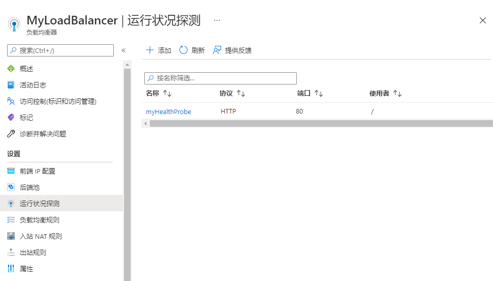

## 任务 5：创建负载均衡器规则

负载均衡器规则用于定义将流量分配给 VM 的方式。 定义传入流量的前端 IP 配置和后端 IP 池以接收流量。 源端口和目标端口在规则中定义。 你将在此处创建负载均衡器规则。

1. 在负载均衡器的“后端池”页的“设置”下，选择“负载均衡规则”，然后选择“添加”   。

1. 在“添加负载均衡规则”页上，输入下表中的信息。

   | **设置**            | **值**                |
   | ---------------------- | ------------------------ |
   | 名称                   | myHTTPRule           |
   | IP 版本             | **IPv4**                 |
   | 前端 IP 地址    | LoadBalancerFrontEnd |
   | 协议               | **TCP**                  |
   | 端口                   | **80**                   |
   | 后端端口           | **80**                   |
   | 后端池           | myBackendPool        |
   | 运行状况探测           | myHealthProbe        |
   | 会话暂留    | **无**                 |
   | 空闲超时(分钟) | **15**                   |
   | 浮动 IP            | **已禁用**             |

1. 选择“添加”  。

   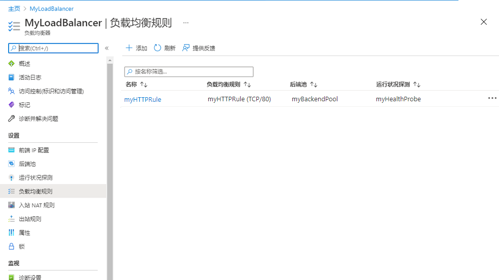

## 任务 6：创建后端服务器

在本部分中，你将为负载均衡器的后端池创建三个 VM，将这些 VM 添加到后端池，然后在这三个 VM 上安装 IIS 以测试负载均衡器。

1. 在 Azure 门户的“Cloud Shell”窗格中打开“PowerShell”会话 。

 > **注意：** 如果这是你首次打开 Cloud Shell，系统会提示你创建存储帐户。 选择“创建存储”。

1. 在 Cloud Shell 窗格的工具栏中，选择“上传/下载文件”图标，在下拉菜单中选择“上传”，将 azuredeploy.json 和 azuredeploy.parameters.json 文件从源文件夹 F:\Allfiles\Exercises\M08 逐个上传到 Cloud Shell 主目录。

1. 部署以下 ARM 模板以创建本练习所需的虚拟网络、子网和 VM：

   >注意：系统会提示你提供管理员密码。

   ```powershell
   $RGName = "IntLB-RG"

   New-AzResourceGroupDeployment -ResourceGroupName $RGName -TemplateFile azuredeploy.json -TemplateParameterFile azuredeploy.parameters.json
   ```
  
    > **注意：** 将需要几分钟才能完成部署。

## 任务 7：将 VM 添加到后端地址池

1. 在 Azure 门户主页上，选择“所有资源”，然后在资源列表中选择“myIntLoadBalancer” 。

1. 在“设置”下，依次选择“后端池”、“myBackendPool”。

1. 在“关联对象”框中，选择“虚拟机” 。

1. 在“虚拟机”下，选择“添加” 。

1. 选中所有 3 个 VM（myVM1、myVM2 和 myVM3）的复选框，然后选择“添加”   。

1. 在“myBackendPool”页上，选择“保存” 。

   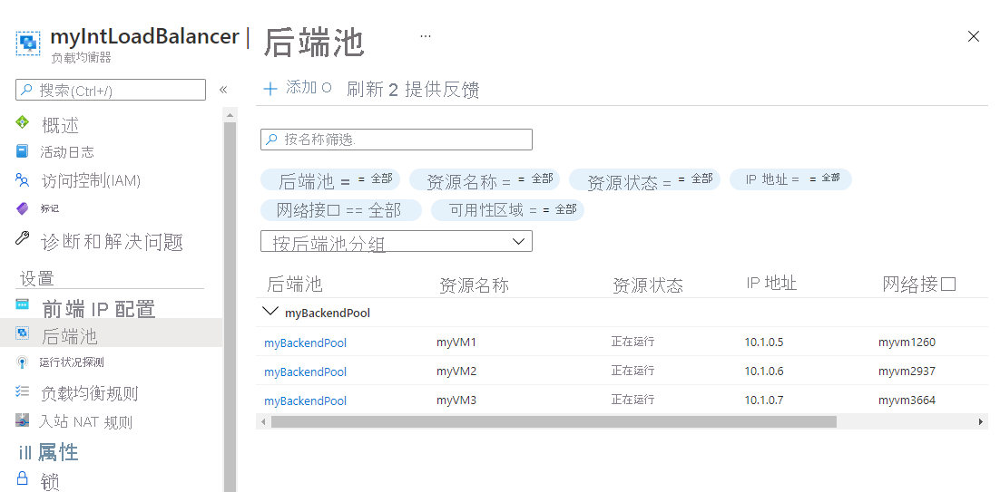

## 任务 8：测试负载均衡器

在本部分中，你将创建一个测试 VM，然后测试负载均衡器。

### 创建测试 VM

> [!Note]  
> 你可能会发现说明和 Azure 门户界面之间存在细微差异，但核心概念是相同的。

1. 在 Azure 主页上，使用全局搜索输入“虚拟机”，然后选择服务下的虚拟机。

1. 在“基本”选项卡上选择“+ 创建; + 虚拟机”，使用下表中的信息创建第一个 VM 。

   | 设置          | 值                                    |
   | -------------------- | -------------------------------------------- |
   | 订阅         | 选择订阅                     |
   | 资源组       | IntLB-RG                                 |
   | 虚拟机名称 | **myTestVM**                                 |
   | 区域               | （美国）美国西部                             |
   | 可用性选项 | 不需要基础结构冗余    |
   | 映像                | Windows Server 2019 Datacenter - Gen 1   |
   | 大小                 | Standard_DS2_v3 - 2 个 vCPU，8 GiB 内存 |
   | 用户名             | TestUser                                 |
   | 密码             | 提供安全密码                |
   | 确认密码     | 提供安全密码                |

1. 选择“下一步: 磁盘”，然后选择“下一步: 网络” 。

1. 在“网络”选项卡上，使用下表中的信息配置网络设置。

   | **设置**                                                  | **值**                     |
   | ------------------------------------------------------------ | ----------------------------- |
   | 虚拟网络                                              | IntLB-VNet                |
   | 子网                                                       | myBackendSubnet           |
   | 公共 IP                                                    | 更改为“无”            |
   | NIC 网络安全组                                   | **高级**                  |
   | 配置网络安全组                             | 选择现有的“myNSG” |
   | 负载均衡                                               | 无（或未选中）       |

1. 选择“查看 + 创建”。

1. 选择“创建”。

1. 等待最后一个 VM 部署完毕，然后再继续执行下一任务。

### 连接到测试 VM 以测试负载均衡器

1. 在 Azure 门户主页上，选择“所有资源”，然后在资源列表中选择“myIntLoadBalancer” 。

1. 在“概述”页上，记下“专用 IP 地址”，或将其复制到剪贴板。 注意：可能需要选择“查看更多”，以查看专用 IP 地址 。

1. 选择“主页”，在 Azure 门户主页上，选择“所有资源”，然后选择刚刚创建的 myTestVM 虚拟机  。

1. 在“概述”页上，选择“连接”，然后选择“Bastion”  。

1. 选择“使用 Bastion”。

1. 在“用户名”框中，输入“TestUser”，在“密码”框中，输入部署期间提供的密码，然后选择“连接”   。

1. 将在另一个浏览器标签页中打开“myTestVM”窗口。

1. 如果出现“网络”窗格，请选择“是” 。

1. 选择任务栏中的“Internet Explorer”图标以打开 Web 浏览器。

1. 在“设置 Internet Explorer 11”对话框中选择“确定” 。

1. 将上一步中的“专用 IP 地址”（例如 10.1.0.4）输入（或粘贴）到浏览器的地址栏中，然后按 Enter。

1. IIS Web 服务器的默认 Web 主页将显示在浏览器窗口中。 后端池中的三个虚拟机之一将做出响应。
    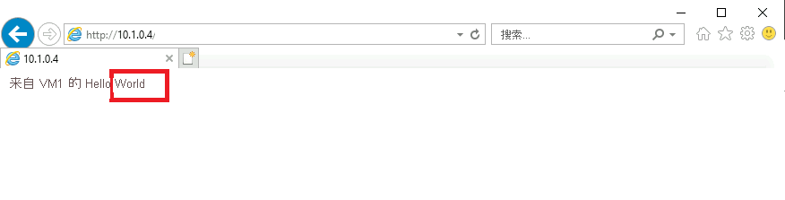

1. 如果多次选择浏览器中的刷新按钮，则将看到响应是从内部负载均衡器后端池中的不同 VM 随机发出的。

    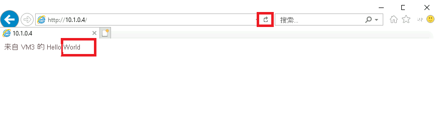

## 任务 9：创建 Log Analytics 工作区

1. 在 Azure 门户主页上，选择“所有服务”，然后在页面顶部的搜索框中输入“Log Analytics”，然后从筛选列表中选择“Log Analytics 工作区”  。

   

1. 选择“创建”。

1. 在“创建 Log Analytics 工作区”页上的“基本信息”选项卡上，使用下表中的信息创建工作区。

   | **设置**    | 值                |
   | -------------- | ------------------------ |
   | 订阅   | 选择订阅 |
   | 资源组 | IntLB-RG             |
   | 名称           | myLAworkspace        |
   | 区域         | **美国西部**              |

1. 依次选择“查看 + 创建”、“创建” 。

   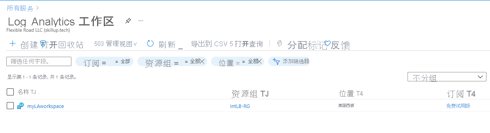

## 任务 10：使用函数依赖关系视图

1. 在 Azure 门户主页上，选择“所有资源”，然后在资源列表中选择“myIntLoadBalancer” 。

   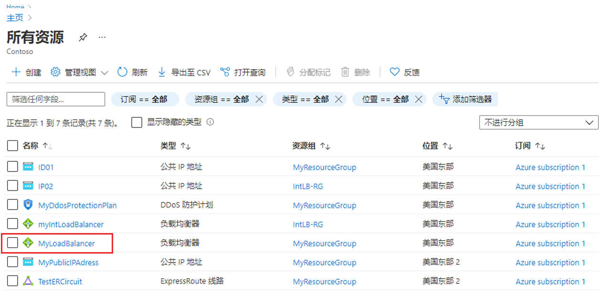

1. 在“监视”下，选择“见解”。

1. 在页面的右上角，选择“X”暂时关闭“指标”窗格 。 稍后将再次打开它。

1. 此页面视图称为函数依赖关系视图，在此视图中，你可以获得有用的交互式图表，其中显示所选网络资源（在本例中为负载均衡器）的拓扑。 对于标准负载平衡器，后端池资源基于运行状况探测状态进行了颜色编码，指示用于提供流量的后端池的当前可用性。

1. 使用页面右下角的放大 (+) 和缩小 (-) 按钮放大和缩小拓扑图（或者，如果有鼠标滚轮，也可以使用鼠标滚轮）。 还可在页面周围拖动拓扑图来移动它。

1. 将鼠标悬停在图中的 LoadBalancerFrontEnd 组件上，然后将鼠标悬停在 myBackendPool 组件上。

1. 请注意，可使用这些弹出窗口中的链接查看有关这些负载均衡器组件的信息，并打开其各自的 Azure 门户边栏选项卡。

1. 若要下载拓扑示意图的 .SVG 文件副本，请选择“下载拓扑”，然后将文件保存在“Downloads”文件夹中 。

1. 在右上角，选择“查看指标”以重新在屏幕右侧打开“指标”窗格。
    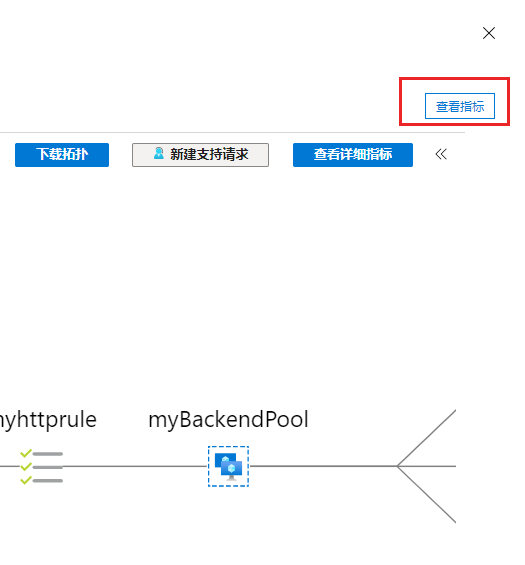

1. “指标”窗格以条形图和折线图的形式提供了此负载均衡器资源的一些关键指标的快速视图。

    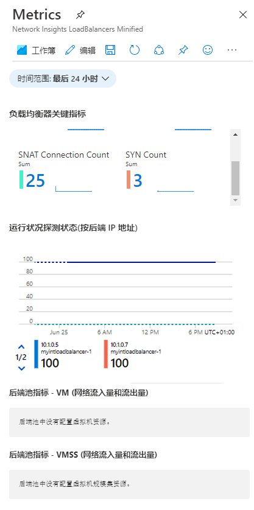

## 任务 11：查看详细指标

1. 若要查看此网络资源的更全面的指标，请选择“查看详细指标”。
   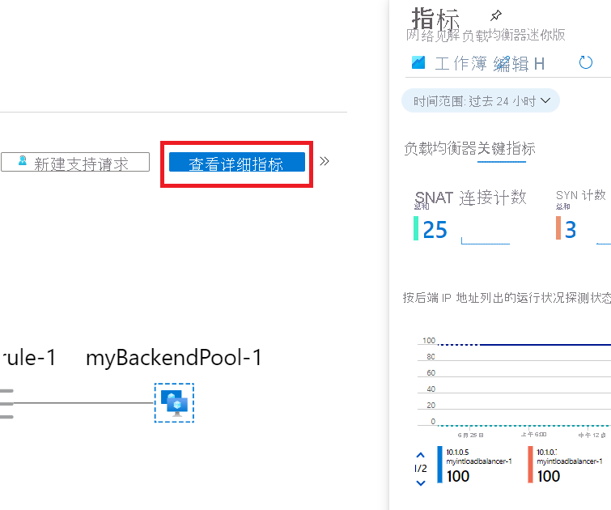

1. 这会在 Azure 网络见解平台中打开一个完整的大型“指标”页面。 登录的第一个选项卡是“概述”选项卡，该选项卡显示负载均衡器的可用性状态，以及附加到负载均衡器的每个前端 IP 的整体数据吞吐量和前端和后端可用性。 这些指标指示前端 IP 是否响应，并且后端池中的计算实例是否分别响应入站连接。
   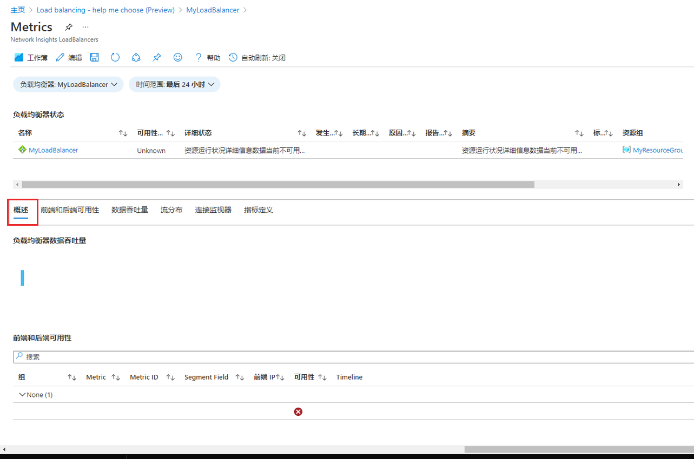

1. 选择“前端和后端可用性”选项卡，然后向下滚动页面以查看“运行状况探测状态”图表。 如果看到这些项的值低于 100，则表示这些资源出现某种类型的中断。
   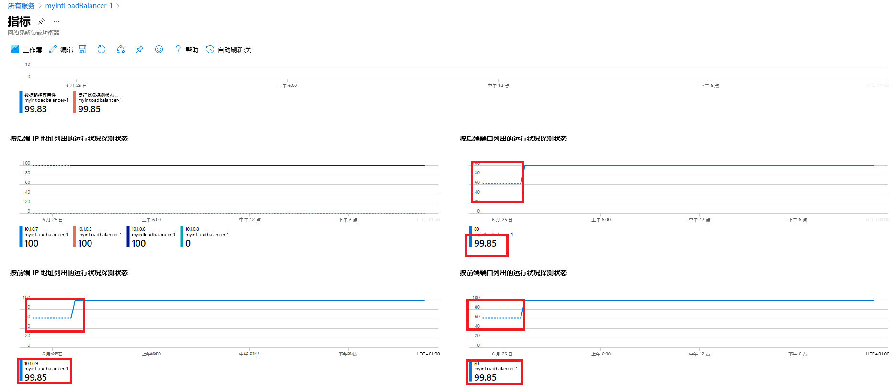

1. 选择“数据吞吐量”选项卡，然后向下滚动页面以查看其他数据吞吐量图表。

1. 将鼠标悬停在图表中的某些数据点上，你将看到值会发生变化以显示该时间点的准确值。
   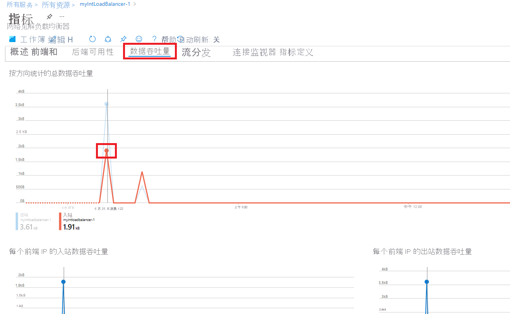

1. 选择“流分发”选项卡，然后向下滚动页面以查看“VM 流创建和网络流量”部分下的图表 。

   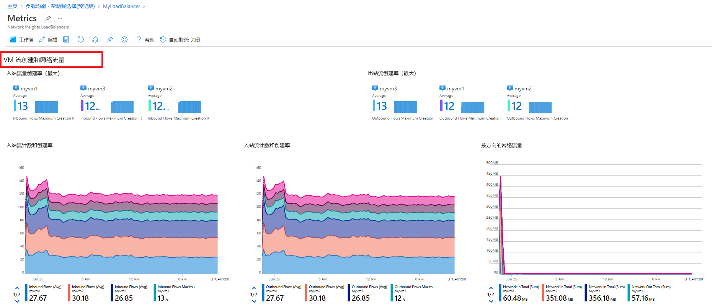

## 任务 12：查看资源运行状况

1. 若要查看负载均衡器资源的运行状况，请在 Azure 门户主页上，选择“所有服务”，然后选择“监视” 。

1. 在“监视”&gt;“概述”页上，选择左侧菜单中的“服务运行状况” 。

1. 在“服务运行状况”&gt;“服务问题”页上，选择左侧菜单中的“资源运行状况” 。

1. 在“服务运行状况”&gt;“资源运行状况”页上的“资源类型”下拉列表中，向下滚动列表并选择“负载均衡器”。

   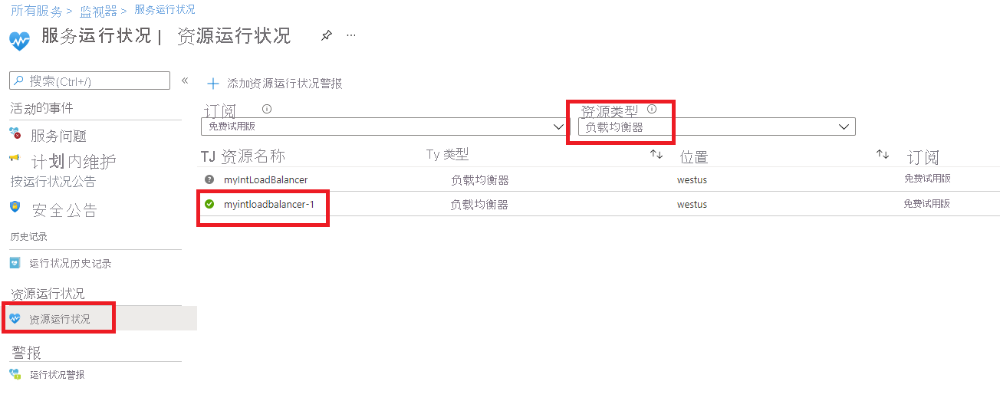

1. 然后从列表中选择负载均衡器的名称。

1. “资源运行状况”页将标识负载均衡器资源任何重大的可用性问题。 如果“运行状况历史记录”部分下有任何事件，则可以展开运行状况事件以查看有关事件的更多详细信息。 甚至可以将有关事件的详细信息保存为 PDF 文件，以供日后查看和报告。

   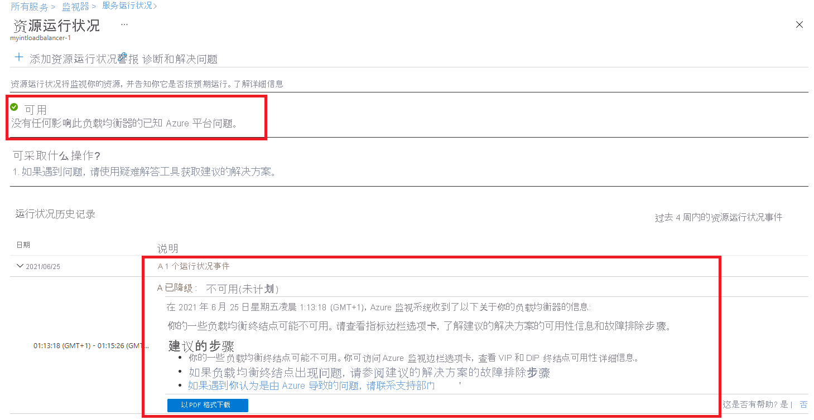

## 任务 13：配置诊断设置

1. 在 Azure 门户主页上，选择“资源组”，然后从列表中选择“IntLB-RG”资源组 。

1. 在“IntLB-RG”页，选择资源列表中的“myIntLoadBalancer”负载均衡器资源的名称 。

1. 在“监视”下，选择“诊断设置”，然后选择“添加诊断设置”  。

   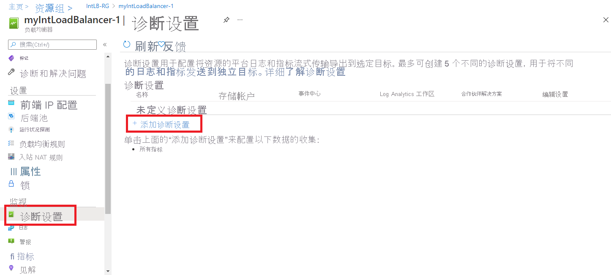

1. 在“诊断设置”页的名称框中，输入“myLBDiagnostics” 。

1. 选中“AllMetrics”复选框，然后选中“发送到 Log Analytics 工作区”复选框。

1. 从列表中选择订阅，然后从工作区下拉列表中选择“myLAworkspace (westus)”。

1. 选择“保存”。

   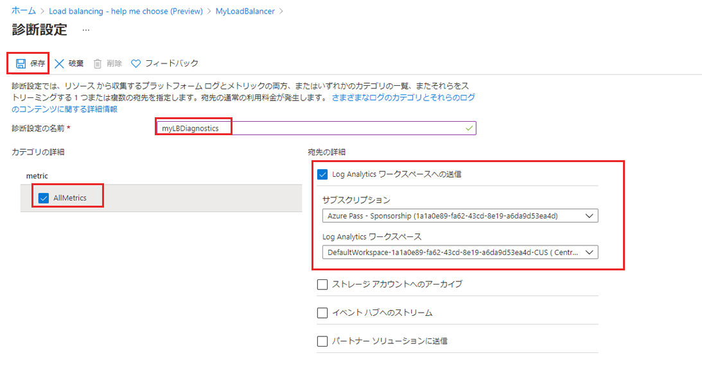

## 任务 14：清理资源

   >**注意**：记得删除所有不再使用的新建 Azure 资源。 删除未使用的资源可确保不会出现意外费用。

1. 在 Azure 门户的“Cloud Shell”窗格中打开“PowerShell”会话 。

1. 通过运行以下命令，删除在此模块的实验室中创建的所有资源组：

   ```powershell
   Remove-AzResourceGroup -Name 'IntLB-RG' -Force -AsJob
   ```

    >**注意**：该命令以异步方式执行（由 -AsJob 参数决定），因此，虽然你可以随后立即在同一个 PowerShell 会话中运行另一个 PowerShell 命令，但需要几分钟才能实际删除资源组。
