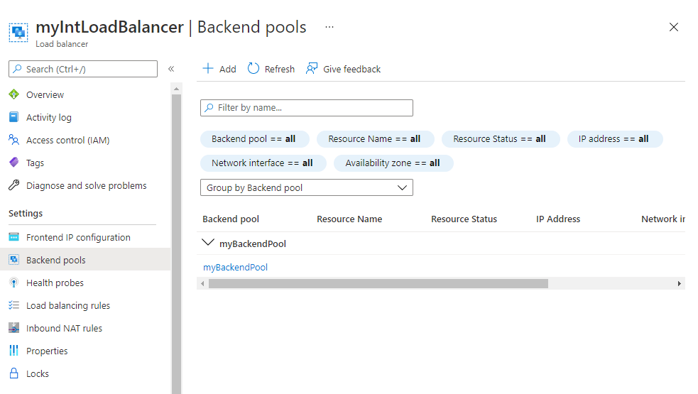

---
Exercise:
  title: 模块 08 - 第 3 单元 使用 Azure Monitor 监视负载均衡器资源
  module: Module 08 - Design and implement network monitoring
---

# 模块 08 - 第 3 单元 使用 Azure Monitor 监视负载均衡器资源

## 练习场景

在本练习中，你将为虚构的 Contoso Ltd 组织创建一个内部负载均衡器。 然后，你将创建一个 Log Analytics 工作区，并使用 Azure Monitor 见解查看有关内部负载均衡器的信息。 你将查看函数依赖关系视图，然后查看负载均衡器资源的详细指标，并查看负载均衡器的资源运行状况信息。 最后，配置负载均衡器的诊断设置，以将指标发送到创建的 Log Analytics 工作区。

下图展示了将在本练习中部署的环境。


### 工作技能

 通过学习本练习，你将能够：

+ 任务 1：创建虚拟网络
+ 任务 2：创建负载均衡器
+ 任务 3：创建后端池
+ 任务 4：创建运行状况探测
+ 任务 5：创建负载均衡器规则
+ 任务 6：创建后端服务器
+ 任务 7：将 VM 添加到后端地址池
+ 任务 8：测试负载均衡器
+ 任务 9：创建 Log Analytics 工作区
+ 任务 10：使用函数依赖关系视图
+ 任务 11：查看详细指标
+ 任务 12：查看资源运行状况
+ 任务 13：配置诊断设置

### 预计用时：55 分钟

## 任务 1：创建虚拟网络

在本部分，你将创建虚拟网络和子网。

1. 登录到 Azure 门户。

1. 在 Azure 门户中，搜索并选择“虚拟网络”。****

1. 选择“+ 新建”。

   

1. 在“基本信息”选项卡上，使用下表中的信息创建虚拟网络。

   | **设置**    | 值                                           |
   | -------------- | --------------------------------------------------- |
   | 订阅   | 选择订阅                            |
   | 资源组 | 选择“新建”<br /><br />名称：IntLB-RG |
   | 名称           | IntLB-VNet                                      |
   | 区域         | （美国）美国西部                                    |

1. 选择“下一步: 安全性”。

1. 在“BastionHost”下，选择“启用”，然后输入下表中的信息。

    | **设置**                       | **值**                                              |
    | --------------------------------- | ------------------------------------------------------ |
    | Bastion 名称                      | myBastionHost                                      |
    | 公共 IP 地址                 | 选择“新建”<br /><br />名称：myBastionIP |

1. 选择“下一步: IP 地址”。

1. 选择“删除 IP 地址”，然后选择“IPv4 地址空间”****。**** 输入“10.1.0.0/16”****。

1. 编辑 AzureBastionSubnet，并将“起始地址”更改为 10.1.1.0。************ **保存**更改。 

1. 选择“+ 添加子网”，子网名称为 `myBackendSubnet`，子网地址范围为 `10.1.0.0/24`。**** 选择 **添加** 。

1. 现在应有一个包含两个子网的虚拟网络。 

1. 选择“查看 + 创建”。

1. 选择“创建”。

## 任务 2：创建负载均衡器

在本部分中，你将创建一个内部标准 SKU 负载均衡器。 在此练习中创建标准 SKU 负载均衡器（而不是基本 SKU 负载均衡器）的原因是，之后的练习需要使用标准 SKU 版本的负载均衡器。

1. 在 Azure 门户中，搜索并选择“负载均衡器”****

1. 选择“创建”，然后选择“标准负载均衡器”********。

1. 在“基本信息”选项卡上，使用下表中的信息创建负载均衡器。

   | **设置**           | **值**                |
   | --------------------- | ------------------------ |
   | “基本信息”选项卡            |                          |
   | 订阅          | 选择订阅 |
   | 资源组        | IntLB-RG             |
   | 名称                  | myIntLoadBalancer    |
   | 区域                | （美国）美国西部         |
   | SKU                   | **标准**             |
   | 类型                  | **内部**             |

1. 前往“前端 IP 配置”选项卡，选择“+ 添加前端 IP 配置”********。

   | 设置            | 值            |
   | 名称                  | `LoadBalancerFrontEnd` |
   | 虚拟网络       | IntLB-VNet           |
   | 子网                | myBackendSubnet      |
   | IP 地址分配 | 动态              ********************|

1. 保存更改，然后选择“查看 + 创建”********。

1. 成功验证后，选择“创建”。****

## 任务 3：创建后端池

后端地址池包含连接到负载均衡器的虚拟 NIC 的 IP 地址。

1. 在 Azure 门户中，搜索并选择 myIntLoadBalancer 资源****。

1. 在“设置”下，依次选择“后端池”、“添加”。

1. 在“添加后端池”页上，输入下表中的信息。

   | **设置**     | **值**            |
   | --------------- | -------------------- |
   | 名称            | myBackendPool    |
   | 虚拟网络 | IntLB-VNet    |
   | 后端池配置   | **NIC** |

1. 选择“保存”。

   

## 任务 4：创建运行状况探测

负载均衡器使用运行状况探测器监视应用的状态。 运行状况探测器基于 VM 对运行状况检查的响应，在负载均衡器中添加或删除 VM。 你将在此处创建运行状况探测来监视 VM 的运行状况。

1. 对于负载均衡器资源，请依次选择“设置”、“运行状况探测”和“添加”。************

1. 在“添加运行状况探测”页上，输入下表中的信息。

   | **设置**         | **值**         |
   | ------------------- | ----------------- |
   | 名称                | `myHealthProbe` |
   | 协议            | **HTTP**          |
   | 端口                | **80**            |
   | 路径                | **/**             |
   | 时间间隔            | **15**            |

1. 选择“保存”。

   

## 任务 5：创建负载均衡器规则

负载均衡器规则用于定义将流量分配给 VM 的方式。 定义传入流量的前端 IP 配置和后端 IP 池以接收流量。 源端口和目标端口在规则中定义。 你将在此处创建负载均衡器规则。

1. 对于负载均衡器资源，请依次选择“设置”、“负载均衡规则”和“添加”。************

   | **设置**            | **值**                |
   | ---------------------- | ------------------------ |
   | 名称                   | myHTTPRule           |
   | IP 版本             | **IPv4**                 |
   | 前端 IP 地址    | LoadBalancerFrontEnd |
   | 后端池           | myBackendPool        |
   | 协议               | **TCP**                  |
   | 端口                   | **80**                   |
   | 后端端口           | **80**                   |
   | 运行状况探测           | myHealthProbe        |
   | 会话暂留    | **无**                 |
   | 空闲超时(分钟) | **15**                   |
   | 浮动 IP            | **已禁用**             |

   

## 任务 6：创建后端服务器

在本部分中，你将为负载均衡器的后端池创建三个 VM，将这些 VM 添加到后端池，然后在这三个 VM 上安装 IIS 以测试负载均衡器。

1. 在 Azure 门户中，选择右上角的 Cloud Shell 图标。 如有必要，请配置 Shell。  
    + 选择“PowerShell”****。
    + 选择“**不需要存储帐户**”和“**订阅**”，然后选择“**应用**”。
    + 等待终端创建并显示提示。 

1. 在 Cloud Shell 窗格的工具栏中，选择“**管理文件**”图标，在下拉菜单中选择“**上传**”，将 **azuredeploy.json** 和 **azuredeploy.parameters.json** 文件上传到 Cloud Shell 主目录。

    > **备注：** 如果在自己的订阅中工作，则[模板文件](https://github.com/MicrosoftLearning/AZ-700-Designing-and-Implementing-Microsoft-Azure-Networking-Solutions/tree/master/Allfiles/Exercises)在 GitHub 实验室存储库中可用。

1. 部署以下 ARM 模板，创建本练习所需的虚拟网络、子网和 VM。 注意****：系统会提示你提供管理员密码。

   ```powershell
   $RGName = "IntLB-RG"
   New-AzResourceGroupDeployment -ResourceGroupName $RGName -TemplateFile azuredeploy.json -TemplateParameterFile azuredeploy.parameters.json
   ```
1. 部署可能需要几分钟的时间。 可以通过刷新虚拟机资源页面，在门户中查看进度。   

## 任务 7：将 VM 添加到后端地址池

1. 在 Azure 门户中，搜索并选择 myIntLoadBalancer 资源****。

1. 在“设置”下，依次选择“后端池”、“myBackendPool”。

1. 在“IP 配置”部分中，选择“添加”。********

1. 选择显示的所有虚拟机，然后选择“添加”。****

1. 选择 myVM1 和 myVM2 对应的复选框，然后选择“添加”。************

1. 在“myBackendPool”页上，选择“保存” 。

## 任务 8：测试负载均衡器

在本部分中，你将创建一个测试 VM，然后测试负载均衡器。

### 连接到测试 VM (VM3) 以测试负载均衡器

1. 在 Azure 门户中，搜索并选择 myIntLoadBalancer 资源****。

1. 在“概述”页上，记下“专用 IP 地址”，或将其复制到剪贴板。 注意：可能需要选择“查看更多”，以查看专用 IP 地址 。

1. 搜索并选择 myVM3****。 

1. 选择“连接”，然后选择“通过 Bastion 连接”。********

1. 在“用户名”框中，输入“TestUser”，在“密码”框中，输入部署期间提供的密码，然后选择“连接”   。

1. 将在另一个浏览器标签页中打开“myTestVM”窗口。

1. 如果出现“网络”窗格，请选择“是” 。

1. 选择任务栏中的“Internet Explorer”图标以打开 Web 浏览器。

1. 在“设置 Internet Explorer 11”对话框中选择“确定” 。

1. 输入（或粘贴）负载均衡器 IP 地址（例如 10.1.0.4）。

1. 两个后端服务器虚拟机（myVM1 或 myVM2）中的一个将做出响应。 继续刷新页面，可以注意到响应是由后端服务器随机返回的。 

## 任务 9：创建 Log Analytics 工作区

1. 在 Azure 门户中，搜索并选择“Log Analytics 工作区”资源****。
   
1. 选择**创建**。

1. 在“创建 Log Analytics 工作区”页上的“基本信息”选项卡上，使用下表中的信息创建工作区。

   | **设置**    | 值                |
   | -------------- | ------------------------ |
   | 订阅   | 选择订阅 |
   | 资源组 | IntLB-RG             |
   | 名称           | myLAworkspace        |
   | 区域         | **美国西部**              |

1. 依次选择“查看 + 创建”、“创建” 。

## 任务 10：使用函数依赖关系视图

1. 在 Azure 门户中，搜索并选择 myIntLoadBalancer 资源****。 

   

1. 在“监视”下，选择“见解”。

1. “指标”窗格以条形图和折线图的形式提供了此负载均衡器资源的一些关键指标的快速视图。

    

## 任务 11：查看详细指标

1. 若要查看此网络资源的更全面的指标，请选择“查看详细指标”。
   

1. 这会在 Azure 网络见解平台中打开一个完整的大型“指标”页面。 登录的第一个选项卡是“概述”选项卡，该选项卡显示负载均衡器的可用性状态，以及附加到负载均衡器的每个前端 IP 的整体数据吞吐量和前端和后端可用性。 这些指标指示前端 IP 是否响应，并且后端池中的计算实例是否分别响应入站连接。
   

1. 选择“前端和后端可用性”选项卡，然后向下滚动页面以查看“运行状况探测状态”图表。 如果看到这些项的值低于 100，则表示这些资源出现某种类型的中断。
   

1. 选择“数据吞吐量”选项卡，然后向下滚动页面以查看其他数据吞吐量图表。

1. 将鼠标悬停在图表中的某些数据点上，你将看到值会发生变化以显示该时间点的准确值。
   

1. 选择“流分发”选项卡，然后向下滚动页面以查看“VM 流创建和网络流量”部分下的图表 。

   

## 任务 12：查看资源运行状况

1. 若要查看负载均衡器资源的运行状况，请在 Azure 门户主页上，选择“所有服务”，然后选择“监视” 。

1. 在“监视”&gt;“概述”页上，选择左侧菜单中的“服务运行状况” 。

1. 在“服务运行状况”&gt;“服务问题”页上，选择左侧菜单中的“资源运行状况” 。

1. 在“服务运行状况”&gt;“资源运行状况”页上的“资源类型”下拉列表中，向下滚动列表并选择“负载均衡器”。

   

1. 然后从列表中选择负载均衡器的名称。

1. “资源运行状况”页将标识负载均衡器资源任何重大的可用性问题。 如果“运行状况历史记录”部分下有任何事件，则可以展开运行状况事件以查看有关事件的更多详细信息。 甚至可以将有关事件的详细信息保存为 PDF 文件，以供日后查看和报告。

   

## 任务 13：配置诊断设置

1. 在 Azure 门户主页上，选择“资源组”，然后从列表中选择“IntLB-RG”资源组 。

1. 在“IntLB-RG”页，选择资源列表中的“myIntLoadBalancer”负载均衡器资源的名称 。

1. 在“监视”下，选择“诊断设置”，然后选择“添加诊断设置”  。

   

1. 在“诊断设置”页的名称框中，输入“myLBDiagnostics” 。

1. 选中“AllMetrics”复选框，然后选中“发送到 Log Analytics 工作区”复选框。

1. 从列表中选择订阅，然后从工作区下拉列表中选择“myLAworkspace (westus)”。

1. 选择“保存”。

   

## 清理资源

>**注意**：记得删除所有不再使用的新建 Azure 资源。 删除未使用的资源可确保不会出现意外费用。

1. 在 Azure 门户的“Cloud Shell”窗格中打开“PowerShell”会话 。

1. 通过运行以下命令，删除在此模块的实验室中创建的所有资源组：

   ```powershell
   Remove-AzResourceGroup -Name 'IntLB-RG' -Force -AsJob
   ```

>**注意**：该命令以异步方式执行（由 -AsJob 参数决定），因此，虽然你可以随后立即在同一个 PowerShell 会话中运行另一个 PowerShell 命令，但需要几分钟才能实际删除资源组。
    
## 使用 Copilot 扩展学习

Copilot 可帮助你了解如何使用 Azure 脚本工具。 Copilot 还可以帮助了解实验室中未涵盖的领域或需要更多信息的领域。 打开 Edge 浏览器并选择“Copilot”（右上角）或导航到*copilot.microsoft.com*。 花几分钟时间尝试这些提示。
+ 汇总可用于监视虚拟网络的 Azure 工具。
+ 可以使用哪些 Azure 网络观察程序监视工具？

## 通过自定进度的培训了解详细信息

+ [Azure Monitor 简介](https://learn.microsoft.com/training/modules/intro-to-azure-monitor/)。 本模块介绍如何使用 Azure Monitor 提供对 Azure 资源性能和操作的见解。
+ [使用网络监视工具监视端到端 Azure 网络基础结构并对其进行故障排除](https://learn.microsoft.com/training/modules/troubleshoot-azure-network-infrastructure/)。 本模块介绍如何使用 Azure 网络观察程序工具、诊断和日志帮助查找并修复 Azure 基础结构中的网络问题。

## 关键结论

恭喜你完成本实验室的内容。 下面是本实验室的主要重点。 

+ Azure Monitor 提供的功能和工具用于从所有 Azure、其他云和本地资源收集、管理和分析 IT 数据。
+ 指标是显示应用程序或资源性能快照的定量度量。 指标通常是可以在一段时间内进行测量的数值。
+ 日志是资源或应用程序中发生的事件、操作和消息的文本记录。 
+ Azure Monitor 见解、可视化效果和仪表板可以使用和传输有关应用程序的监视信息。
+ 警报会向你显示关键情况并可采取纠正措施。 警报规则可以基于指标或日志数据。+ 
    
